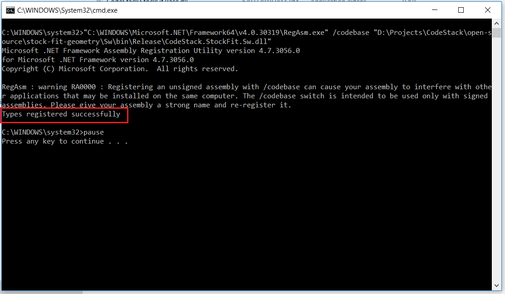

This article explains how to deploy and register SOLIDWORKS add-in manually.

### Deploying binaries

Once project is successfully compiled all required binaries and data files are placed into the output folder.

{ width=350 }

When deploying the product (add-in or stand-alone application) all files must be deployed (including any 3rd party dlls or interops). You may exclude any supporting files such as pdb-files or xml documentation files.

### Registering add-in

Copying the files to the user machine is not enough to register it on the target system. It is also required to register add-in COM object and add corresponding entries to the registry.

To register .NET add-in (C# or VB.NET) it is required to call the [Assembly Registration Tool (regasm)](https://docs.microsoft.com/en-us/dotnet/framework/tools/regasm-exe-assembly-registration-tool) with /codebase option

> "%Windir%\Microsoft.NET\Framework64\v4.0.30319\regasm" /codebase "PATH TO ADDIN DLL"

Message similar to the following should be displayed if the registration successful:

{ width=500 }

> It is required to use the correct version of the framework depending on the target framework add-in was compiled to.

To register COM add-in (C++) it is required to call the [regsvr32](https://docs.microsoft.com/en-us/windows-server/administration/windows-commands/regsvr32) utility.

> Registration usually requires running the [Command Prompt](https://en.wikipedia.org/wiki/Cmd.exe) as an administrator.

It is not required to register COM objects for stand-alone application unless it explicitly requires this.

### Adding the registry information

Information about the add-in needs to be added to the registry so SOLIDWORKS can correctly load the add-in. It is possible to create a registry file which will be adding this information to the registry.

The keys added to HKEY_LOCAL_MACHINE are mandatory and identify the add-in to be available in the add-ins list. The keys added to HKEY_CURRENT_USER are optional and represent the start-up state of the add-in. Set value to 1 to load add-in at start-up, set to 0 to not load on start-up.

~~~ reg
Windows Registry Editor Version 5.00

[HKEY_LOCAL_MACHINE\SOFTWARE\SolidWorks\Addins\{a377433e-f7cf-4a5a-9d74-b64c0c1758c2}]
@=dword:00000001
"Description"="Sample add-in description"
"Title"="Sample add-in"

[HKEY_CURRENT_USER\Software\SolidWorks\AddInsStartup\{a377433e-f7cf-4a5a-9d74-b64c0c1758c2}]
@=dword:00000001
~~~

The GUID used in the example above is an add-in guid set via [GuidAttribute](https://docs.microsoft.com/en-us/dotnet/api/system.runtime.interopservices.guidattribute?view=netframework-4.0) at the add-in class:

~~~ cs
[Guid("a377433e-f7cf-4a5a-9d74-b64c0c1758c2"), ComVisible(true)]
[SwAddin(Description = "Sample Addin", Title = "Sample AddIn Description", LoadAtStartup = true)]    
public class MyAddIn : ISwAddin
{
    ...
}
~~~

As an alternative option required registry keys can be added directly from the dll when it is registered as a COM object via [ComRegisterFunctionAttribute](https://docs.microsoft.com/en-us/dotnet/api/system.runtime.interopservices.comregisterfunctionattribute?view=netframework-4.0). In this case the above step is not required:

~~~ cs
#region SolidWorks Registration

[ComRegisterFunction]
public static void RegisterFunction(Type t)
{
    try
    {
        var att = t.GetCustomAttributes(false).OfType<SwAddinAttribute>().FirstOrDefault();

        if (att == null)
        {
            throw new NullReferenceException($"{typeof(SwAddinAttribute).FullName} is not set on {t.GetType().FullName}");
        }

        Microsoft.Win32.RegistryKey hklm = Microsoft.Win32.Registry.LocalMachine;
        Microsoft.Win32.RegistryKey hkcu = Microsoft.Win32.Registry.CurrentUser;

        string keyname = "SOFTWARE\\SolidWorks\\Addins\\{" + t.GUID.ToString() + "}";
        Microsoft.Win32.RegistryKey addinkey = hklm.CreateSubKey(keyname);
        addinkey.SetValue(null, 0);

        addinkey.SetValue("Description", att.Description);
        addinkey.SetValue("Title", att.Title);

        keyname = "Software\\SolidWorks\\AddInsStartup\\{" + t.GUID.ToString() + "}";
        addinkey = hkcu.CreateSubKey(keyname);
        addinkey.SetValue(null, Convert.ToInt32(att.LoadAtStartup), Microsoft.Win32.RegistryValueKind.DWord);
    }
    catch (Exception ex)
    {
        Console.WriteLine("Error while registering the addin: " + ex.Message);
    }
}

[ComUnregisterFunction]
public static void UnregisterFunction(Type t)
{
    try
    {
        Microsoft.Win32.RegistryKey hklm = Microsoft.Win32.Registry.LocalMachine;
        Microsoft.Win32.RegistryKey hkcu = Microsoft.Win32.Registry.CurrentUser;

        string keyname = "SOFTWARE\\SolidWorks\\Addins\\{" + t.GUID.ToString() + "}";
        hklm.DeleteSubKey(keyname);

        keyname = "Software\\SolidWorks\\AddInsStartup\\{" + t.GUID.ToString() + "}";
        hkcu.DeleteSubKey(keyname);
    }
    catch (Exception e)
    {
        Console.WriteLine("Error while unregistering the addin: " + e.Message);
    }
}

#endregion
~~~

### Unregistering the add-in

To unregister the .NET add-in it is required to call the [Assembly Registration Tool (regasm)](https://docs.microsoft.com/en-us/dotnet/framework/tools/regasm-exe-assembly-registration-tool) with /u option

> "%Windir%\Microsoft.NET\Framework64\v4.0.30319\regasm" /u /codebase "PATH TO ADDIN DLL"

When add-in is unregistered the following message is displayed in the console:

{ width=500 }

To unregister the COM add-in it is required to call the [regsvr32](https://docs.microsoft.com/en-us/windows-server/administration/windows-commands/regsvr32) utility with /u flag.

To clear the registry values (unless it is done via the [ComUnregisterFunctionAttribute](https://docs.microsoft.com/en-us/dotnet/api/system.runtime.interopservices.comunregisterfunctionattribute?view=netframework-4.0)) call the following registry file:

~~~ reg
Windows Registry Editor Version 5.00

[-HKEY_LOCAL_MACHINE\SOFTWARE\SolidWorks\Addins\{a377433e-f7cf-4a5a-9d74-b64c0c1758c2}]
@=dword:00000001
"Description"="Sample add-in description"
"Title"="Sample add-in"

[-HKEY_CURRENT_USER\Software\SolidWorks\AddInsStartup\{a377433e-f7cf-4a5a-9d74-b64c0c1758c2}]
@=dword:00000001
~~~

### Best practices

Registration and unregistration commands can be placed into a single bat file to simplify the registration and unregistration process:

*Register.bat*
~~~ cmd
"%windir%\Microsoft.NET\Framework64\v4.0.30319\RegAsm.exe" /codebase "%~dp0CodeStack.StockFit.Sw.dll"
regedit.exe /S %~dp0add-registry.reg
pause
~~~

*Unregister.bat*
~~~ cmd
"%windir%\Microsoft.NET\Framework64\v4.0.30319\RegAsm.exe" /codebase /u "%~dp0CodeStack.StockFit.Sw.dll"
regedit.exe /S %~dp0remove-registry.reg
pause
~~~

Change the name of the add-in and place these files into the bin folder and it will be only required to run this bat file on client machine.
