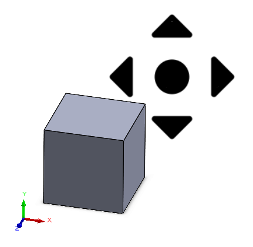

{ width=350 }

This example demonstrates how to move the view (pan) by specifying the offset in X and Y coordinates of the screen (pixels). Macro transforms the offset into the model view 3D space and updates the view positions.

~~~ vb
Dim swApp As SldWorks.SldWorks
Dim swModel As SldWorks.ModelDoc2
Dim swView As SldWorks.ModelView

Sub main()

    Set swApp = Application.SldWorks
    
    Set swModel = swApp.ActiveDoc
    
    Set swView = swModel.ActiveView
    
    Dim swMathUtils As SldWorks.MathUtility
    Set swMathUtils = swApp.GetMathUtility
    
    Dim dVec(2) As Double
    dVec(0) = 100
    dVec(1) = 0
    dVec(2) = 0
    
    Dim swVector As SldWorks.MathVector
    Set swVector = swMathUtils.CreateVector(dVec)
    
    Dim swViewToScreenTransform As SldWorks.MathTransform
    Set swViewToScreenTransform = swView.Transform
    
    Dim swScreenToViewTransform As SldWorks.MathTransform
    Set swScreenToViewTransform = swViewToScreenTransform.Inverse
    
    Dim swDestVec As SldWorks.MathVector
    Set swDestVec = swVector.MultiplyTransform(swScreenToViewTransform)
    
    Set swDestVec = swDestVec.MultiplyTransform(swView.Orientation3)
    
    Set swDestVec = swDestVec.Scale(swView.Scale2)
    
    Dim swTranslateVec As SldWorks.MathVector
    Set swTranslateVec = swView.Translation3
    
    Set swTranslateVec = swTranslateVec.Add(swDestVec)
    
    swView.Translation3 = swTranslateVec
    
    swView.GraphicsRedraw Nothing
    
End Sub
~~~

