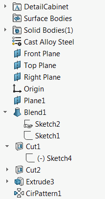

This VBA macro allows to rename the feature manager tree in the part document using SOLIDWORKS API based on specified rules and feature type names.

This macro can be used as a translator macro to rename feature tree form one language to another.

For example this feature tree is in Russian language:

{ width=150 }

It can be renamed to English language equivalent:

{ width=150 }

## Configuration

Macro is using the data specified in 2 files which must be stored in the same folder as the macro:

~~~ vb
Const NO_INCREMENT_FILE As String = "noincrement.csv"
Const CUSTOM_MAP_FILE As String = "custommap.csv"
~~~

These files can be edited in Excel or any text editor (like Notepad).

### No Increment CSV File

This file contains the feature type names whose names should not be increment (i.e. they present once in a tree), for example *Origin* feature or *Documents Folder*.

This is a single column CSV file. [Download](noincrement.csv)

### Custom Map CSV File

This file contains the special names for the feature types. By default the feature will be named after its type, but this behavior can be overridden in this file. For example type name for the *Sketch* feature is *OriginProfileFeature*, so by default all sketches will be renamed to *OriginProfileFeature1*, *OriginProfileFeature2*, *OriginProfileFeature3* etc., unless the following line is added to *custommap.csv* file

~~~
OriginProfileFeature,Sketch
~~~

In this case the sketches will be renamed to *Sketch1*, *Sketch2*, *Sketch3*

This is a 2 column CSV file

[Download](custommap.csv)

## Feature Types

Feature types are language independent identifiers of feature kind. Use [Get Features Type Name](/docs/codestack/solidworks-api/document/features-manager/get-feature-type-name/) VBA macro to extract type names. Use *Type Name 2* unless it is equal to *ICE* (in this case use *Type Name 1*)

### Special Feature Types

There are several special types of feature which can be used for renaming

* _FrontPlane
* _RightPlane
* _TopPlane

~~~ vb
Const NO_INCREMENT_FILE As String = "noincrement.csv"
Const CUSTOM_MAP_FILE As String = "custommap.csv"

Dim swApp As SldWorks.SldWorks

Sub main()

    Set swApp = Application.SldWorks
    
    Dim swModel As SldWorks.ModelDoc2
    
    Set swModel = swApp.ActiveDoc
    
    If Not swModel Is Nothing Then
    
        Dim dicFeatsCount As Object
        Dim collFeatsNonIncr As Collection
        Dim dicBaseNames As Object
        
        Set dicFeatsCount = CreateObject("Scripting.Dictionary")
        Set collFeatsNonIncr = New Collection
        Set dicBaseNames = CreateObject("Scripting.Dictionary")
        
        Dim vTable As Variant
        Dim i As Integer
        
        vTable = ReadCsvFile(swApp.GetCurrentMacroPathFolder() & "\" & NO_INCREMENT_FILE, False)
        
        If Not IsEmpty(vTable) Then
            For i = 0 To UBound(vTable)
                collFeatsNonIncr.Add vTable(i)(0)
            Next
        End If
        
        vTable = ReadCsvFile(swApp.GetCurrentMacroPathFolder() & "\" & CUSTOM_MAP_FILE, False)
        
        If Not IsEmpty(vTable) Then
            For i = 0 To UBound(vTable)
                dicBaseNames.Add vTable(i)(0), vTable(i)(1)
            Next
        End If
        
        Dim vFeats As Variant
        vFeats = GetAllFeatures(swModel)
                
        Dim curRefPlanePos As Integer
        curRefPlanePos = 0
                
        For i = 0 To UBound(vFeats)
                
            Dim swFeat As SldWorks.Feature
            Set swFeat = vFeats(i)
                
            Dim newName As String
            
            Dim typeName As String
            typeName = GetTypeName(swFeat, curRefPlanePos)
            
            If dicFeatsCount.exists(typeName) Then
                dicFeatsCount.item(typeName) = dicFeatsCount.item(typeName) + 1
            Else
                dicFeatsCount.Add typeName, 1
            End If
            
            If dicBaseNames.exists(typeName) Then
                newName = dicBaseNames.item(typeName)
            Else
                newName = typeName
            End If
            
            Dim isIncremented As Boolean
            isIncremented = True
            Dim j As Integer
            For j = 1 To collFeatsNonIncr.Count
                If collFeatsNonIncr(j) = typeName Then
                    isIncremented = False
                    Exit For
                End If
            Next
            
            If isIncremented Then
                newName = newName & dicFeatsCount.item(typeName)
            End If
            
            If typeName = "MaterialFolder" Then
                
                isRefGeom = True
                
                Dim sMatName As String
                
                Dim swPart As SldWorks.PartDoc
                Set swPart = swModel
                
                sMatName = swPart.GetMaterialPropertyName2("", "")
                
                If sMatName <> "" Then
                    newName = sMatName
                End If
                
            End If
            
            swFeat.Name = newName
            
            Set swFeat = swFeat.GetNextFeature
            
        Next
        
    Else
        Err.Raise vbError, "", "Open the model"
    End If
    
End Sub

Function GetAllFeatures(model As SldWorks.ModelDoc2) As Variant

    Dim swFeat As SldWorks.Feature
    
    Dim swFeats() As SldWorks.Feature
    
    Set swFeat = model.FirstFeature
    
    While Not swFeat Is Nothing
        
        If swFeat.GetTypeName2() <> "Reference" Then
        
            ProcessFeature swFeat, swFeats
            
            If swFeat.GetTypeName2 <> "HistoryFolder" Then
                
                TraverseSubFeatures swFeat, swFeats
            
            End If
        
        End If
        
        Set swFeat = swFeat.GetNextFeature
        
    Wend
    
    GetAllFeatures = swFeats
    
End Function

Sub TraverseSubFeatures(parentFeat As SldWorks.Feature, feats() As SldWorks.Feature)
    
    Dim swChildFeat As SldWorks.Feature
    Set swChildFeat = parentFeat.GetFirstSubFeature
    
    While Not swChildFeat Is Nothing
        ProcessFeature swChildFeat, feats
        Set swChildFeat = swChildFeat.GetNextSubFeature()
    Wend
    
End Sub

Sub ProcessFeature(feat As SldWorks.Feature, feats() As SldWorks.Feature)
    
    If Not Contains(feats, feat) Then
        If (Not feats) = -1 Then
            ReDim feats(0)
        Else
            ReDim Preserve feats(UBound(feats) + 1)
        End If
        
        Set feats(UBound(feats)) = feat
    End If
    
End Sub

Function Contains(arr As Variant, item As Object) As Boolean
    
    Dim i As Integer
    
    For i = 0 To UBound(arr)
        If arr(i) Is item Then
            Contains = True
            Exit Function
        End If
    Next
    
    Contains = False
    
End Function

Function GetTypeName(feat As SldWorks.Feature, ByRef curRefPlanePos As Integer) As String

    Dim typeName As String
    
    typeName = feat.GetTypeName2()
    
    If typeName = "RefPlane" Then
    
        Select Case curRefPlanePos
            Case 0
                typeName = "_FrontPlane"
            Case 1
                typeName = "_TopPlane"
            Case 2
                typeName = "_RightPlane"
        End Select
        
        curRefPlanePos = curRefPlanePos + 1
        
    ElseIf typeName = "ICE" Then
    
        typeName = feat.GetTypeName()
        
    End If
    
    GetTypeName = typeName
    
End Function

Function ReadCsvFile(filePath As String, firstRowHeader As Boolean) As Variant
    
    'rows x columns
    Dim vTable() As Variant
        
    Dim fileName As String
    Dim tableRow As String
    
    Set fso = CreateObject("Scripting.FileSystemObject")
    
    If fso.FileExists(filePath) Then
    
        Set file = fso.OpenTextFile(filePath)
        
        Dim isFirstRow As Boolean
        Dim isTableInit As Boolean
        
        isFirstRow = True
        isTableInit = False
        
        Do Until file.AtEndOfStream
            
            tableRow = file.ReadLine
            
            If Not isFirstRow Or Not firstRowHeader Then
                
                Dim vCells As Variant
                vCells = Split(tableRow, ",")
                
                Dim lastRowIndex As Integer
                
                If Not isTableInit Then
                    lastRowIndex = 0
                    isTableInit = True
                    ReDim Preserve vTable(lastRowIndex)
                Else
                    lastRowIndex = UBound(vTable, 1) + 1
                    ReDim Preserve vTable(lastRowIndex)
                End If
                
                vTable(lastRowIndex) = vCells
                
            End If
            
            If isFirstRow Then
                isFirstRow = False
            End If
            
        Loop
        
        file.Close
        
        If isTableInit Then
            ReadCsvFile = vTable
        Else
            ReadCsvFile = Empty
        End If
        
    Else
        ReadCsvFile = Empty
    End If
    
End Function
~~~

