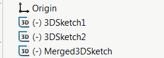

This VBA macro merges the selected sketches (3D and 3D) into a single 3D sketch using SOLIDWORKS API. This macro is using convert entities API to copy the entities from the source sketches to a target sketch.

## Options

Macro can be configured by changing the values of the constant at the beginning of the macro

* *DELETE_SOURCE_SKETCHES* - True to delete original source sketches, False to not delete
* *NEW_SKETCH_NAME* - Name for the newly generated merged sketch, Empty string to use default auto generated name

~~~ vb
Const DELETE_SOURCE_SKETCHES As Boolean = True 'delete all source sketches
Const NEW_SKETCH_NAME As String = "MergedSketch" 'new merged sketch to be named 'MergedSketch'
~~~

## Notes

* Sketches in the assembly or drawings components are also supported
* Relations and dimensions from the source sketch are not copied to a target sketch
* Sketches are merged to an active 3D sketch, or new 3D sketch is created automatically

Use this macro in conjunction with [Select Features By Type](/docs/codestack/solidworks-api/document/selection/select-features-by-type/) to select all sketches to be merged.

~~~ vb
Const DELETE_SOURCE_SKETCHES As Boolean = False
Const NEW_SKETCH_NAME As String = ""

Dim swApp As SldWorks.SldWorks

Sub main()

    Set swApp = Application.SldWorks
    
    Dim swModel As SldWorks.ModelDoc2
    
try:
        
    On Error GoTo catch
        
    Set swModel = swApp.ActiveDoc
    
    If Not swModel Is Nothing Then
        MergeSelectedSketches swModel
    Else
        Err.Raise vbError, "", "Please open model"
    End If
    
    GoTo finally
    
catch:
    Debug.Print Err.Number
    swApp.SendMsgToUser2 Err.Description, swMessageBoxIcon_e.swMbStop, swMessageBoxBtn_e.swMbOk
finally:

End Sub

Sub MergeSelectedSketches(model As SldWorks.ModelDoc2)
    
    Dim swSketch As SldWorks.Sketch
        
    If Not model.SketchManager.ActiveSketch Is Nothing Then
        If False = model.SketchManager.ActiveSketch.Is3D() Then
            Err.Raise vbError, "", "Only 3D sketch is supported as a target sketch"
        End If
    End If
    
    Dim vSketchSegs As Variant
    Dim vSketches As Variant
    vSketchSegs = GetSelectedSketchSegments(model, vSketches)
    
    If model.SketchManager.ActiveSketch Is Nothing Then
        model.ClearSelection2 True
        model.SketchManager.Insert3DSketch True
    End If
    
    Dim swTargetSketch As SldWorks.Feature
    
    If model.Extension.MultiSelect2(vSketchSegs, False, Nothing) = UBound(vSketchSegs) + 1 Then
    
        model.SketchManager.SketchUseEdge3 False, False
        
        Set swTargetSketch = model.SketchManager.ActiveSketch
        
        model.SketchManager.ActiveSketch.RelationManager.DeleteAllRelations
                
        model.SketchManager.Insert3DSketch True
    Else
        Err.Raise vbError, "", "Failed to select sketches"
    End If
    
    If DELETE_SOURCE_SKETCHES Then
        If model.Extension.MultiSelect2(vSketches, False, Nothing) = UBound(vSketches) + 1 Then
            model.Extension.DeleteSelection2 swDeleteSelectionOptions_e.swDelete_Absorbed
        Else
            Err.Raise vbError, "", "Failed to selected sketches for deletion"
        End If
    End If
    
    If NEW_SKETCH_NAME <> "" Then
        swTargetSketch.Name = NEW_SKETCH_NAME
    End If
    
End Sub

Function GetSelectedSketchSegments(model As SldWorks.ModelDoc2, ByRef vSketches As Variant) As Variant
    
    Dim swSketches() As SldWorks.Feature
    Dim isSkArrInit As Boolean
    isSkArrInit = False
    
    Dim swSketchSegs() As SldWorks.SketchSegment
    Dim isInit As Boolean
    isInit = False
    
    Dim swSelMgr As SldWorks.SelectionMgr
    Set swSelMgr = model.SelectionManager
    
    Dim i As Integer
    
    For i = 1 To swSelMgr.GetSelectedObjectCount2(-1)
        
        If swSelMgr.GetSelectedObjectType3(i, -1) = swSelectType_e.swSelSKETCHES Then
            
            Dim swFeat As SldWorks.Feature
            Set swFeat = swSelMgr.GetSelectedObject6(i, -1)
            
            If Not isSkArrInit Then
                isSkArrInit = True
                ReDim swSketches(0)
            Else
                ReDim Preserve swSketches(UBound(swSketches) + 1)
            End If
            
            Set swSketches(UBound(swSketches)) = swFeat
            
            Dim swSketch As SldWorks.Sketch
            Set swSketch = swFeat.GetSpecificFeature2
            
            Dim vSegs As Variant
            vSegs = swSketch.GetSketchSegments
            
            Dim j As Integer
            
            If Not IsEmpty(vSegs) Then
                                
                For j = 0 To UBound(vSegs)
                                
                    If Not isInit Then
                        ReDim swSketchSegs(0)
                        isInit = True
                    Else
                        ReDim Preserve swSketchSegs(UBound(swSketchSegs) + 1)
                    End If
                    
                    Set swSketchSegs(UBound(swSketchSegs)) = vSegs(j)
                
                Next
                
            End If
            
        End If
    Next
    
    GetSelectedSketchSegments = swSketchSegs
    
    If isSkArrInit Then
        vSketches = swSketches
    End If
    
End Function
~~~

