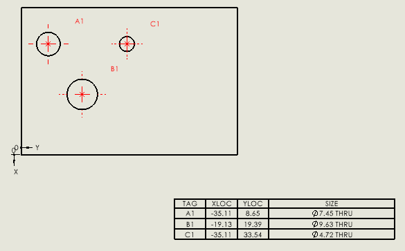

{ width=300 }

This macro demonstrates how to insert holes table into the existing drawing.

Before running the macro it is required to preselect input objects in the following order.

1. Vertex which corresponds to an origin
1. Edge which corresponds to X axis
1. Edge which corresponds to Y axis
1. Face which contains holes

Macro will clear the selection and reselect entities.

Table is inserted using default template into 0,0 coordinate.

 > Note, in your case you might be using different approach of retrieving the pointers to entities. 

 ~~~ vb
Dim swApp As SldWorks.SldWorks

Sub main()

    Set swApp = Application.SldWorks

    Dim swModel As SldWorks.ModelDoc2
    
    Set swModel = swApp.ActiveDoc
    
    Dim swSelMgr As SldWorks.SelectionMgr
    
    Set swSelMgr = swModel.SelectionManager
    
    Dim swVertexOrigin As SldWorks.Entity
    Dim swEdgeX As SldWorks.Entity
    Dim swEdgeY As SldWorks.Entity
    Dim swHolesFace As SldWorks.Entity
    
    Set swVertexOrigin = swSelMgr.GetSelectedObject6(2, -1)
    Set swEdgeX = swSelMgr.GetSelectedObject6(3, -1)
    Set swEdgeY = swSelMgr.GetSelectedObject6(4, -1)
    Set swHolesFace = swSelMgr.GetSelectedObject6(5, -1)
    
    Dim swView As SldWorks.View
    Set swView = swModel.SelectionManager.GetSelectedObjectsDrawingView(1)
    
    swModel.ClearSelection2 True
    
    swVertexOrigin.SelectByMark False, 1
    swEdgeX.SelectByMark True, 4
    swEdgeY.SelectByMark True, 8
    swHolesFace.SelectByMark True, 2
    
    Dim swHoleTable As SldWorks.TableAnnotation
    Set swHoleTable = swView.InsertHoleTable2(False, 0, 0, 1, "", "")
    
End Sub
~~~

