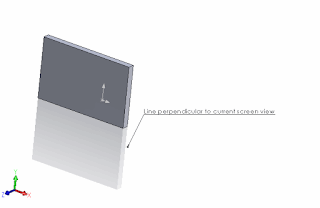

This example demonstrates how to draw a sketch line which is perpendicular (normal) to the current view orientation relative to the screen using SOLIDWORKS API.

The line will start at the point at the middle of the screen and will be perpendicular to the screen orientation. That means that initially it will be rendered as point until view rotates.

[IModelView::Transform](https://help.solidworks.com/2018/english/api/sldworksapi/solidworks.interop.sldworks~solidworks.interop.sldworks.imodelview~transform.html) SOLIDWORKS API property is used to extract the transformation matrix of current orientation of the view.

{ width=320 height=208 }

~~~ vb
Dim swApp As SldWorks.SldWorks
Dim swModel As SldWorks.ModelDoc2
Dim swMathUtils As SldWorks.MathUtility

Sub main()

    Set swApp = Application.SldWorks
    
    Set swMathUtils = swApp.GetMathUtility
    
    Set swModel = swApp.ActiveDoc
    
    If Not swModel Is Nothing Then
    
        Dim swModelView As SldWorks.modelView
        
        Set swModelView = swModel.ActiveView
        
        If Not swModelView Is Nothing Then
            
            Dim swNormVec As SldWorks.MathVector
            Dim swMidPt As SldWorks.MathPoint
            
            Set swNormVec = GetNormalVector(swModelView)
            Set swMidPt = GetMidPoint(swModelView)
            
            DrawVector swMidPt.ArrayData, swNormVec.ArrayData, 0.1
            
        Else
            MsgBox "Active model doesn't contain view"
        End If
        
    Else
        MsgBox "Please open the 3D model"
    End If
    
End Sub

Function GetNormalVector(modelView As SldWorks.modelView) As SldWorks.MathVector
    
    Dim swScreenToModelViewTransform As SldWorks.MathTransform
    Set swScreenToModelViewTransform = modelView.Transform.Inverse()
    
    Dim dVec(2) As Double
    dVec(0) = 0: dVec(1) = 0: dVec(2) = 1
    
    Dim swNormVec As SldWorks.MathVector
    Set swNormVec = swMathUtils.CreateVector(dVec)
    
    Set swNormVec = swNormVec.MultiplyTransform(swScreenToModelViewTransform)
    
    Set GetNormalVector = swNormVec
    
End Function

Function GetMidPoint(modelView As SldWorks.modelView) As SldWorks.MathPoint
    
    Dim swScreenToModelViewTransform As SldWorks.MathTransform
    Set swScreenToModelViewTransform = modelView.Transform.Inverse()
    
    Dim dPt(2) As Double
    dPt(0) = modelView.FrameWidth / 2
    dPt(1) = modelView.FrameHeight / 2
    dPt(2) = 0
    
    Dim swMathPt As SldWorks.MathPoint
    Set swMathPt = swMathUtils.CreatePoint(dPt)
    
    Set swMathPt = swMathPt.MultiplyTransform(swScreenToModelViewTransform)
        
    Set GetMidPoint = swMathPt
    
End Function

Function DrawVector(startPt As Variant, dir As Variant, length As Double)
    
    swModel.ClearSelection2 True
    
    Dim swEndPt As SldWorks.MathPoint
    Dim swDirVec As SldWorks.MathVector
    
    Set swDirVec = swMathUtils.CreateVector(dir)
    Set swDirVec = swDirVec.Normalise()
    Set swDirVec = swDirVec.Scale(length)
    
    Set swEndPt = swMathUtils.CreatePoint(startPt)
    Set swEndPt = swEndPt.AddVector(swDirVec)
    
    Dim endPt As Variant
    endPt = swEndPt.ArrayData
    
    swModel.Insert3DSketch2 True
    swModel.SketchManager.AddToDB = True
    
    swModel.SketchManager.CreateLine startPt(0), startPt(1), startPt(2), endPt(0), endPt(1), endPt(2)
    
    swModel.SketchManager.AddToDB = False
    swModel.Insert3DSketch2 True
    
End Function
~~~

