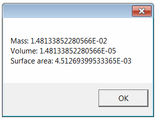

This example demonstrates how to extract mass properties from the specified file using vbScript via SOLIDWORKS API.

* Create a text file and name it as *get-mass-prps.vbs*
* Copy-paste the following code into the file

~~~ vbs
Dim swApp
Set swApp = CreateObject("SldWorks.Application")

Dim filePath
filePath = InputBox("Specify the path to the part file")

Dim docSpec
Set docSpec = swApp.GetOpenDocSpec(filePath)
docSpec.ReadOnly = True
docSpec.Silent = True

Dim swModel
Set swModel = swApp.OpenDoc7(docSpec)

Dim swMassPrps
Set swMassPrps = swModel.Extension.CreateMassProperty()

MsgBox "Mass: " & swMassPrps.Mass & vbLf & "Volume: " & swMassPrps.Volume & vbLf & "Surface area: " & swMassPrps.SurfaceArea

swApp.CloseDoc swModel.GetTitle()
~~~

* Save the file
* Double click to run the script
* Specify the full path to a SOLIDWORKS file (part or assembly) in the displayed input box
* As the result the following message box is displayed with mass property values

{ width=250 }
