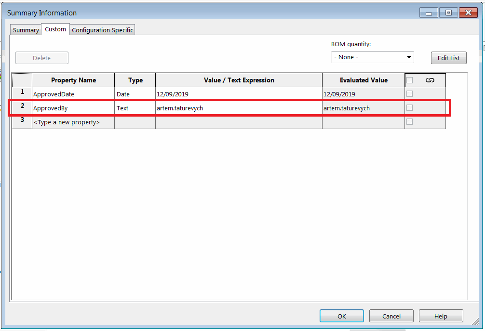

{ width=450 }

This VBA example demonstrates how to add the *ApprovedBy* property with the value of the name of current user to all sources using Document Manager API. Property will be added (or updated) for the file (general), all configurations and all cut-list items.

Specify the full path of the file in the *FILE_PATH* constant.

~~~ vb
Const SW_DM_KEY As String = "Your License Key"

Const FILE_PATH As String = "C:\SampleModel.SLDPRT"
Const PRP_NAME As String = "ApprovedBy"

Dim swDmClassFactory As SwDocumentMgr.swDmClassFactory
Dim swDmApp As SwDocumentMgr.SwDMApplication

Sub main()

    Set swDmClassFactory = CreateObject("SwDocumentMgr.SwDMClassFactory")
    
    If Not swDmClassFactory Is Nothing Then
        
        Set swDmApp = swDmClassFactory.GetApplication(SW_DM_KEY)
        Dim swDmDoc As SwDocumentMgr.SwDMDocument19
        Set swDmDoc = OpenDocument(FILE_PATH, False)
        
        Dim curUser As String
        curUser = Environ("UserName")
        
        SetGeneralProperty swDmDoc, PRP_NAME, curUser, SwDmCustomInfoType.swDmCustomInfoText
        SetConfigurationSpecificProperty swDmDoc, PRP_NAME, curUser, SwDmCustomInfoType.swDmCustomInfoText
        SetCutListProperty swDmDoc, PRP_NAME, curUser, SwDmCustomInfoType.swDmCustomInfoText
        
        swDmDoc.Save
        swDmDoc.CloseDoc
        
    Else
        MsgBox "Document Manager SDK is not installed"
    End If
    
End Sub

Sub SetGeneralProperty(dmDoc As SwDocumentMgr.SwDMDocument19, prpName As String, prpVal As String, prpType As SwDmCustomInfoType)
    dmDoc.AddCustomProperty prpName, prpType, prpVal
    dmDoc.SetCustomProperty prpName, prpVal
End Sub

Sub SetConfigurationSpecificProperty(dmDoc As SwDocumentMgr.SwDMDocument19, prpName As String, prpVal As String, prpType As SwDmCustomInfoType)
    
    Dim vConfNames As Variant
    vConfNames = dmDoc.ConfigurationManager.GetConfigurationNames()
    
    Dim i As Integer
        
    For i = 0 To UBound(vConfNames)
        
        Dim confName As String
        confName = vConfNames(i)
        
        Dim swDmConf As SwDocumentMgr.SwDMConfiguration13
        Set swDmConf = dmDoc.ConfigurationManager.GetConfigurationByName(confName)
        
        swDmConf.AddCustomProperty prpName, prpType, prpVal
        swDmConf.SetCustomProperty prpName, prpVal
        
    Next
    
End Sub

Sub SetCutListProperty(dmDoc As SwDocumentMgr.SwDMDocument19, prpName As String, prpVal As String, prpType As SwDmCustomInfoType)
    
    Dim vConfNames As Variant
    vConfNames = dmDoc.ConfigurationManager.GetConfigurationNames()
    
    Dim i As Integer
    
    For i = 0 To UBound(vConfNames)
        
        Dim confName As String
        confName = vConfNames(i)
        
        Dim swDmConf As SwDocumentMgr.SwDMConfiguration16
        Set swDmConf = dmDoc.ConfigurationManager.GetConfigurationByName(confName)
        
        Dim vCutListItems As Variant
        vCutListItems = swDmConf.GetCutListItems
                
        If Not IsEmpty(vCutListItems) Then
            
            Dim j As Integer
            
            For j = 0 To UBound(vCutListItems)
                
                Dim swDmCutList As SwDocumentMgr.SwDMCutListItem3
                Set swDmCutList = vCutListItems(j)
                
                swDmCutList.AddCustomProperty prpName, prpType, prpVal
                swDmCutList.SetCustomProperty prpName, prpVal
                
            Next
        
        End If
        
    Next
    
End Sub

Function OpenDocument(filePath As String, readOnly As Boolean) As SwDocumentMgr.SwDMDocument19
    
    Dim openErr As SwDmDocumentOpenError
    
    Dim docType As SwDocumentMgr.SwDmDocumentType
    
    Dim ext As String
    ext = LCase(Right(filePath, Len(".SLDXXX")))
    
    Select Case ext
        Case ".sldprt"
            docType = swDmDocumentPart
        Case ".sldasm"
            docType = swDmDocumentAssembly
        Case ".slddrw"
            docType = swDmDocumentDrawing
    End Select
    
    Dim swDmDoc As SwDocumentMgr.SwDMDocument19
    
    Set swDmDoc = swDmApp.GetDocument(filePath, docType, readOnly, openErr)
    
    If swDmDoc Is Nothing Then
        Err.Raise vbError, "", "Failed to open document: " & openErr
    End If
    
    Set OpenDocument = swDmDoc
    
End Function
~~~

