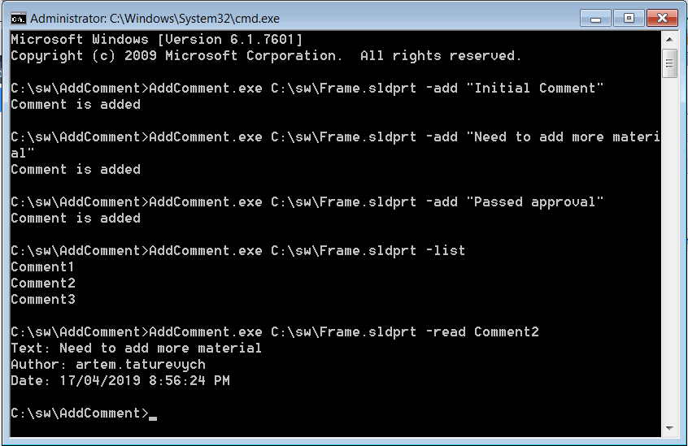

This example demonstrates how to store user text comments directly in the model 3rd party storage store using SOLIDWORKS Document Manager API.

Each comment is stored in the individual sub stream of 3rd party storage store. Specific comment can be accessed without the need of loading of all comments.

The program developed as a console application and has 3 modes

* Add new comment. Performed by adding the -add switch followed by comment content

~~~
AddWatermark.exe C:\MyFile.sldprt -add "Sample Comment"
~~~

* List all comments. Performed by adding the -list switch. This command loads the names of all comments without loading their contents.

~~~
AddWatermark.exe C:\MyFile.sldprt -list
~~~

* Read specific comment. Performed by adding the -read switch followed by comment name. In this case he comment information (text, author and date) is loaded and printed to the console.

~~~
AddWatermark.exe C:\MyFile.sldprt -read Comment3
~~~

{ width=450 }

### Program.cs

Routine to handle the command line parameters and perform corresponding operations.

~~~ cs
using SolidWorks.Interop.swdocumentmgr;
using System;
using System.IO;
using System.Linq;
using System.Xml.Serialization;
using ThirdPartyStorage;

namespace CodeStack
{
    public class Comment
    {
        public string Text { get; set; }
        public string Author { get; set; }
        public DateTime Date { get; set; }
    }

    class Program
    {
        private enum Action_e
        {
            AddComment,
            ListComments,
            ReadComment
        }

        private const string DM_LIC_KEY = "<Your DM License Key>";
        private const string STORAGE_STORE_NAME = "CodeStackComments";

        private const string ARG_ADD_COMMENT = "-add";
        private const string ARG_LIST_COMMENTS = "-list";
        private const string ARG_READ_COMMENT = "-read";

        static void Main(string[] args)
        {
            var filePath = args[0];

            var action = Action_e.AddComment;

            switch (args[1])
            {
                case ARG_ADD_COMMENT:
                    action = Action_e.AddComment;
                    break;

                case ARG_LIST_COMMENTS:
                    action = Action_e.ListComments;
                    break;

                case ARG_READ_COMMENT:
                    action = Action_e.ReadComment;
                    break;

                default:
                    throw new NotSupportedException("Action is not supported");
            }

            var docType = GetDocumentType(filePath);
            
            var dmApp = ConnectoToDm(DM_LIC_KEY);

            SwDmDocumentOpenError err;
            var doc = dmApp.GetDocument(filePath, docType, action != Action_e.AddComment, out err) as SwDMDocument19;

            if (doc != null)
            {
                var storage = doc.Get3rdPartyStorageStore(STORAGE_STORE_NAME, action == Action_e.AddComment) as IStorage;

                try
                {
                    switch (action)
                    {
                        case Action_e.AddComment:
                            AddComment(storage, args[2]);
                            break;

                        case Action_e.ListComments:
                            ListComments(storage);
                            break;

                        case Action_e.ReadComment:
                            ReadComment(storage, args[2]);
                            break;
                    }
                }
                catch
                {
                    throw;
                }
                finally
                {
                    doc.Release3rdPartyStorageStore(STORAGE_STORE_NAME);

                    if (action == Action_e.AddComment)
                    {
                        doc.Save();
                    }

                    doc.CloseDoc();
                }
            }
            else
            {
                throw new NullReferenceException($"Failed to open the document: {err}");
            }
        }

        private static void ReadComment(IStorage storage, string name)
        {
            if (storage != null)
            {
                using (var comStorage = new ComStorage(storage, false))
                {
                    var stream = comStorage.OpenStream(name);

                    using (var comStream = new ComStream(stream, false, false))
                    {
                        var ser = new XmlSerializer(typeof(Comment));
                        var wm = ser.Deserialize(comStream) as Comment;

                        Console.WriteLine($"Text: {wm.Text}");
                        Console.WriteLine($"Author: {wm.Author}");
                        Console.WriteLine($"Date: {wm.Date}");
                    }
                }
            }
            else
            {
                Console.WriteLine("Comments not available");
            }
        }

        private static void AddComment(IStorage storage, string text)
        {
            var wm = new Comment()
            {
                Text = text,
                Author = Environment.UserName,
                Date = DateTime.Now
            };

            using (var comStorage = new ComStorage(storage, true))
            {
                var stream = comStorage.CreateStream($"Comment{comStorage.EnumElements().Count() + 1}");

                using (var comStream = new ComStream(stream, true))
                {
                    var ser = new XmlSerializer(wm.GetType());
                    ser.Serialize(comStream, wm);
                }
            }

            Console.WriteLine("Comment is added");
        }

        private static void ListComments(IStorage storage)
        {
            using (var comStorage = new ComStorage(storage, false))
            {
                foreach (var elem in comStorage.EnumElements())
                {
                    Console.WriteLine(elem.pwcsName);
                }
            }
        }

        private static SwDMApplication ConnectoToDm(string licKey)
        {
            var classFact = new SwDMClassFactory();
            var docMgr = classFact.GetApplication(licKey) as SwDMApplication;

            return docMgr;
        }

        private static SwDmDocumentType GetDocumentType(string filePath)
        {
            var docType = SwDmDocumentType.swDmDocumentUnknown;

            switch (Path.GetExtension(filePath).ToUpper())
            {
                case ".SLDPRT":
                    docType = SwDmDocumentType.swDmDocumentPart;
                    break;
                case ".SLDASM":
                    docType = SwDmDocumentType.swDmDocumentAssembly;
                    break;
                case ".SLDDRW":
                    docType = SwDmDocumentType.swDmDocumentDrawing;
                    break;
                default:
                    throw new NotSupportedException("File type not supported");

            }

            return docType;
        }
    }
}

~~~

### ComStorage.cs

Wrapper around [IStorage](https://docs.microsoft.com/en-us/windows/desktop/api/objidl/nn-objidl-istorage) interface which simplifies the access from .NET language

~~~ cs
using System;
using System.Collections.Generic;
using System.Runtime.InteropServices;
using System.Diagnostics;
using System.IO;
using System.Runtime.InteropServices.ComTypes;

namespace ThirdPartyStorage
{
    #region WinAPI

    [Flags]
    public enum STGM : int
    {
        STGM_READ = 0x0,
        STGM_WRITE = 0x1,
        STGM_READWRITE = 0x2,
        STGM_SHARE_DENY_NONE = 0x40,
        STGM_SHARE_DENY_READ = 0x30,
        STGM_SHARE_DENY_WRITE = 0x20,
        STGM_SHARE_EXCLUSIVE = 0x10,
        STGM_PRIORITY = 0x40000,
        STGM_CREATE = 0x1000,
        STGM_CONVERT = 0x20000,
        STGM_FAILIFTHERE = 0x0,
        STGM_DIRECT = 0x0,
        STGM_TRANSACTED = 0x10000,
        STGM_NOSCRATCH = 0x100000,
        STGM_NOSNAPSHOT = 0x200000,
        STGM_SIMPLE = 0x8000000,
        STGM_DIRECT_SWMR = 0x400000,
        STGM_DELETEONRELEASE = 0x4000000
    }

    public enum STGTY : int
    {
        STGTY_STORAGE = 1,
        STGTY_STREAM = 2,
        STGTY_LOCKBYTES = 3,
        STGTY_PROPERTY = 4
    };

    [ComImport]
    [Guid("0000000d-0000-0000-C000-000000000046")]
    [InterfaceType(ComInterfaceType.InterfaceIsIUnknown)]
    public interface IEnumSTATSTG
    {
        [PreserveSig]
        uint Next(uint celt,
        [MarshalAs(UnmanagedType.LPArray), Out]
        System.Runtime.InteropServices.ComTypes.STATSTG[] rgelt,
        out uint pceltFetched
        );

        void Skip(uint celt);

        void Reset();

        [return: MarshalAs(UnmanagedType.Interface)]
        IEnumSTATSTG Clone();
    }

    [ComImport]
    [Guid("0000000b-0000-0000-C000-000000000046")]
    [InterfaceType(ComInterfaceType.InterfaceIsIUnknown)]
    public interface IStorage
    {
        void CreateStream(string pwcsName, uint grfMode, uint reserved1, uint reserved2, out IStream ppstm);
        void OpenStream(string pwcsName, IntPtr reserved1, uint grfMode, uint reserved2, out IStream ppstm);
        void CreateStorage(string pwcsName, uint grfMode, uint reserved1, uint reserved2, out IStorage ppstg);
        void OpenStorage(string pwcsName, IStorage pstgPriority, uint grfMode, IntPtr snbExclude, uint reserved, out IStorage ppstg);
        void CopyTo(uint ciidExclude, Guid rgiidExclude, IntPtr snbExclude, IStorage pstgDest);
        void MoveElementTo(string pwcsName, IStorage pstgDest, string pwcsNewName, uint grfFlags);
        void Commit(uint grfCommitFlags);
        void Revert();
        void EnumElements(uint reserved1, IntPtr reserved2, uint reserved3, out IEnumSTATSTG ppenum);
        void DestroyElement(string pwcsName);
        void RenameElement(string pwcsOldName, string pwcsNewName);
        void SetElementTimes(string pwcsName, System.Runtime.InteropServices.ComTypes.FILETIME pctime, System.Runtime.InteropServices.ComTypes.FILETIME patime, System.Runtime.InteropServices.ComTypes.FILETIME pmtime);
        void SetClass(Guid clsid);
        void SetStateBits(uint grfStateBits, uint grfMask);
        void Stat(out System.Runtime.InteropServices.ComTypes.STATSTG pstatstg, uint grfStatFlag);
    }

    #endregion

    public class ComStorage : IDisposable
    {
        [DllImport("ole32.dll")]
        public static extern int StgOpenStorage(
            [MarshalAs(UnmanagedType.LPWStr)] string pwcsName,
            IStorage pstgPriority,
            int grfMode,
            IntPtr snbExclude,
            uint reserved,
            out IStorage ppstgOpen);

        private IStorage m_Storage;
        private bool m_IsWritable;

        public ComStorage(IStorage storage, bool writable)
        {
            if (storage == null)
            {
                throw new ArgumentNullException(nameof(storage));
            }

            m_IsWritable = writable;
            m_Storage = storage;
        }

        public IStorage OpenStorage(string storageName, STGM mode = STGM.STGM_SHARE_EXCLUSIVE)
        {
            IStorage storage;

            m_Storage.OpenStorage(storageName, null,
                (uint)mode, IntPtr.Zero, 0, out storage);

            return storage;
        }

        public IStream OpenStream(string streamName, STGM mode = STGM.STGM_SHARE_EXCLUSIVE)
        {
            IStream stream = null;

            m_Storage.OpenStream(streamName,
                IntPtr.Zero, (uint)mode, 0, out stream);

            return stream;
        }

        public IStream CreateStream(string streamName)
        {
            IStream stream = null;

            m_Storage.CreateStream(streamName,
                (uint)STGM.STGM_CREATE | (uint)STGM.STGM_SHARE_EXCLUSIVE | (uint)STGM.STGM_WRITE,
                0, 0, out stream);

            return stream;
        }

        public IStorage CreateStorage(string streamName)
        {
            IStorage storage = null;

            m_Storage.CreateStorage(streamName,
                (uint)STGM.STGM_CREATE | (uint)STGM.STGM_SHARE_EXCLUSIVE | (uint)STGM.STGM_WRITE,
                0, 0, out storage);

            return storage;
        }

        public IEnumerable<System.Runtime.InteropServices.ComTypes.STATSTG> EnumElements()
        {
            IEnumSTATSTG ssenum = null;

            m_Storage.EnumElements(0, IntPtr.Zero, 0, out ssenum);

            var ssstruct = new System.Runtime.InteropServices.ComTypes.STATSTG[1];

            uint numReturned;

            do
            {
                ssenum.Next(1, ssstruct, out numReturned);

                if (numReturned != 0)
                {
                    yield return ssstruct[0];
                }
            } while (numReturned > 0);
        }

        public void Close()
        {
            if (m_Storage != null)
            {
                if (m_IsWritable)
                {
                    m_Storage.Commit(0);
                }

                Marshal.ReleaseComObject(m_Storage);
                m_Storage = null;
                GC.SuppressFinalize(this);
            }
        }

        public void Dispose()
        {
            Close();
        }
    }
}

~~~

### ComStream.cs

Wrapper around [IStream](https://docs.microsoft.com/en-us/windows/desktop/api/objidl/nn-objidl-istream) interface which simplifies the access from .NET language

~~~ cs
using System;
using System.IO;
using System.Runtime.InteropServices.ComTypes;

namespace ThirdPartyStorage
{
    public class ComStream : Stream
    {
        private readonly IStream m_ComStream;
        private readonly bool m_Commit;

        private bool m_IsWritable;

        public override bool CanRead
        {
            get
            {
                return true;
            }
        }

        public override bool CanSeek
        {
            get
            {
                return true;
            }
        }

        public override bool CanWrite
        {
            get
            {
                return m_IsWritable;
            }
        }

        public override long Length
        {
            get
            {
                const int STATSFLAG_NONAME = 1;

                STATSTG statstg;

                m_ComStream.Stat(out statstg, STATSFLAG_NONAME);

                return statstg.cbSize;
            }
        }

        public override long Position
        {
            get
            {
                return Seek(0, SeekOrigin.Current);
            }
            set
            {
                Seek(value, SeekOrigin.Begin);
            }
        }

        public ComStream(IStream comStream, bool writable, bool commit = true)
        {
            if (comStream == null)
            {
                throw new ArgumentNullException(nameof(comStream));
            }
            
            m_ComStream = comStream;
            m_Commit = commit;
            m_IsWritable = writable;
        }

        public override void Flush()
        {
            if (m_Commit)
            {
                const int STGC_DEFAULT = 0;

                m_ComStream.Commit(STGC_DEFAULT);
            }
        }

        public unsafe override int Read(byte[] buffer, int offset, int count)
        {
            if (offset != 0)
            {
                throw new NotSupportedException("Offset is not supported");
            }

            int bytesRead;

            var address = new IntPtr(&bytesRead);

            m_ComStream.Read(buffer, count, address);

            return bytesRead;
        }

        public unsafe override long Seek(long offset, SeekOrigin origin)
        {
            long position = 0;

            var address = new IntPtr(&position);

            m_ComStream.Seek(offset, (int)origin, address);

            return position;
        }

        public override void SetLength(long value)
        {
            m_ComStream.SetSize(value);
        }
        
        public override void Write(byte[] buffer, int offset, int count)
        {
            if (offset != 0)
            {
                throw new NotSupportedException("Offset is not supported");
            }

            m_ComStream.Write(buffer, count, IntPtr.Zero);
        }

        protected override void Dispose(bool disposing)
        {
            try
            {
                if (disposing)
                {
                    m_IsWritable = false;
                }
            }
            finally
            {
                base.Dispose(disposing);
            }
        }

        ~ComStream()
        {
            Dispose(false);
        }
    }
}

~~~

