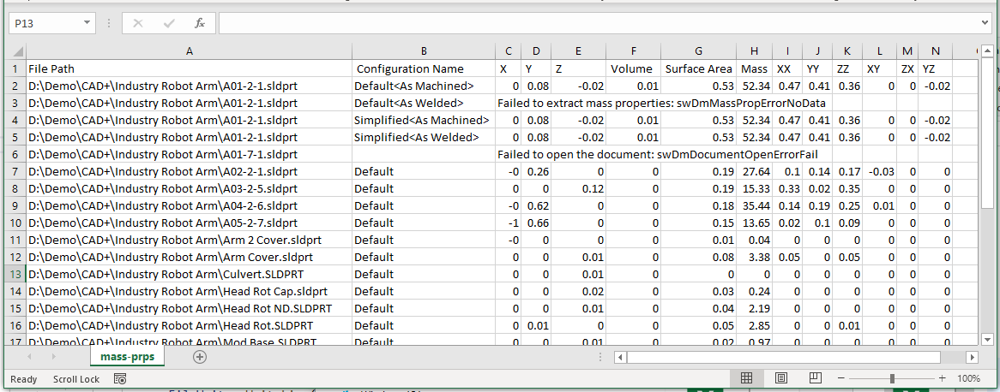

This C# code example demonstrates how to employ SOLIDWORKS Document Manager API to extract mass properties from all configurations of the files in the input directory.

Result is output to the specified CSV file with the following columns:

* File Path
* Configuration Name
* X coordinate of Center of gravity (m)
* Y coordinate of Center of gravity (m)
* Z coordinate of Center of gravity (m)
* Volume (m^3)
* Surface Area (m^2)
* Mass (kg)
* XX Moment Of Intertial (kg*m^2)
* YY Moment Of Intertial (kg*m^2)
* ZZ Moment Of Intertial (kg*m^2)
* XY Moment Of Intertial (kg*m^2)
* ZX Moment Of Intertial (kg*m^2)
* YZ Moment Of Intertial (kg*m^2)
 
> If there were any errors extracting the properties, this will be output to the CSV file

It is required to specify 3 command line parameters

1. Full path to an input directory
1. Fiilter for files
1. Full path to output CSV file

~~~
> export-mass-props.exe "D:\Input Folder" *.sldprt D:\mass-prps.csv
~~~

~~~ cs
using SolidWorks.Interop.swdocumentmgr;
using System;
using System.IO;
using System.Linq;

namespace ExtractMassProperties
{
    class Program
    {
        private const string LICENSE_KEY = "{YOUR DOCUMENT MANAGER LICENSE KEY}";

        static void Main(string[] args)
        {
            var dirPath = args[0];
            var filter = args[1];
            var outCsvFilePath = args[2];

            var classFact = new SwDMClassFactory();

            var app = classFact.GetApplication(LICENSE_KEY);

            using (var csvFileWriter = File.CreateText(outCsvFilePath))
            {
                csvFileWriter.WriteLine("File Path, Configuration Name, X, Y, Z, Volume, Surface Area, Mass, XX, YY, ZZ, XY, ZX, YZ");

                foreach (var filePath in Directory.GetFiles(dirPath, filter, SearchOption.AllDirectories))
                {
                    try
                    {
                        ProcessFile(app, filePath, csvFileWriter);
                    }
                    catch (Exception ex)
                    {
                        csvFileWriter.WriteLine($"\"{filePath}\",,{ex.Message}");
                    }
                }
            }
        }

        private static void ProcessFile(SwDMApplication app, string filePath, StreamWriter csvFileWriter)
        {
            var docType = SwDmDocumentType.swDmDocumentUnknown;

            switch (Path.GetExtension(filePath).ToLower())
            {
                case ".sldprt":
                    docType = SwDmDocumentType.swDmDocumentPart;
                    break;

                case ".sldasm":
                    docType = SwDmDocumentType.swDmDocumentAssembly;
                    break;

                case ".slddrw":
                    docType = SwDmDocumentType.swDmDocumentDrawing;
                    break;
            }

            SwDmDocumentOpenError err;
            var doc = app.GetDocument(filePath, docType, true, out err);

            if (doc != null)
            {
                var confNames = (string[])doc.ConfigurationManager.GetConfigurationNames();

                if (confNames?.Any() == true)
                {
                    foreach (var confName in confNames)
                    {
                        try
                        {
                            ProcessConfiguration(doc, confName, csvFileWriter);
                        }
                        catch (Exception ex)
                        {
                            csvFileWriter.WriteLine($"\"{filePath}\",\"{confName}\",{ex.Message}");
                        }
                    }
                }
                else
                {
                    throw new Exception("No configurations found");
                }
            }
            else
            {
                throw new Exception($"Failed to open the document: {err}");
            }
        }

        private static void ProcessConfiguration(SwDMDocument doc, string confName, StreamWriter csvFileWriter)
        {
            var conf = doc.ConfigurationManager.GetConfigurationByName(confName);

            var massPrps = (double[])conf.GetMassProperties(out SwDmMassPropError massPrpsErr);

            if (massPrpsErr != SwDmMassPropError.swDmMassPropErrorNone)
            {
                throw new Exception($"Failed to extract mass properties: {massPrpsErr}");
            }

            var cogX = massPrps[0];
            var cogY = massPrps[1];
            var cogZ = massPrps[2];
            var volume = massPrps[3];
            var surfArea = massPrps[4];
            var mass = massPrps[5];
            var momXX = massPrps[6];
            var momYY = massPrps[7];
            var momZZ = massPrps[8];
            var momXY = massPrps[9];
            var momZX = massPrps[10];
            var momYZ = massPrps[11];

            csvFileWriter.WriteLine($"\"{doc.FullName}\",\"{confName}\",{cogX},{cogY},{cogZ},{volume},{surfArea},{mass},{momXX},{momYY},{momZZ},{momXY},{momZX},{momYZ}");
        }
    }
}

~~~

