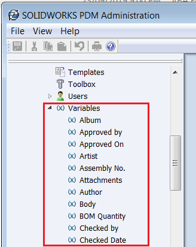

This VBA macro lists all the variables of the specified vault using SOLIDWORKS PDM API. The variable name and ID is output to the immediate window of VBA Editor in the following format:

~~~
Album(102)
Approved by(53)
Approved On(46)
Artist(101)
Assembly No.(67)
Attachments(92)
Author(55)
Body(91)
BOM Quantity(106)
Checked by(58)
Checked Date(62)
~~~

~~~ vb
Sub main()

    Dim swPdmVault As New EdmVault5
    swPdmVault.LoginAuto "TestVault", 0
    
    If swPdmVault.IsLoggedIn Then
        
        Dim swPdmVarsMgr As IEdmVariableMgr7
        Set swPdmVarsMgr = swPdmVault
        
        Dim swVarPost As IEdmPos5
        Set swVarPost = swPdmVarsMgr.GetFirstVariablePosition()
        
        While Not swVarPost.IsNull
            Dim swPdmVar As IEdmVariable5
            Set swPdmVar = swPdmVarsMgr.GetNextVariable(swVarPost)
            Debug.Print swPdmVar.Name & "(" & swPdmVar.ID & ")"
        Wend
    Else
        Err.Raise vberr, "", "Not logged in"
    End If

End Sub
~~~

