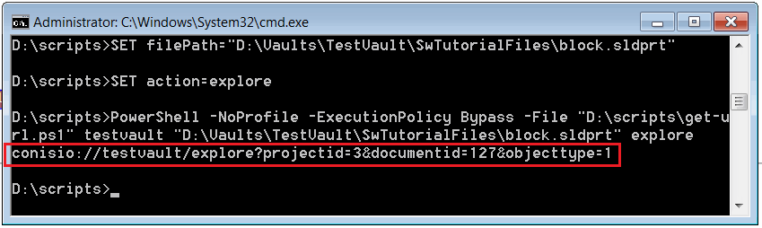
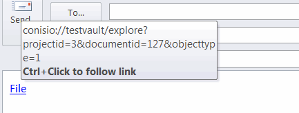

This PowerShell script allows extracting the conisio url to the specified file in the vault. This link can be used to get a persistent link to a file which can be used by any SOLIDWORKS PDM users.

SOLIDWORKS PDM API is used to extract the data required to form the conisio url: file id, folder id, etc.

Create 2 script files and paste the code below:

## get-url.ps1
~~~ ps1
$vault_name=$args[0]
$filePath=$args[1]
$action=$args[2]

$Source = @"
Imports System
Imports System.IO

Public Class SwPdmTools

    'open view explore get lock properties history
    Public Shared Sub GetHyperlink(vaultName As String, filePath As String, action As String)

        Dim vault As Object = Activator.CreateInstance(Type.GetTypeFromProgID("ConisioLib.EdmVault"))

        vault.LoginAuto(vaultName, 0)

        Dim folderPath As String = Path.GetDirectoryName(filePath)
        Dim fileName As String = Path.GetFileName(filePath)

        Dim folder As Object = vault.GetFolderFromPath(folderPath)
        Dim file As Object = folder.GetFile(fileName)

        If Not file Is Nothing Then

            Const EdmObject_File As Integer = 1
            Dim url As String = String.Format("conisio://{0}/{1}?projectid={2}&documentid={3}&objecttype={4}", vaultName, action, folder.ID, file.ID, EdmObject_File)
            Console.WriteLine(url)

        End If

    End Sub

End Class
"@

Add-Type -TypeDefinition $Source -Language VisualBasic

[SwPdmTools]::GetHyperlink($vault_name, $filePath, $action)

~~~

## get-url.cmd
~~~ cmd
SET vaultName=%1
SET filePath=%2
SET action=%3

PowerShell -NoProfile -ExecutionPolicy Bypass -File "%~dp0get-url.ps1" %vaultName% %filePath% %action%
~~~

Call the command line with the following parameters

* Vault Name
* Full path to a file
* Action for the hyperlink. Select one of the following: 
    * open
    * view
    * explore
    * get
    * lock
    * properties
    * history

For example:

~~~ cmd
get-url myvault "D:\myvault\part.sldprt" explore
~~~

The hyperlink is output to console:

{ width=450 }

This hyperlink can be used now to access the file.

{ width=450 }
