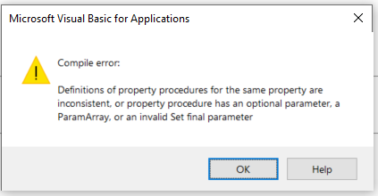

Properties have a very similar use to [variables](/docs/codestack/visual-basic/variables/declaration/) when it comes to consuming of the property

~~~ vb jagged
Set myObj = Property1 'assigning the reference value from the property to the variable
myInt = Property2 ' assigning integer value from the property to variable
Property3 = 0.1 'assigning double value to a property
Set Property4 = CreateObject("ComClass") ' assigning the instance of COM class to property
~~~

The above code would look exactly the same if Property1, Property2, Property3 and Property4 were declared as variables and will have no difference in usage. The will also have the same intellisense icon

However properties declarations are more similar to [functions](/docs/codestack/visual-basic/functions/).

## Types Of Properties

There are 3 types of properties:

### Read-Only Properties

Those properties can only return values. These properties act like functions:

~~~vba
Sub Macro1()
    Debug.Print Prop1
    Debug.Print Prop2 Is Nothing
    'Prop1.Value = "New Value" - not possible
End Sub

Property Get Prop1() As String
    Prop1 = "Prop1 Value"
End Property

Property Get Prop2() As Object
    Set Prop2 = CreateObject("Scripting.Dictionary")
End Property
~~~

Attempt to assign the value to read-only property results in the *invalid qualifier* compile error

### Write-Only Properties

The contrast to read-only properties are write-only properties which can be used to assign the value. These properties act like sub procedures.

~~~vba
Sub Macro2()
    Prop3 = "Val1"
    Set Prop4 = CreateObject("Scripting.Dictionary")
End Sub

Property Let Prop3(val As String)
    Debug.Print val
End Property

Property Set Prop4(val As Object)
    Debug.Print val Is Nothing
End Property
~~~

There are *Let* and *Set* write properties. *Let* should be used to for simple types, such as *String*, *Integer*, *Double*, while *Set* properties should be used for reference types, such as *Object* or instances custom classes.

> Note, it is still possible to use Let properties for reference types, in this case Set keyword is not required to assign the value to the property. This however is not recommended practice as this would make code less readable and misaligned with functions and variables where Set keyword always used with reference types.

### Read-Write Properties

Read-write properties is a combination of read and write capabilities within a single property.

~~~vba
Sub Macro3()
    Prop5 = "Val1"
    Debug.Print Prop5
End Sub

Property Get Prop5() As String
    Prop5 = "Prop5 Value"
End Property

Property Let Prop5(val As String)
    Debug.Print val
End Property
~~~

Declaration of read and write properties must have the same name and have the same type, i.e. type of the parameter in the write property must match the type of the return value in read property, otherwise the *Definitions of property procedures for the same property are inconsistent, or property procedure has an optional parameter, a ParamArray or invalid Set final parameter* compile time error will be thrown

~~~ vb
Property Get Prop1() As Integer
    Prop1 = Prop1
End Property

Property Let Prop1(val As String)
    Debug.Print val
End Property

Property Get Prop2()
    Prop2 = "Prop2 Value"
End Property

Property Let Prop2(val As String) 'invalid as implicitly assigned type is Variant
    Debug.Print val
End Property
~~~

Note that when type is not explicitly declared for the property it would be treated as Variant.

## Properties With Parameters

Although this is rarely used, properties can have additional parameters.

~~~vba
Sub Macro4()
    Prop6("p1") = 20
    Debug.Print Prop6("p2")
End Sub

Property Get Prop6(param1 As String) As Double
    Prop6 = 10
End Property

Property Let Prop6(param1 As String, val As Double)
    Debug.Print param1 & " " & val
End Property
~~~

> If you need more than 1 parameter in the property, consider using function instead.

## Usage

Although properties can be considered redundant as all the functionality covered by properties can be achieved by functions, properties provide better code readability and easier consumption of class or module. Prefer to use properties for the elements which describe the property of the entity rather than action, for example for the class *Car*, it would be beneficial to declare *Color*, *Made*, *YearOfManufacturing* as properties (instead of *GetColor*, *SetColor*, *GetMade* etc. functions), while *Drive* would be declared as procedure.
