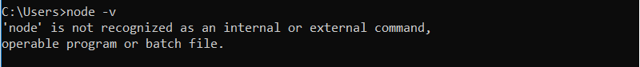
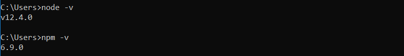
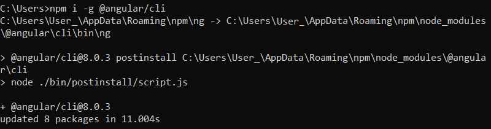
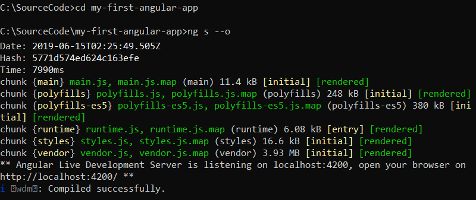
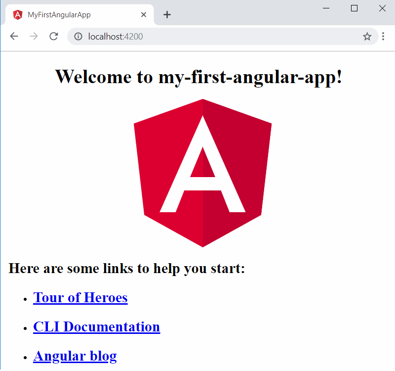
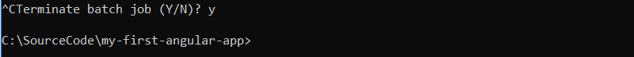

 使用 Node.js 设置开发环境，并在 Visual Studio Code 中使用 Angular 8 框架和 Angular CLI 创建第一个项目
image: angular-start-page.png
labels: [nodejs,visual studio code,angular cli,angular project]
sidebar_position: 0
---
让我们从创建你的第一个基本 Angular 应用程序开始。

## 准备工作

### 安装编辑器

选择并安装一个现有的 Angular 代码编辑器：
* [Visual Studio Code](https://code.visualstudio.com/)
* [Atom](https://atom.io/)
* 你也可以使用 Visual Studio 或任何其他 Angular 代码编辑器（Sublime Text、Webstorm、Angular IDE 等）。

*你可以跳过此步骤，稍后再回来进行 Angular 应用程序的开发。*

在本示例中，我将使用 Visual Studio Code 和 cmd。

### 安装 Node.js

通过在控制台中从任何位置运行以下命令来检查你的机器上是否已安装 Node.js：

~~~
> node -v
~~~

如果你看到以下“未识别”消息，则必须先安装 [Node.js](https://nodejs.org/en/)：

否则，你将看到 Node.js 的版本。你还可以通过运行以下命令来检查 npm（Node.js 包管理器）的版本：

~~~
> npm -v
~~~

### 安装 Angular CLI

要安装 Angular CLI，请在 cmd 中运行以下命令：

~~~
> npm i -g @angular/cli  
~~~

其中，**i** 是 install 的缩写，**-g** 是全局安装的标志。全局表示 angular-cli 包将在你的机器上的所有 Angular 应用程序中都可用。

已安装 Angular CLI 的第 8 版。

## 创建

你可以在同一个终端中继续进行，或者打开 Visual Studio Code 并在其中继续，方法是在菜单中选择 Terminal。

在选定的终端中，导航到你机器上的源代码文件夹，并创建名为 "my-first-angular-app" 的新 Angular 项目：

~~~
> ng new my-first-angular-app
~~~

<video controls>
  <source src=".\init-angular-app.mp4" width="350" type="video/mp4"/>创建新的 Angular 项目
</video>

Angular CLI 将为你创建应用程序环境并安装 npm 包。

恭喜你，你的第一个 Angular 应用程序已创建成功！

## 运行

要尝试你的新应用程序，请在终端中转到应用程序文件夹并运行 serve 命令：

~~~
> ng s --o
~~~

其中，**s** 是 serve 的缩写，**--o** 是 open 的缩写。

*你可以在不使用 open 标志的情况下启动应用程序，但在这种情况下，你需要手动在浏览器中打开 http://localhost:4200/。*

应用程序将被构建并运行。

在浏览器中查看你的第一个 Angular 应用程序：

## 完成

关闭浏览器并不足以停止应用程序。你应该在终端中停止它。

点击 ctrl+c 停止服务器，并回答 "Terminate batch job (Y/N)?" 的问题时选择 y：

*不需要为每个更改停止和运行应用程序。你可以在代码中进行更改，并立即在浏览器中看到它们。*