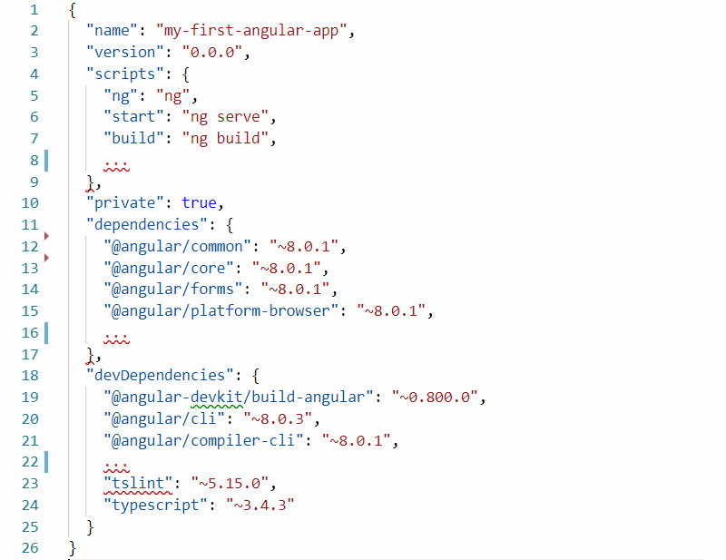

 管理Angular项目的package.json文件概述
image: angular-package.png
labels: [angular,package,json,dependencies,devDependencies,scripts]
sidebar_position: 0
---
{ width=400 }

创建新的Angular应用程序后，您将在新创建的文件和文件夹中看到package.json文件。package.json文件位于项目根目录中，包含有关您的Web应用程序的信息。该文件的主要目的来自其名称*package*，因此它将包含有关项目安装的npm软件包的信息。

让我们来看看package.json文件中的主要部分。

## 项目元数据

元数据包含有关您的应用程序的信息。

~~~
  "name": "my-first-angular-app",
  "version": "0.0.0",
  "private": true,
~~~

字段         | 值                          | 描述
--------------|--------------------------------|-----------
"name" | "my-first-angular-app"     | 您的项目名称
"version" | "0.0.1" | 您的项目版本
"private" | true | 项目是私有的，不能在npm中发布

您可以添加以下字段和值：

字段         | 值                          | 描述
--------------|--------------------------------|-----------
"description" | "一些项目描述"     |
"main"        | "src/main.ts"                  | 应用程序的入口点。"src/main.ts"是Angular应用程序的默认值
"author"      | "姓名, name@email.com, https://name.com" 或 "author": {   "name":"姓名","email":"name@email.com", "url":"https://name.com"} | 以纯字符串形式设置所有内容或使用结构
"contributors"| ["贡献者, contributor@email.com, https://contributor.com"] 或 "contributors": [{ "name": "贡献者", "email": "contributor@email.com", "url": "https://contributor.com" }]   | 您可以将贡献者信息作为字符串数组或使用结构数组添加
"bugs"        | "https://github.com/用户名/my-first-angular-app/issues"  | 如果有的话，链接到错误跟踪系统
"homepage"    | "https://site-name.com"                               | 链接到主页
"license"     | "MIT"                                                 | 应用程序的许可证
"repository"  | "{"type": "git",  "url": "https://github.com/用户名/my-first-angular-app.git"}"                   | 存储库位置

## 脚本

此部分描述了您可以在应用程序中运行的Node脚本。由于代码示例使用Angular CLI，所有脚本都调用它。

~~~
  "scripts": {
    "ng": "ng",
    "start": "ng serve",
    "build": "ng build",
    "test": "ng test",
    "lint": "ng lint",
    "e2e": "ng e2e"
  },
~~~

您可以在脚本中放置任何cmd命令，并且可以使用npm运行它。要运行脚本，只需从项目位置在命令行中运行它：

~~~
> npm start
~~~

这行代码将为您运行**ng serve**，这意味着启动应用程序。您可以清除现有的脚本并添加自己的新脚本。

## 依赖项

在此项目中作为依赖项安装的软件包列表在运行时是必需的。

~~~
"dependencies": {
  "@angular/animations": "~8.0.1",
  "@angular/common": "~8.0.1",
  "@angular/compiler": "~8.0.1",
  "@angular/core": "~8.0.1",
  "@angular/forms": "~8.0.1",
  "@angular/platform-browser": "~8.0.1",
  "@angular/platform-browser-dynamic": "~8.0.1",
  "@angular/router": "~8.0.1",
  "rxjs": "~6.4.0",
  "tslib": "^1.9.0",
  "zone.js": "~0.9.1"
},
~~~

其中**@angular/animations**是软件包名称，**~8.0.0**是软件包版本。您可能会注意到软件包版本说明不同。版本前面的符号告诉npm install使用哪个软件包版本
**1.0.0**表示严格使用软件包的1.0.0版本
**~8.0.0**表示8.0.0版本或其后的补丁版本（第三个数字可能会有所不同）：8.0、8.0.x
**^1.9.0**表示1.9.0版本或其后的次要版本（第二个数字可能会有所不同）：1、1.x

其他版本控制符号：

符号         | 描述      
---------------|------------------
*  | 可以安装软件包的最新版本，包括主要版本更新（第一个数字可能会有所不同）
>  | 必须安装高于指定版本的版本
>= | 必须安装相同或更高版本的软件包
<  | 必须安装低于指定版本的版本
<= | 必须安装相同或更低版本的软件包

要安装新软件包，请运行：

~~~
> npm i 要安装的新软件包名称
~~~

其中**i**是install的缩写，您需要将**要安装的新软件包名称**替换为实际的软件包名称和版本。安装后，软件包名称和其版本的行将自动添加到"dependencies"列表中。

## 开发依赖项

仅在开发人员的计算机上需要的软件包列表。这些软件包仅在开发人员的计算机上安装，并且不会在生产构建中运行。

~~~
"devDependencies": {
  "@angular-devkit/build-angular": "~0.800.0",
  "@angular/cli": "~8.0.3",
  "@angular/compiler-cli": "~8.0.1",
  "@angular/language-service": "~8.0.1",
  "@types/node": "~8.9.4",
  "@types/jasmine": "~3.3.8",
  "@types/jasminewd2": "~2.0.3",
  "codelyzer": "^5.0.0",
  "jasmine-core": "~3.4.0",
  "jasmine-spec-reporter": "~4.2.1",
  "karma": "~4.1.0",
  "karma-chrome-launcher": "~2.2.0",
  "karma-coverage-istanbul-reporter": "~2.0.1",
  "karma-jasmine": "~2.0.1",
  "karma-jasmine-html-reporter": "^1.4.0",
  "protractor": "~5.4.0",
  "ts-node": "~7.0.0",
  "tslint": "~5.15.0",
  "typescript": "~3.4.3"
}
~~~

要安装开发依赖项，请在安装字符串中添加**-dev**标志：

~~~
> npm i -dev 要安装的新软件包名称
~~~