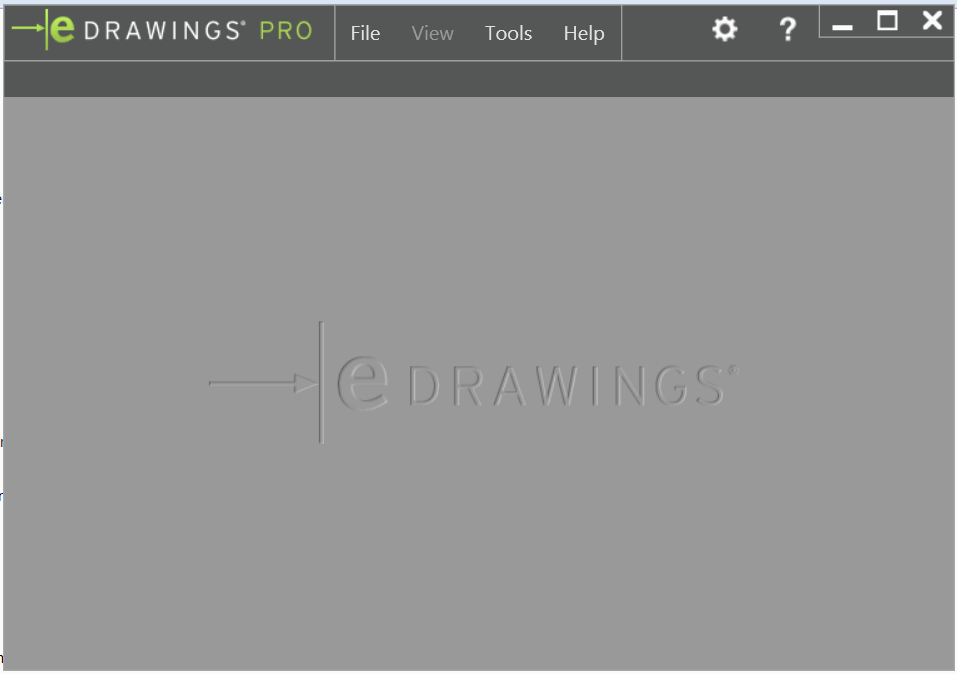
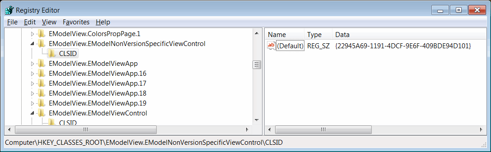
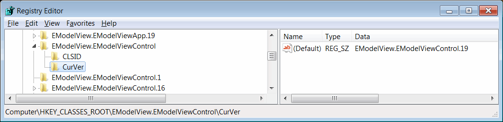
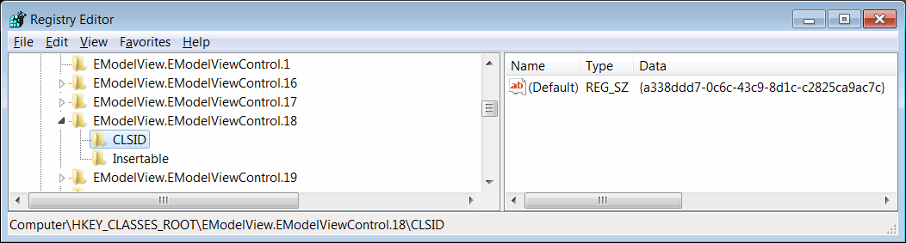

 开发使用 eDrawings API 的应用程序的入门指南
image: edrawings.png
labels: [edrawings, 入门]
sidebar_position: 0
---
{ width=350 }

eDrawings API 可以通过托管 eDrawings ActiveX 控件并调用其方法来使用。

该控件实现了 [IEModelViewControl](https://help.solidworks.com/2016/english/api/emodelapi/eDrawings.Interop.EModelViewControl~eDrawings.Interop.EModelViewControl.IEModelViewControl.html) 接口，表示 API 对象模型中的最顶层对象。

[IEModelMarkupControl](https://help.solidworks.com/2016/english/api/emodelapi/eDrawings.Interop.EModelMarkupControl~eDrawings.Interop.EModelMarkupControl.IEModelMarkupControl.html) 可以让您通过 eDrawings API 访问标记功能。有关 eDrawings 标记 API 的更多信息，请参阅 [使用 SOLIDWORKS eDrawings API 利用标记功能](/docs/codestack/edrawings-api/markup/)。

eDrawings 控件可以作为 ActiveX 控件托管在非托管应用程序中，也可以作为 .NET 应用程序的 [用户窗体](winforms)、[WPF 应用程序](wpf) 和 HTML 页面中的控件。

Interop dll 可以在 eDrawings 的安装文件夹中找到。通常位于 *%commonprogramfiles%\eDrawings[Version]\eDrawings.Interop.EModelViewControl.dll*

在 .NET 应用程序中，可以通过实现 [AxHost](https://docs.microsoft.com/en-us/dotnet/api/system.windows.forms.axhost) 来创建 eDrawings 主机控件。

~~~ cs
public class EDrawingHost : AxHost
{
    public EDrawingHost() : base("22945A69-1191-4DCF-9E6F-409BDE94D101")
    {
        m_IsLoaded = false;
    }
}
~~~

控件的 GUID 可以在注册表中找到。

版本无关的 GUID 可以在 *HKEY_CLASSES_ROOT\EModelView.EModelNonVersionSpecificViewControl\CLSID* 注册表键中找到，其值为 *{22945A69-1191-4DCF-9E6F-409BDE94D101}*

如果安装了多个版本的 eDrawings 控件，则版本无关的 GUID 将对应于在 *HKEY_CLASSES_ROOT\EModelView.EModelViewControl\CurVer* 注册表键中设置的当前版本：

要启用特定版本的 eDrawings，需要使用特定的 GUID。例如，对于 eDrawings 2018，可以在 *HKEY_CLASSES_ROOT\EModelView.EModelViewControl.18\CLSID* 注册表键中找到 GUID，其值为 *{a338ddd7-0c6c-43c9-8d1c-c2825ca9ac7c}*。

*eDrawings.Interop.EModelViewControl.dll* 中的 eDrawings 接口既不向后兼容也不向前兼容。这意味着 OCX 控件只能转换为相应的互操作版本，因为不同版本中的所有接口具有不同的 GUID。作为解决方法，可以使用后期绑定和 [ComEventsHelper](https://docs.microsoft.com/en-us/dotnet/api/system.runtime.interopservices.comeventshelper?view=netcore-3.1) 来访问 eDrawings API。请参阅 [此实现](https://github.com/xarial/cad-plus/blob/master/src/SwEDrawingsHost/EDrawingsControl.cs)。