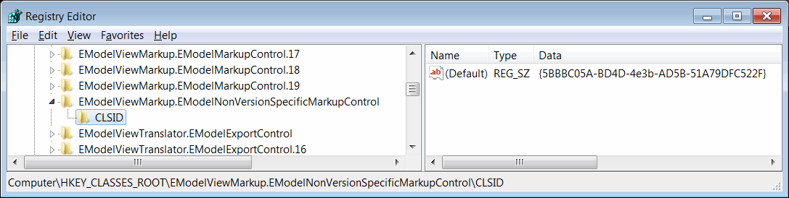

 使用 eDrawings API 使用标记功能（测量、图章、注释）的指南
labels: [edrawings,markup,getting started]
---
eDrawings 标记 API（如注释、图章、测量）可以通过 [IEModelMarkupControl](https://help.solidworks.com/2016/english/api/emodelapi/eDrawings.Interop.EModelMarkupControl~eDrawings.Interop.EModelMarkupControl.IEModelMarkupControl.html) 接口访问。

Interop 可在 eDrawings 安装文件夹中找到：*%commonprogramfiles%\eDrawings[Version]\eDrawings.Interop.EModelMarkupControl.dll*

可以通过调用 [IEModelViewControl::CoCreateInstance](https://help.solidworks.com/2018/english/api/emodelapi/eDrawings.Interop.EModelViewControl~eDrawings.Interop.EModelViewControl.IEModelViewControl~CoCreateInstance.html) eDrawings API 方法来访问标记接口。

可以传递标记控件的特定版本和版本无关的 GUID 或 ProgId。

版本无关的 GUID 可在注册表 *HKEY_CLASSES_ROOT\EModelViewMarkup.EModelNonVersionSpecificMarkupControl\CLSID* 下找到。

特定版本的 GUID 可在相应版本的标记控件下找到（例如 *eDrawings 2018* 的 *EModelViewMarkup.EModelViewMarkupControl.18* 或 *eDrawings 2019* 的 *EModelViewMarkup.EModelViewMarkupControl.19*）

~~~ cs
// 使用 ProgId 创建版本无关的标记实例
var eDrawingsMarkupCtrl = eDrawingsCtrl.CoCreateInstance("EModelViewMarkup.EModelMarkupControl") as EModelMarkupControl;
...
// 使用 GUID 创建版本无关的标记实例
var eDrawingsMarkupCtrl = eDrawingsCtrl.CoCreateInstance("{5BBBC05A-BD4D-4e3b-AD5B-51A79DFC522F}") as EModelMarkupControl;
...
// 使用 ProgId 创建特定版本的标记实例（eDrawings 2018）
var eDrawingsMarkupCtrl = eDrawingsCtrl.CoCreateInstance("EModelViewMarkup.EModelMarkupControl.18") as EModelMarkupControl;
~~~