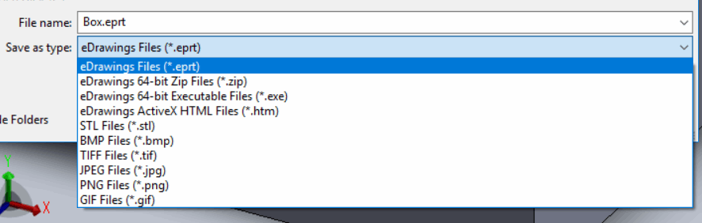

eDrawings 可以将 SOLIDWORKS 文件导出为以下外部格式：

{ width=450 }

可以通过 [IEModelViewControl::Save](https://help.solidworks.com/2016/English/api/emodelapi/eDrawings.Interop.EModelViewControl~eDrawings.Interop.EModelViewControl.IEModelViewControl~Save.html) eDrawings API 方法执行导出。

除此之外，还可以通过 [IEModelViewControl::Print5](https://help.solidworks.com/2016/English/api/emodelapi/eDrawings.Interop.EModelViewControl~eDrawings.Interop.EModelViewControl.IEModelViewControl~Print5.html) eDrawings API 方法打印已打开的文件。

导出和打印的 API 都是异步的。需要跟踪相应的完成事件以确定进程何时完成。使用 [OnFinishedPrintingDocument](https://help.solidworks.com/2019/english/api/emodelapi/eDrawings.Interop.EModelViewControl~eDrawings.Interop.EModelViewControl._IEModelViewControlEvents_OnFinishedPrintingDocumentEventHandler.html) 和 [OnFinishedSavingDocument](https://help.solidworks.com/2019/english/api/emodelapi/eDrawings.Interop.EModelViewControl~eDrawings.Interop.EModelViewControl._IEModelViewControlEvents_OnFinishedSavingDocumentEventHandler.html) 来跟踪打印和保存的完成。

如果发生错误，完成事件将不会被发送。在这种情况下，需要处理 [OnFailedSavingDocument](https://help.solidworks.com/2019/english/api/emodelapi/eDrawings.Interop.EModelViewControl~eDrawings.Interop.EModelViewControl._IEModelViewControlEvents_OnFailedSavingDocumentEventHandler.html) 和 [OnFailedPrintingDocument](https://help.solidworks.com/2019/english/api/emodelapi/eDrawings.Interop.EModelViewControl~eDrawings.Interop.EModelViewControl._IEModelViewControlEvents_OnFailedPrintingDocumentEventHandler.html) 事件。