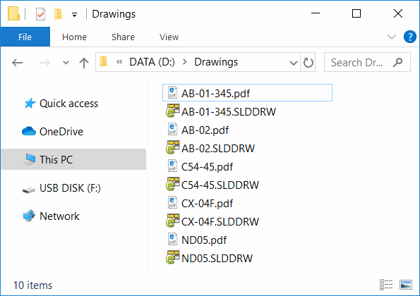

{ width=200 }

这个用VB.NET开发的控制台应用程序允许使用SOLIDWORKS eDrawings的免费版本通过其API将SOLIDWORKS、DXF、DWG文件导出为PDF。使用此工具不需要安装SOLIDWORKS或使用其许可证。此工具支持Windows 8.1及更高版本。

此功能已集成到[xPort](https://cadplus.xarial.com/xport/)实用程序中。

## 运行工具

此应用程序可以从命令行运行，并期望以下2个必填参数和一个可选参数：

1. 输入文件或文件夹的完整路径（在这种情况下，将导出与过滤器匹配的所有文件）
2. 过滤器。指定*以匹配所有文件。或者指定*.slddrw以匹配所有SOLIDWORKS绘图文件
3. （可选）输出文件夹以保存PDF文件。如果未指定，PDF文件将在与输入SOLIDWORKS文件相同的文件夹中创建。如果文件夹不存在，则会自动创建。

## 示例命令

* 将*C:\SOLIDWORKS Drawings*文件夹中的所有slddrw文件（包括子文件夹）导出到与源文件相同的位置

~~~
> exportpdf.exe "C:\SOLIDWORKS Drawings" "*.slddrw"
~~~

* 将*C:\SOLIDWORKS Drawings*文件夹（包括子文件夹）中以*print_*开头的所有SOLIDWORKS绘图文件导出到*C:\PDFs*目录

~~~
> exportpdf.exe "C:\SOLIDWORKS Drawings" "print_*.slddrw" "C:\PDFs"
~~~

## 结果

操作进度显示在控制台窗口中

{ width=450 }

根据设置创建PDF文件。PDF文件的名称与生成它们的源文件相同。

{ width=450 }

## EDrawingsHost.vb

~~~ vb
Imports System.Windows.Forms
Imports eDrawings.Interop.EModelViewControl

Public Class EDrawingsHost
    Inherits AxHost

    Public Event ControlLoaded As Action(Of EModelViewControl)
    Private m_IsLoaded As Boolean

    Public Sub New()
        MyBase.New("22945A69-1191-4DCF-9E6F-409BDE94D101")
        m_IsLoaded = False
    End Sub

    Protected Overrides Sub OnCreateControl()
        MyBase.OnCreateControl()

        If Not m_IsLoaded Then
            m_IsLoaded = True
            Dim ctrl = TryCast(Me.GetOcx(), EModelViewControl)
            RaiseEvent ControlLoaded(TryCast(Me.GetOcx(), EModelViewControl))
        End If
    End Sub

End Class

~~~

## Module1.vb

~~~ vb
Imports System.Drawing.Printing
Imports System.IO
Imports System.Windows.Forms
Imports eDrawings.Interop
Imports eDrawings.Interop.EModelViewControl

Module Module1

    Dim m_Ctrl As EModelViewControl

    Dim m_Files As List(Of String)
    Dim m_OutDir As String

    Sub Main()

        Try
            ExtractInputParameters()

            Dim eDrwCtrl = New EDrawingsHost()

            AddHandler eDrwCtrl.ControlLoaded, AddressOf OnEdrawingsControlLoaded

            Dim winForm As Form = New Form
            winForm.Controls.Add(eDrwCtrl)
            eDrwCtrl.Dock = DockStyle.Fill
            winForm.ShowIcon = False
            winForm.ShowInTaskbar = False
            winForm.WindowState = FormWindowState.Minimized
            winForm.ShowDialog()

        Catch ex As Exception
            PrintError(ex.Message)
        End Try

    End Sub

    Private Sub ExtractInputParameters()

        Dim args As String() = Environment.GetCommandLineArgs()
        Dim input As String = args(1)
        Dim filter As String = args(2)
        m_OutDir = ""

        If args.Length > 3 Then
            m_OutDir = args(3)
        End If

        If Not String.IsNullOrEmpty(m_OutDir) Then
            If Not Directory.Exists(m_OutDir) Then
                Directory.CreateDirectory(m_OutDir)
            End If
        End If

        If Directory.Exists(input) Then
            m_Files = Directory.GetFiles(input, filter, SearchOption.AllDirectories).ToList()
        ElseIf File.Exists(input) Then
            m_Files = New List(Of String)()
            m_Files.Add(input)
        Else
            Throw New Exception("请指定输入文件或目录")
        End If

    End Sub

    Sub OnEdrawingsControlLoaded(ctrl As EModelViewControl)

        Console.WriteLine(String.Format("开始任务。正在导出{0}个文件", m_Files.Count))

        m_Ctrl = ctrl

        AddHandler m_Ctrl.OnFinishedLoadingDocument, AddressOf OnDocumentLoaded
        AddHandler m_Ctrl.OnFailedLoadingDocument, AddressOf OnDocumentLoadFailed
        AddHandler m_Ctrl.OnFinishedPrintingDocument, AddressOf OnDocumentPrinted
        AddHandler m_Ctrl.OnFailedPrintingDocument, AddressOf OnPrintFailed

        PrintNext()

    End Sub

    Sub PrintNext()

        If m_Files.Any() Then

            Dim filePath As String
            filePath = m_Files.First()
            m_Files.RemoveAt(0)

            m_Ctrl.CloseActiveDoc("")
            m_Ctrl.OpenDoc(filePath, False, False, False, "")

        Else
            Console.WriteLine("完成")
            Environment.Exit(0)
        End If

    End Sub

    Sub OnDocumentLoaded(fileName As String)

        Const PRINTER_NAME As String = "Microsoft Print to PDF"
        Const AUTO_SOURCE As Integer = 7

        Console.WriteLine(String.Format("已打开{0}", fileName))
        m_Ctrl.SetPageSetupOptions(EMVPrintOrientation.eLandscape, CInt(PaperKind.A4), 100, 100, 1, AUTO_SOURCE, PRINTER_NAME, 0, 0, 0, 0)

        Dim pdfFileName = Path.GetFileNameWithoutExtension(fileName) + ".pdf"
        Dim outDir As String

        If Not String.IsNullOrEmpty(m_OutDir) Then
            outDir = m_OutDir
        Else
            outDir = Path.GetDirectoryName(fileName)
        End If

        Dim pdfFilePath As String
        pdfFilePath = Path.Combine(outDir, pdfFileName)

        Console.WriteLine(String.Format("正在将{0}导出为{1}", fileName, pdfFilePath))

        m_Ctrl.Print5(False, fileName, False, False, True, EMVPrintType.eOneToOne, 1, 0, 0, True, 1, 1, pdfFilePath)

    End Sub

    Sub OnDocumentLoadFailed(fileName As String, errorCode As Integer, errorString As String)
        PrintError(String.Format("无法加载{0}：{1}", fileName, errorString))
        PrintNext()
    End Sub

    Sub OnDocumentPrinted(printJobName As String)
        Console.WriteLine(String.Format("'{0}'导出完成", printJobName))
        PrintNext()
    End Sub

    Sub OnPrintFailed(printJobName As String)
        PrintError(String.Format("无法导出'{0}'", printJobName))
        PrintNext()
    End Sub

    Sub PrintError(msg As String)
        Console.ForegroundColor = ConsoleColor.Red
        Console.WriteLine(msg)
        Console.ResetColor()
    End Sub

End Module

~~~

源代码可在[GitHub](https://github.com/codestackdev/solidworks-api-examples/tree/master/edrawings-api/BatchExportPdf)上找到。