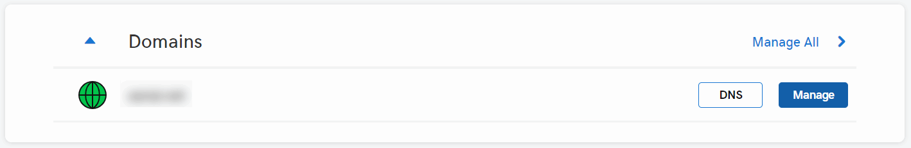
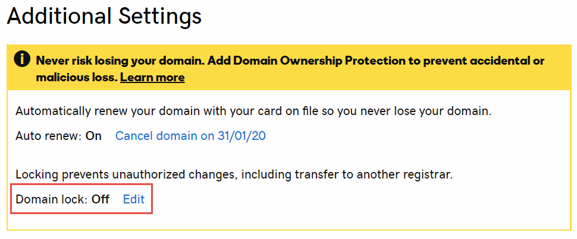
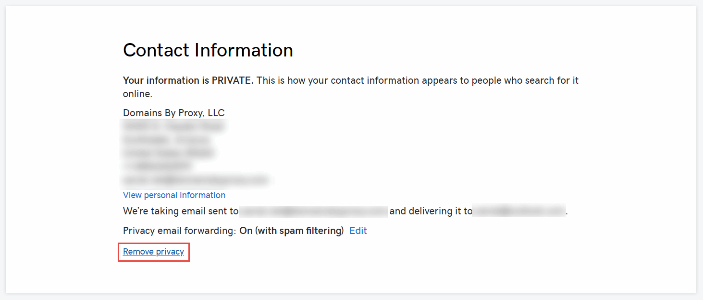
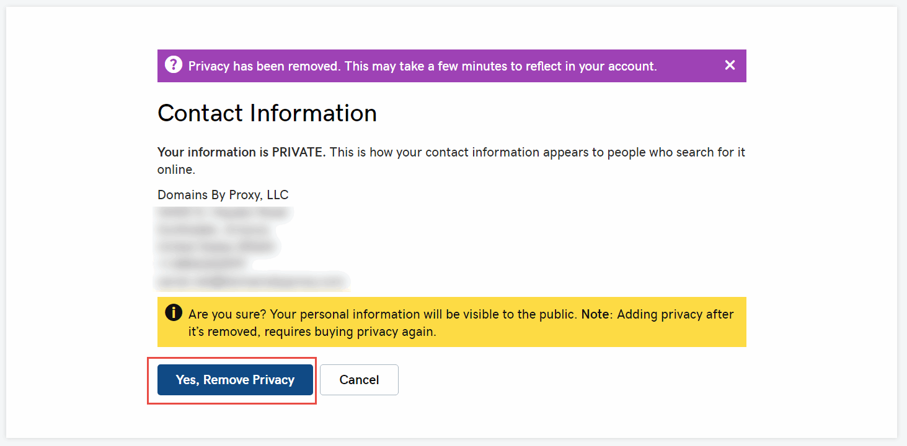
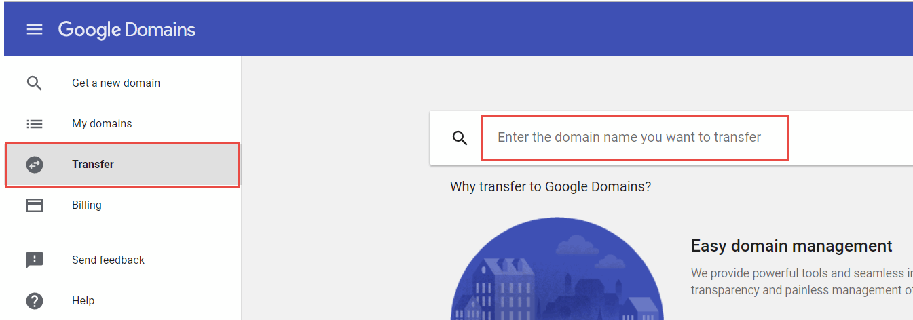
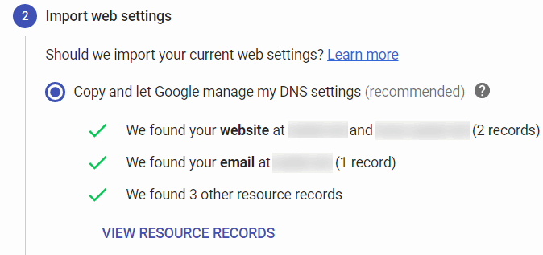
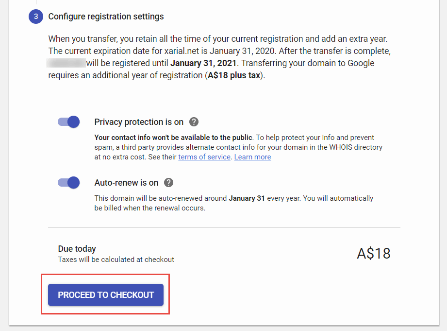
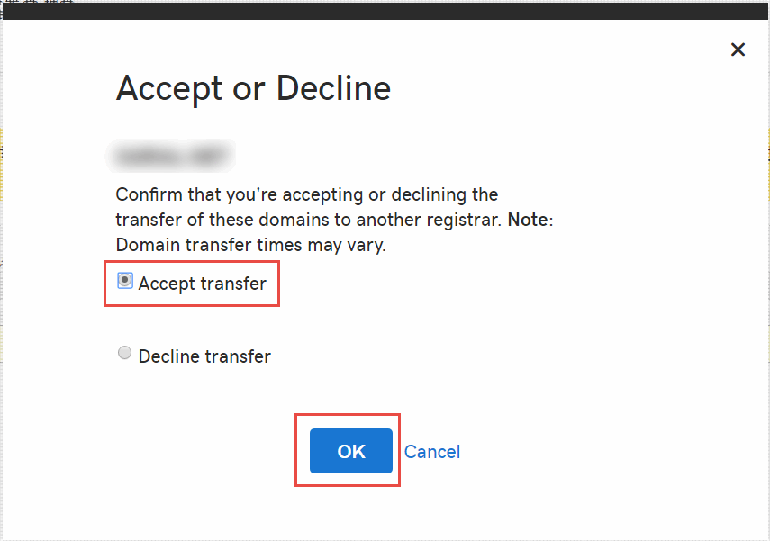

 详细指南，将域名主机从GoDaddy转移到Google Domains
image: transfer-domain-to-google.png
labels: [google domains,godaddy,transfer]
---
本文是将域名主机从GoDaddy转移到Google Domains的详细逐步指南。转移域名注册商的原因可能有多种，包括价格、安全性、隐私功能、灵活性、特别优惠、托管选项等。

Google Hosting相对于GoDaddy Hosting的一些优势包括：

* 免费的主机隐私保护
* 免费电子邮件转发服务的电子邮件加密

## 在GoDaddy中解锁账户

账户的转移应该从GoDaddy网站开始。

登录到网站，点击要转移的域名的*管理*按钮。

向下滚动到*附加设置*部分，关闭*域名锁定*功能。

如果您在GoDaddy启用了隐私保护功能，则在转移之前必须将其禁用。稍后可以在Google Domains中重新激活。

该功能的禁用可能需要几分钟时间。

> 如果未关闭隐私功能，则域名转移将无法完成，并且在Google Domains页面上将显示“转移被拒绝。请与当前注册商联系以获取更多信息”的消息。

点击*获取授权代码*按钮以生成临时令牌，该令牌需要粘贴到Google Domains中以授权转移。令牌将通过与GoDaddy注册的电子邮件发送。

{ width=250 }

> 建议在转移之前生成此令牌，因为它可能会过期，导致转移过程失败。

## 启动转移到Google Domains的转移

登录到Google Domains并激活*转移*选项卡，然后搜索要转移的域名（在上一步中解锁的域名）。

在搜索栏上按Enter键，然后按照向导执行转移。确保第一步中显示了*[域名]已解锁并准备好转移*的消息。粘贴从上一步骤中通过电子邮件发送的授权令牌。

在下一步中，指定要从以前的设置中转移的选项（例如DNS记录）。您可能希望使用默认选择。

{ width=350 }

在接下来的步骤中配置隐私和自动续订选项。

{ width=450 }

填写购买表单以完成转移。

> 请注意，需要提前支付一年的域名维护费用才能执行转移。但是，现有的注册期限将被保留。例如，如果域名在1年后到期（例如2020年1月），将其转移到Google Domains将使其延长一年（例如2021年1月）。

{ width=450 }

购买获得批准后，域名将等待GoDaddy的批准以完成转移。

## 完成转移

您将收到来自GoDaddy的有关转移的电子邮件，该转移将在几个工作日内自动完成。但是，可以加快该过程并立即完成转移。

要做到这一点，请在GoDaddy网站的*我的域名*部分中，找到待转移的域名的*查看详细信息*链接。

在表格中点击*接受或拒绝*链接。

选择*接受转移*选项，然后点击*确定*。

{ width=450 }

转移将在几分钟内完成。完成后，域名将从GoDaddy控制台中删除，并显示在Google Domains控制台中。

