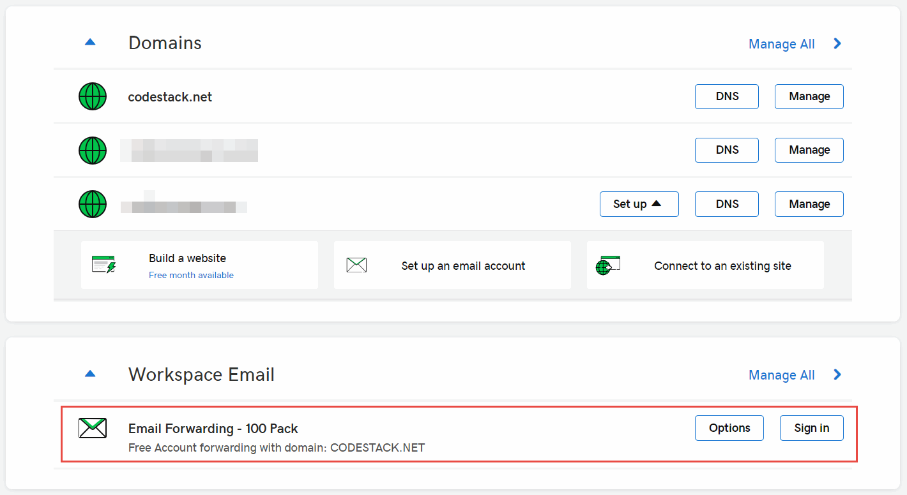
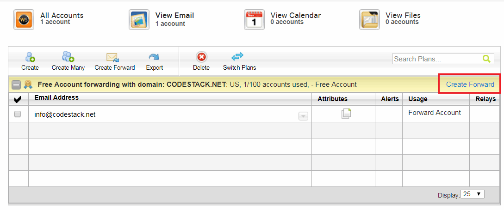
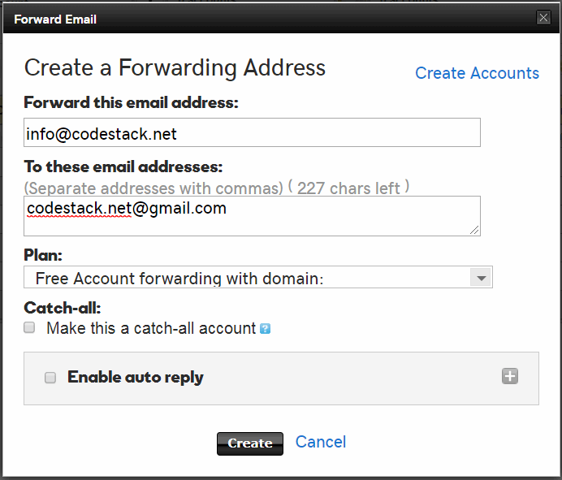
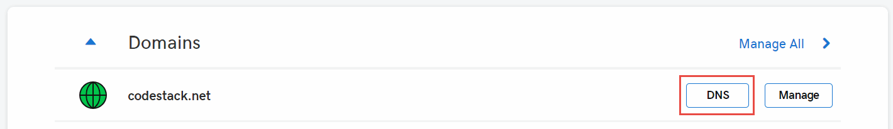
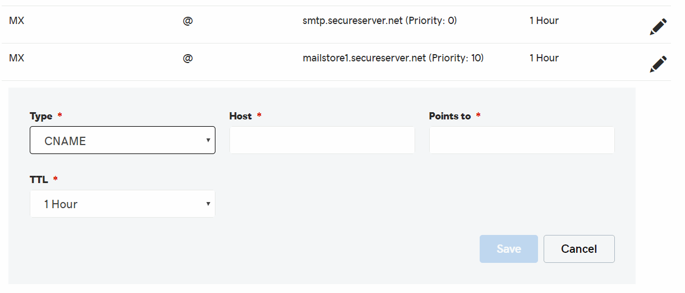
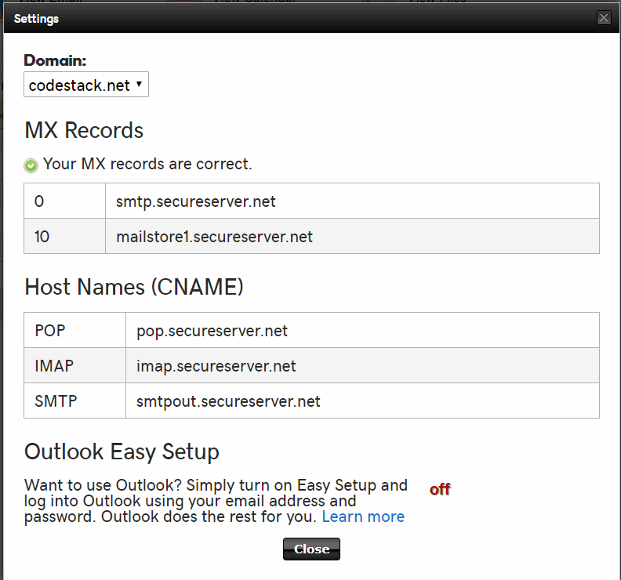
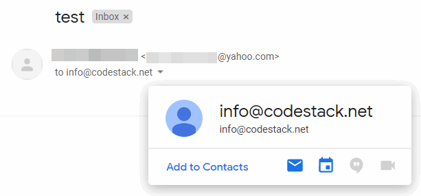
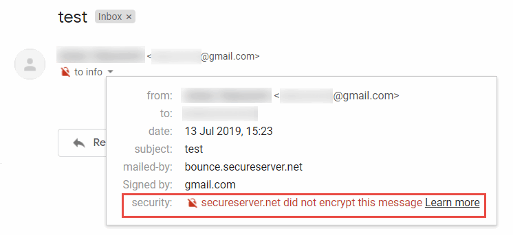

 使用GoDaddy设置最多100个免费自定义域名的电子邮件转发
labels: [godaddy, 电子邮件转发]
---
如果您在GoDaddy注册了域名，您可能希望设置使用自定义域名发送和接收电子邮件（例如info@domain.com）。

GoDaddy提供电子邮件托管服务。该计划每个用户每月从5美元起。

GoDaddy还提供最多100个电子邮件的免费转发服务。所有发送到指定电子邮件的电子邮件都将重定向到您选择的电子邮件，包括免费电子邮件（例如Gmail、Outlook、Yahoo等）。

这是一个详细的逐步设置GoDaddy电子邮件转发的指南。

## 添加转发电子邮件

在GoDaddy控制台的*Workspace Email*部分下选择*Manage All*链接。

> 您可能需要通过单击同一页上*Additional Products*部分下的*Redeem*按钮来激活此服务器。

{ width=550 }

在打开的页面中点击*Create Forward*链接。

{ width=550 }

填写*Forward Email*表单。指定您要转发的电子邮件（即带有自定义域名的电子邮件）。以及您要转发到的电子邮件（例如Gmail）。

如果需要，可以指定其他选项，例如捕获发送到您的域的所有电子邮件。

{ width=450 }

## 配置DNS记录

现在需要配置DNS记录以启用转发。

点击域名下的*DNS*按钮。

根据以下表格添加DNS记录：

| 类型  | 主机 | 指向                       | 优先级 | TTL    |
|-------|------|-----------------------------|----------|--------|
| MX    | @    | smtp.secureserver.net       | 0        | 1小时 |
| MX    | @    | mailstore1.secureserver.net | 10       | 1小时 |
| CNAME | pop  | pop.secureserver.net        | N/A      | 1小时 |
| CNAME | imap | imap.secureserver.net       | N/A      | 1小时 |
| CNAME | smtp | smtpout.secureserver.net    | N/A      | 1小时 |

通过激活*Tools->Server Settings*菜单命令验证记录是否正确添加。应显示以下对话框。

{ width=350 }

## 接收电子邮件

现在，您可以从任何电子邮件地址发送电子邮件到您新创建的电子邮件（例如info@domain.com）。电子邮件将被重定向到指定的电子邮件邮箱，而*to*框将显示带有自定义域名的电子邮件。

然而，GoDaddy电子邮件转发存在一个限制，即不支持加密，并且对所有转发的电子邮件显示“secureserver.net did not encrypt this message”警告：

请按照[免费设置Google Domains自定义域名的电子邮件转发](/docs/codestack/hosting/email/googledomains-email-forwarding/)的步骤设置类似的免费服务，Google Domains支持电子邮件加密并克服了此限制。您需要[将域名主机从GoDaddy转移到Google Domains](/docs/codestack/hosting/domain/transfer-godaddy-domain-to-googledomains/)以使用此服务。