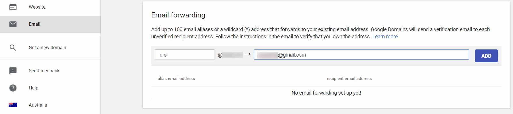
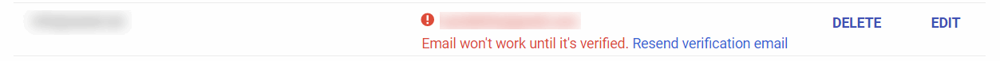
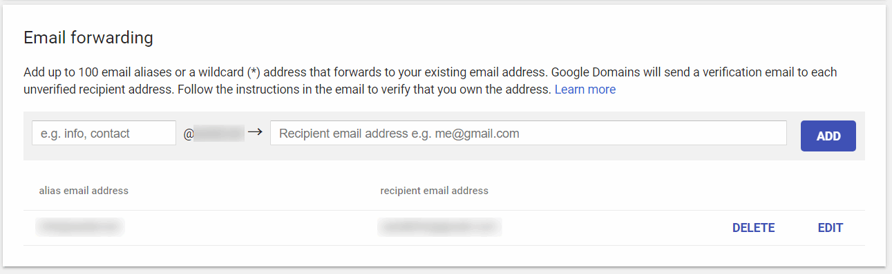
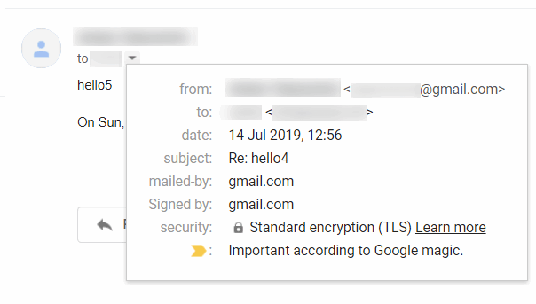

 使用Google Domains设置最多100个免费的自定义域名电子邮件转发
labels: [google domains,电子邮件转发]
---
Google Domains注册商提供了一个免费服务，可以将最多100封电子邮件从自定义域名转发。要启用此服务，请在Google Domains控制台中导航到*Email*选项卡。

在第一个框中指定要转发的电子邮件，第二个框中指定要转发到的电子邮件。

验证代码将发送到目标电子邮件。在电子邮件验证之前，转发功能不会启用：

一旦电子邮件验证成功，警告将被移除：

与[GoDaddy的转发方式](/docs/codestack/hosting/email/godaddy-email-forwarding/)不同，Google Domains为转发的电子邮件启用了加密功能：

