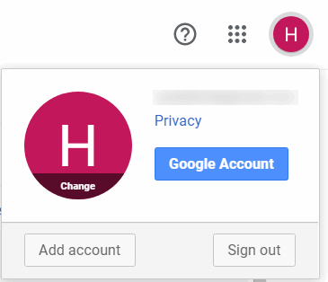
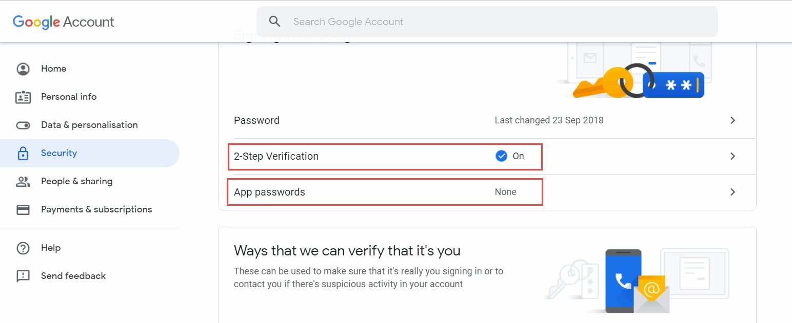
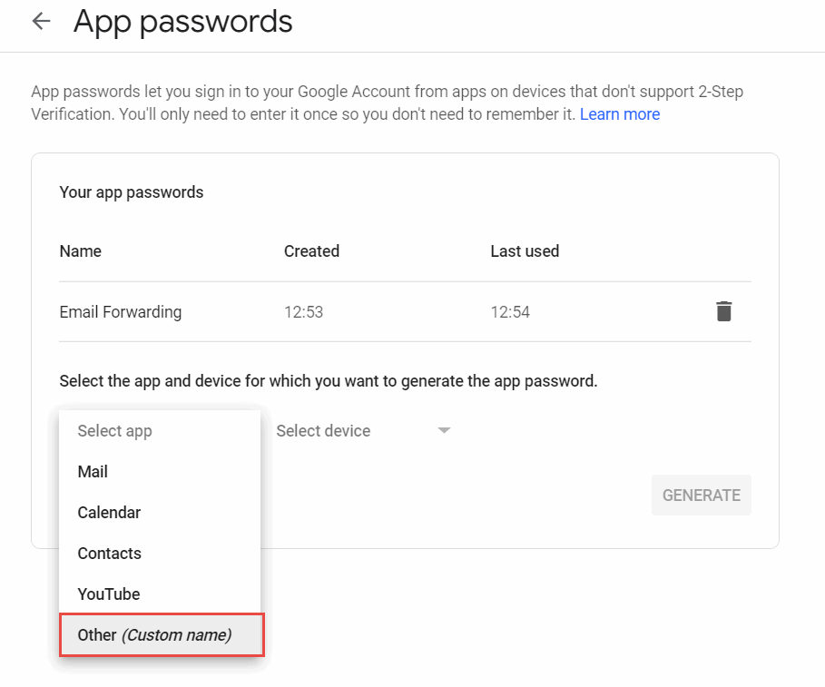
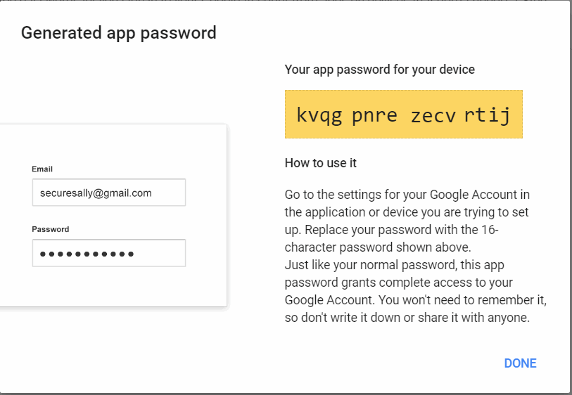
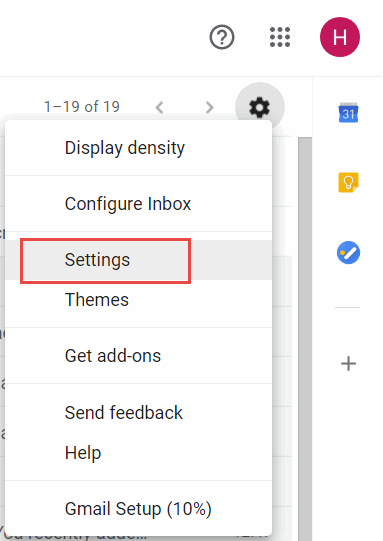
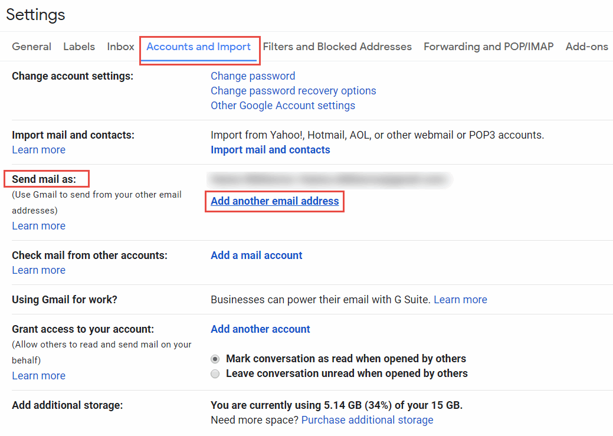
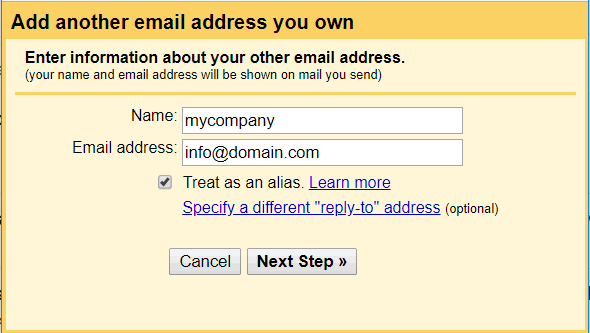
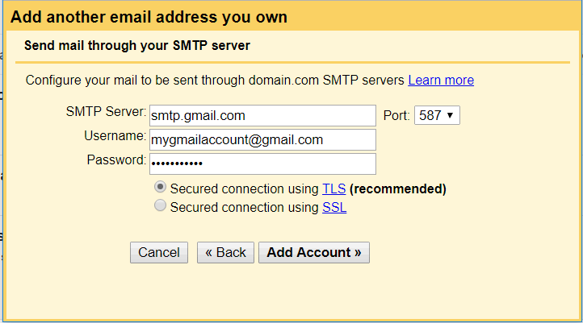
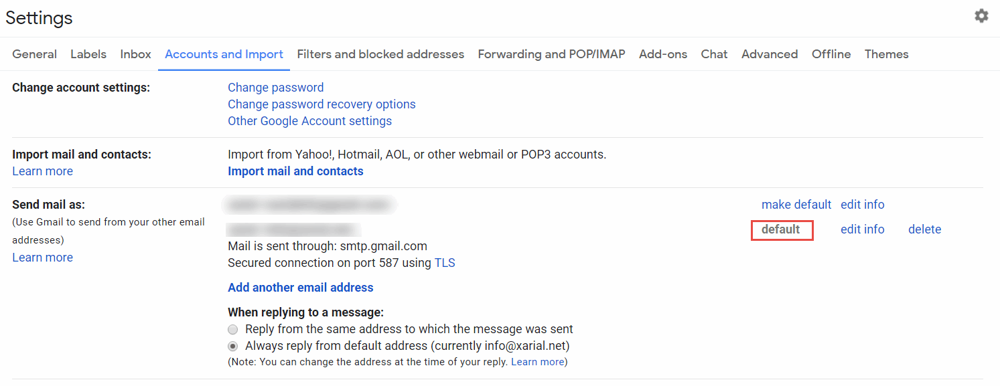

Gmail允许使用别名发送电子邮件，这意味着可以代表在[GoDaddy](https://godaddy.com)或[Google Domains](https://domains.google)等注册商设置的自定义域名发送Gmail。

以下是设置别名以发送电子邮件的详细逐步说明，无需使用任何额外的第三方服务。

## 设置应用程序

启用别名的第一步是设置两步验证和应用程序密码。

转到Google帐户。

{ width=250 }

选择安全选项卡并启用*2步验证*选项。按照指南设置设置。

完成后，选择*应用程序密码*选项以创建新的应用程序。从*选择应用程序*下拉框中选择*其他（自定义名称）*选项。

{ width=350 }

点击*生成*按钮。结果会为该应用程序生成密码。复制此密码，因为它将在下一步中使用。

{ width=350 }

## 设置电子邮件别名

打开[电子邮件页面](https://mail.google.com)，并从下拉菜单中选择*设置*命令。

{ width=350 }

激活*帐户和导入*选项卡。

找到*发送邮件作为*部分，然后点击*添加另一个电子邮件地址*链接。

指定有关其他电子邮件的信息（即您要为其创建别名的电子邮件）。

{ width=450 }

配置SMTP服务器。将*SMTP服务器*的值设置为*smtp.gmail.com*。用户名是您的Gmail用户名（不是自定义域名，即当前登录到Gmail的用户）。密码是在上一步中生成的应用程序密码（不是Gmail密码）。

{ width=450 }

作为可选步骤，将创建的别名设置为默认选项，这样电子邮件将默认使用别名发送。

现在，您可以使用别名发送电子邮件，接收者将看到自定义域名的电子邮件，而不是@gmail.com的电子邮件。