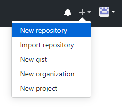
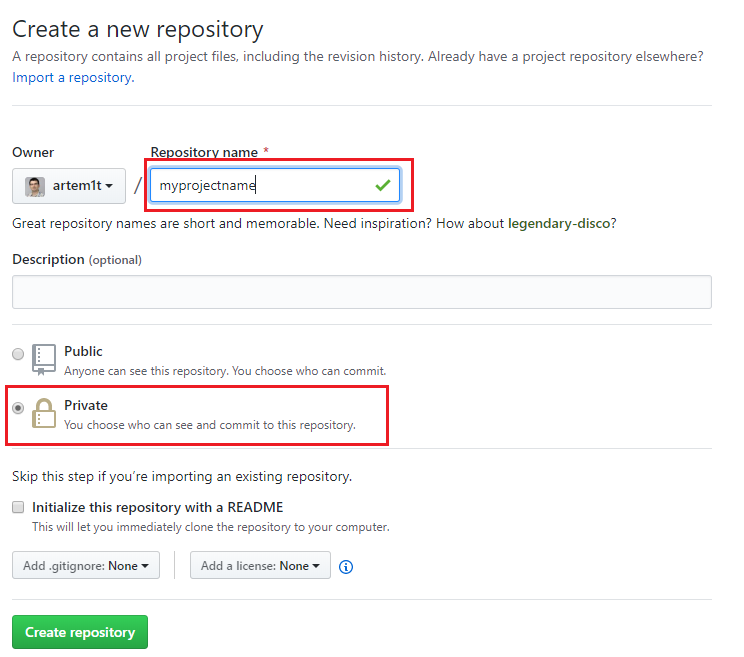
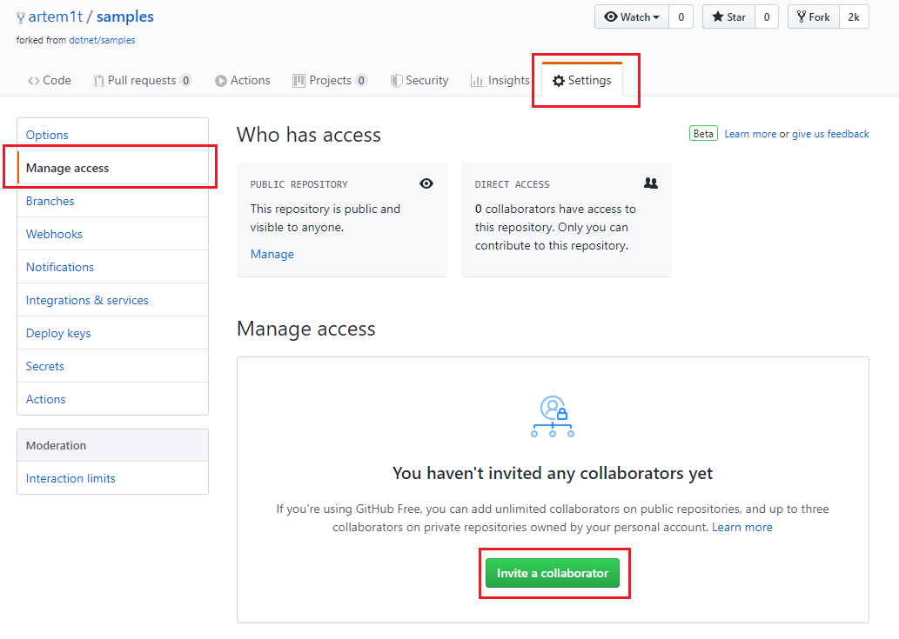
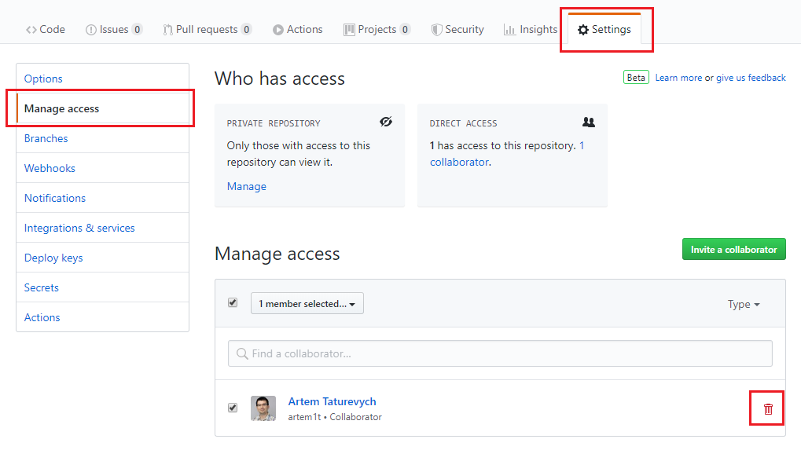

以下是在[GitHub](https://github.com/)上设置存储库并向第三方开发人员提供访问权限的步骤：

## 创建新账户

* 转到[https://github.com/](https://github.com/)并点击**Sign up**

* 输入注册详细信息

* 选择计划。检查**Free**计划的功能，因为这可能足够满足您项目的范围，但如果有必要，您也可以探索其他选项。

* 根据需要验证账户

* 创建新存储库：

* 指定存储库的名称。选择**Private**选项以使存储库仅对所有者可见，否则它将对所有人可见：

## 向项目添加协作者：

* 点击存储库
* 转到**Settings**选项卡
* 从左侧列表中选择**Manage access**
* 点击**Invite a collaborator**按钮
* 搜索用户ID以提供对存储库的访问权限

* 项目完成后，您可以删除协作者：

