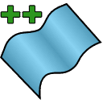
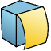

Geometry++是一个SOLIDWORKS插件，扩展了与几何创建和操作相关的功能。该插件完全集成到SOLIDWORKS中，并提供与其他内置功能相同的外观和感觉。所有特性都保留了参数化行为，并在需要时自动重新生成。

有关更多信息和下载链接，请参阅[安装](installation)页面。

源代码可在[GitHub](https://github.com/codestackdev/geometry-plus-plus)上获取。

## 功能

### 将实体转换为曲面

此命令将实体转换为曲面。可以在一个特征中转换多个输入实体。

### 裁剪实体

此命令允许使用草图或草图区域（修剪工具）裁剪曲面和实体（目标实体）。

### 带盖子的曲面挤压

此命令允许挤压曲面并在挤压的两端添加盖子。

### 实体倒角

此命令允许对整个实体、面、边和顶点添加倒角，支持在单个特征中处理多个实体。

### 按面分割实体

此命令允许从输入的实体或曲面实体的所有面创建曲面（面）实体。

## 性能

此命令允许在SOLIDWORKS零件、装配和绘图中临时暂停重建操作，以将多个重建操作合并为一个操作，以减少重建时间。