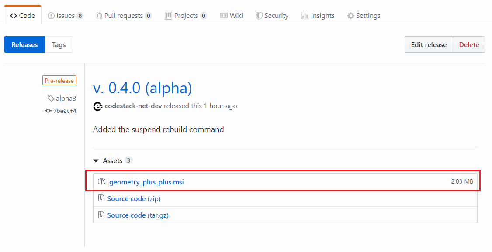
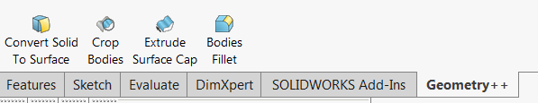

要安装插件，请在[此链接 v. 0.4.0 (alpha 3)](https://github.com/codestackdev/geometry-plus-plus/releases/tag/alpha3)下载最新的 msi 安装程序（*geometry_plus_plus.msi*）。

{ width=550 }

安装程序完成后，重新启动 SOLIDWORKS（如果已经启动）。SOLIDWORKS 菜单、工具栏和命令管理器框中会添加一个新的 *Geometry++* 组。

插件在启动时会检查更新。如果有新的更新可用，将显示带有下载链接的弹出消息。

插件可以从控制面板的“添加或删除程序”组中卸载。