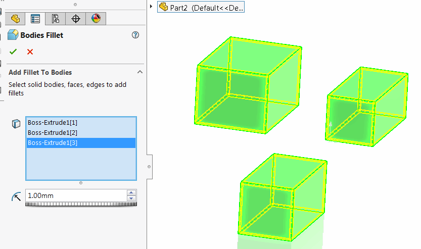
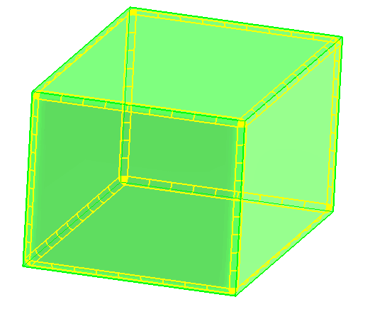
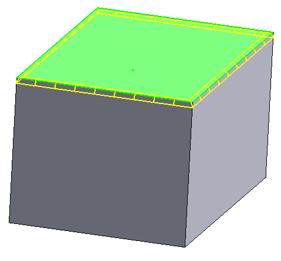
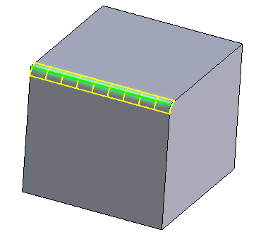
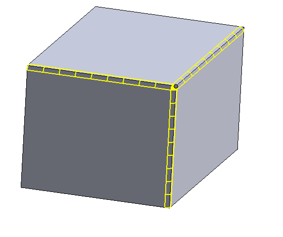

该命令允许对实体、面和边添加简单的倒角。该命令支持多实体，这意味着可以使用单个特征对不同的实体添加倒角。

{ width=250 }

## 对实体添加倒角

{ width=250 }

从特征树或使用选择过滤器选择整个实体。倒角将添加到实体的每个边。

## 对面添加倒角

{ width=250 }

选择要添加倒角的面。倒角将添加到该面的所有边。

## 对边添加倒角

{ width=250 }

选择要添加倒角的边。

## 对顶点添加倒角

{ width=250 }

选择要添加倒角的顶点。倒角将添加到该顶点的所有连接边。