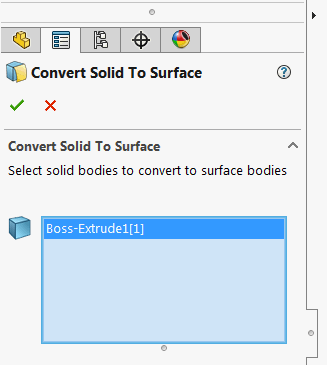
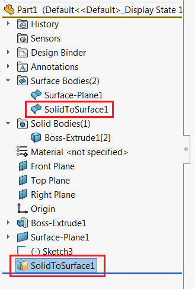

 在SOLIDWORKS零件文档中将实体转换为曲面，保留参数化功能
image: icon.png
toc-group-name: labs-solidworks-geometry-plus-plus
---
此功能将实体转换为曲面。

* 选择要转换的实体或实体
* 单击绿色勾号

在特征管理器树中添加了新功能。

所有选择的实体都将被相应的曲面替换。该功能是完全参数化的。如果某些形成实体的基础特征被修改，则曲面特征也会被修改。