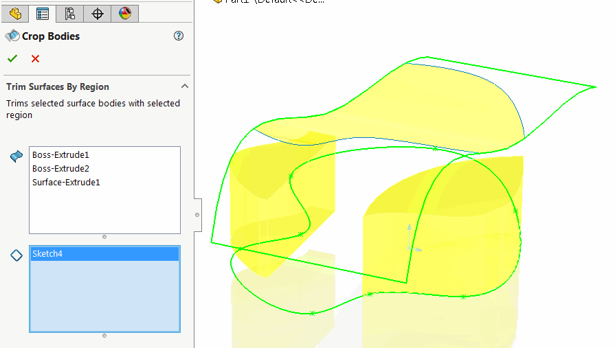
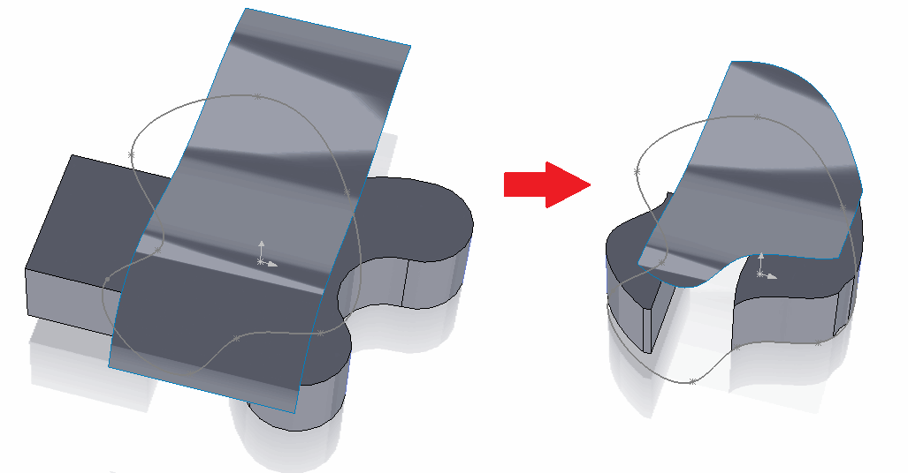
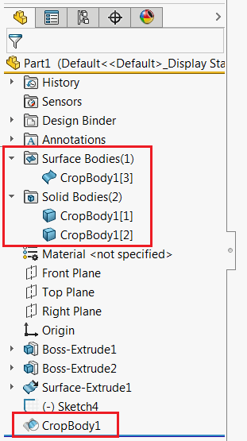

 该功能允许使用草图或草图轮廓来裁剪SOLIDWORKS零件文档中的表面或实体或多个表面或实体
image: icon.png
toc-group-name: labs-solidworks-geometry-plus-plus
redirect-from:
  - /labs/solidworks/geometry-plus-plus/user-guide/region-trim-surface/
---

该命令允许使用草图或草图区域（裁剪工具）来裁剪表面或实体（目标实体）。

支持多个目标实体和裁剪工具。

* 从图形区域或特征树中选择表面或实体或多个表面或实体。支持框选。
* 选择草图或草图区域（需要设置SOLIDWORKS过滤器）来裁剪表面。工具将保留位于草图区域内的表面几何图形。该功能将根据相应的裁剪工具草图法线垂直裁剪表面。

{ width=500 }

选择完成并点击绿色勾号后，新功能将添加到特征管理器树中。

{ width=500 }

新功能获取了原始实体。区域外的实体将被宏特征移除。

{ width=300 }

该功能可以像其他功能一样进行编辑、删除和回滚。