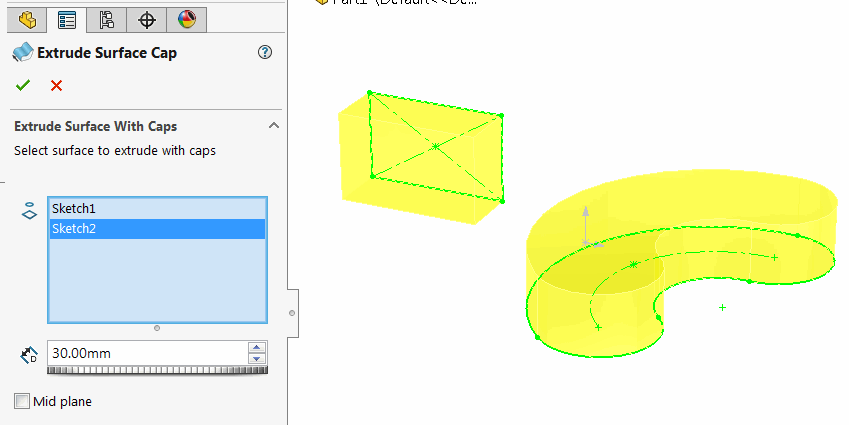
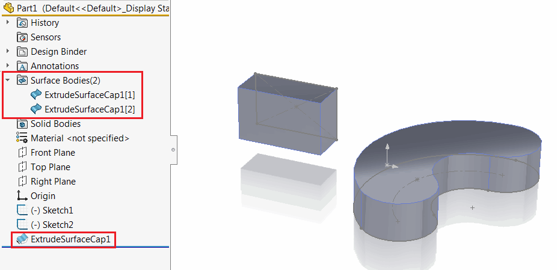
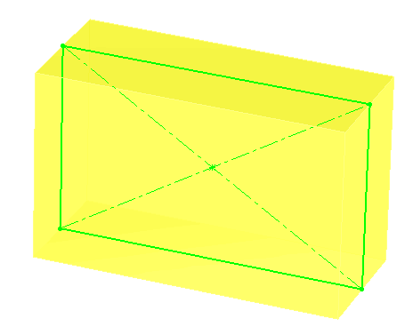

 该功能允许将草图或草图轮廓挤压到曲面上，并自动在挤压的两端添加盖子，而无需将结果转换为实体，并将其保持为曲面实体。
image: icon.png
toc-group-name: labs-solidworks-geometry-plus-plus
---

此命令允许将草图或草图轮廓自动挤压到曲面上，并在挤压的两端添加盖子，而无需将结果转换为实体，并将其保持为曲面实体。

{ width=250 }

在单个功能中可以选择多个草图。

{ width=450 }

中平面选项允许在两个方向上挤压特征。

{ width=250 }