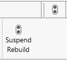
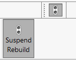
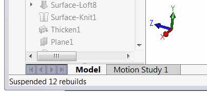

 使用Geometry++插件暂停SOLIDWORKS零件、装配和绘图中的重建操作，以批量重建以提高性能
image: icon.png
toc-group-name: labs-solidworks-geometry-plus-plus
---


此命令允许在仍然可以修改尺寸、草图和特征定义的情况下暂时暂停重建操作。

这种方法通过批量模式执行重建操作，大大减少了建模时间。

该命令可在菜单、工具栏和命令管理器选项卡中使用，并作为切换按钮。

当按钮未切换时，暂停重建模式被禁用，重建操作将正常执行。

当按钮切换时，所有重建操作都会被暂停。

状态栏显示当前暂停重建操作的数量信息。

在暂停重建模式下，更改不会被解决，模型将保持不变。在编辑特征定义并关闭属性管理器页面时，编辑的特征下方的所有特征都将被禁用（不可编辑），直到重新构建模型。

完成批量编辑后，禁用*Suspend Rebuild*按钮，然后单击*Rebuild (ctrl+B)*或*Regenerate (ctrl+Q)*命令以更新模型。

> 免责声明：尽管使用SOLIDWORKS API实现了暂停重建的功能，但禁用重建可能会导致模型出现意外行为。然而，目前没有报告任何损坏或损坏的问题。请自行承担风险。