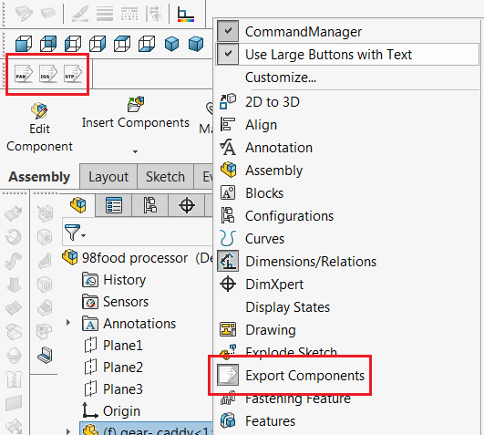

[Defined commands](/docs/codestack/labs/solidworks/swex/add-in/commands-manager/defining-commands/) can be hosted in different locations of SOLIDWORKS commands area: [command group](#command-group), which includes [menu](#menu), [toolbar](#toolbar) and [command tab box (ribbon)](#command-tab-box) as well as in the [context menu](#context-menu)

## Command Group

In order to add command group it is required to call the [AddCommandGroup](https://docs.codestack.net/swex/add-in/html/M_CodeStack_SwEx_AddIn_SwAddInEx_AddCommandGroup__1.htm) method and pass the enumeration type as a generic parameter.

It is required to provide the void handler function with a parameter of enumerator which will be called by framework when command is clicked.

~~~vb
Public Overrides Function OnConnect() As Boolean
    AddCommandGroup(Of CommandsA_e)(AddressOf OnCommandsAButtonClick)
    AddCommandGroup(Of CommandsB_e)(AddressOf OnCommandsBButtonClick)
    AddCommandGroup(Of CommandsC_e)(AddressOf OnCommandsCButtonClick)
    Return True
End Function

Private Sub OnCommandsAButtonClick(ByVal cmd As CommandsA_e)
End Sub

Private Sub OnCommandsBButtonClick(ByVal cmd As CommandsB_e)
End Sub

Private Sub OnCommandsCButtonClick(ByVal cmd As CommandsC_e)
End Sub
~~~

~~~cs
public override bool OnConnect()
{
    AddCommandGroup<CommandsA_e>(OnCommandsAButtonClick);
    AddCommandGroup<CommandsB_e>(OnCommandsBButtonClick);
    AddCommandGroup<CommandsC_e>(OnCommandsCButtonClick);

    return true;
}

private void OnCommandsAButtonClick(CommandsA_e cmd)
{
    //TODO: handle the button click
}

private void OnCommandsBButtonClick(CommandsB_e cmd)
{
    //TODO: handle the button click
}

private void OnCommandsCButtonClick(CommandsC_e cmd)
{
    //TODO: handle the button click
}
~~~

### Menu

{ width=350 }

By default command will be added to menu and [toolbar](#toolbar). This behaviour can be changed by assigning the *hasMenu* boolean parameter of the [CommandItemInfoAttribute](https://docs.codestack.net/swex/add-in/html/T_CodeStack_SwEx_AddIn_Attributes_CommandItemInfoAttribute.htm) attribute.

### Toolbar

{ width=350 }

By default command will be added to [menu](#menu) and toolbar. This behaviour can be changed by assigning the *hasToolbar* boolean parameter of the [CommandItemInfoAttribute](https://docs.codestack.net/swex/add-in/html/T_CodeStack_SwEx_AddIn_Attributes_CommandItemInfoAttribute.htm) attribute.

### Command Tab Box

{ width=450 }

Command item can be added to tab box by setting the *showInCmdTabBox* parameter of 
[CommandItemInfoAttribute](https://docs.codestack.net/swex/add-in/html/T_CodeStack_SwEx_AddIn_Attributes_CommandItemInfoAttribute.htm) to *true* for the specific command defined in the enumeration.

*textStyle* parameter allows to specify the alignment of the hint text relative to the icon.

{ width=250 }

* Icon only (without text) (swCommandTabButton_NoText)
* Text below icon (swCommandTabButton_TextBelow)
* Text to the right to icon, aligned horizontally (swCommandTabButton_TextHorizontal)

~~~vb
Imports CodeStack.SwEx.AddIn.Attributes
Imports CodeStack.SwEx.AddIn.Enums
Imports SolidWorks.Interop.swconst

Public Enum CommandsC_e

    <CommandItemInfo(True, True, swWorkspaceTypes_e.Assembly, True, swCommandTabButtonTextDisplay_e.swCommandTabButton_NoText)>
    CommandC1

    <CommandItemInfo(True, True, swWorkspaceTypes_e.AllDocuments, True, swCommandTabButtonTextDisplay_e.swCommandTabButton_TextBelow)>
    CommandC2

    <CommandItemInfo(True, True, swWorkspaceTypes_e.AllDocuments, True, swCommandTabButtonTextDisplay_e.swCommandTabButton_TextHorizontal)>
    CommandC3

End Enum
~~~

~~~cs
using CodeStack.SwEx.AddIn.Attributes;
using CodeStack.SwEx.AddIn.Enums;
using SolidWorks.Interop.swconst;

public enum CommandsC_e
{
    [CommandItemInfo(true, true, swWorkspaceTypes_e.Assembly,
        true, swCommandTabButtonTextDisplay_e.swCommandTabButton_NoText)]
    CommandC1,

    [CommandItemInfo(true, true, swWorkspaceTypes_e.AllDocuments,
        true, swCommandTabButtonTextDisplay_e.swCommandTabButton_TextBelow)]
    CommandC2,

    [CommandItemInfo(true, true, swWorkspaceTypes_e.AllDocuments,
        true, swCommandTabButtonTextDisplay_e.swCommandTabButton_TextHorizontal)]
    CommandC3,
}
~~~

## Context Menu

{ width=250 }

In order to add context menu it is required to call the [AddContextMenu](https://docs.codestack.net/swex/add-in/html/M_CodeStack_SwEx_AddIn_SwAddInEx_AddContextMenu__1.htm) method and pass the enumeration as a template parameter.

It is required to provide the void handler function with a parameter of enumeration which will be called by framework when command is clicked.

It is optionally required to specify the selection type of where this menu should be displayed.

~~~vb
Public Overrides Function OnConnect() As Boolean
    AddContextMenu(Of CommandsD_e)(AddressOf OnCommandsDContextMenuClick)
    AddContextMenu(Of CommandsE_e)(AddressOf OnCommandsEContextMenuClick, swSelectType_e.swSelFACES)
    Return True
End Function

Private Sub OnCommandsDContextMenuClick(ByVal cmd As CommandsD_e)
    'TODO: handle the context menu click
End Sub

Private Sub OnCommandsEContextMenuClick(ByVal cmd As CommandsE_e)
    'TODO: handle the context menu click
End Sub
~~~

~~~cs
public override bool OnConnect()
{
    AddContextMenu<CommandsD_e>(OnCommandsDContextMenuClick);
    AddContextMenu<CommandsE_e>(OnCommandsEContextMenuClick, swSelectType_e.swSelFACES);

    return true;
}

private void OnCommandsDContextMenuClick(CommandsD_e cmd)
{
    //TODO: handle the context menu click
}

private void OnCommandsEContextMenuClick(CommandsE_e cmd)
{
    //TODO: handle the context menu click
}
~~~

