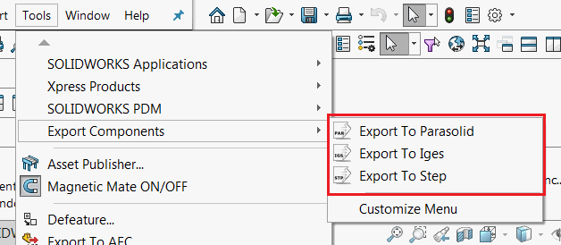
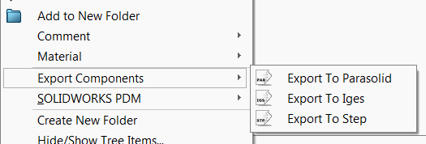

 使用SwEx.AddIn（命令组、上下文菜单、工具栏和命令选项卡框）托管SOLIDWORKS命令的选项
image: commands-toolbar.png
toc-group-name: labs-solidworks-swex
sidebar_position: 0
redirect-from:
  - /labs/solidworks/swex/add-in/commands-manager/adding-command-group/
  - /labs/solidworks/swex/add-in/commands-manager/tab-boxes/
  - /labs/solidworks/swex/add-in/commands-manager/adding-context-menu/
---
[已定义的命令](/docs/codestack/labs/solidworks/swex/add-in/commands-manager/defining-commands/)可以托管在SOLIDWORKS命令区域的不同位置：[命令组](#command-group)，其中包括[菜单](#menu)、[工具栏](#toolbar)和[命令选项卡框（功能区）](#command-tab-box)，以及[上下文菜单](#context-menu)。

## 命令组

要添加命令组，需要调用[AddCommandGroup](https://docs.codestack.net/swex/add-in/html/M_CodeStack_SwEx_AddIn_SwAddInEx_AddCommandGroup__1.htm)方法，并将枚举类型作为泛型参数传递。

需要提供一个带有枚举器参数的void处理程序函数，当单击命令时，框架将调用该函数。

~~~vb
Public Overrides Function OnConnect() As Boolean
    AddCommandGroup(Of CommandsA_e)(AddressOf OnCommandsAButtonClick)
    AddCommandGroup(Of CommandsB_e)(AddressOf OnCommandsBButtonClick)
    AddCommandGroup(Of CommandsC_e)(AddressOf OnCommandsCButtonClick)
    Return True
End Function

Private Sub OnCommandsAButtonClick(ByVal cmd As CommandsA_e)
End Sub

Private Sub OnCommandsBButtonClick(ByVal cmd As CommandsB_e)
End Sub

Private Sub OnCommandsCButtonClick(ByVal cmd As CommandsC_e)
End Sub
~~~

~~~cs
public override bool OnConnect()
{
    AddCommandGroup<CommandsA_e>(OnCommandsAButtonClick);
    AddCommandGroup<CommandsB_e>(OnCommandsBButtonClick);
    AddCommandGroup<CommandsC_e>(OnCommandsCButtonClick);

    return true;
}

private void OnCommandsAButtonClick(CommandsA_e cmd)
{
    //TODO: 处理按钮点击事件
}

private void OnCommandsBButtonClick(CommandsB_e cmd)
{
    //TODO: 处理按钮点击事件
}

private void OnCommandsCButtonClick(CommandsC_e cmd)
{
    //TODO: 处理按钮点击事件
}
~~~

### 菜单

{ width=350 }

默认情况下，命令将添加到菜单和[工具栏](#toolbar)。可以通过为[CommandItemInfoAttribute](https://docs.codestack.net/swex/add-in/html/T_CodeStack_SwEx_AddIn_Attributes_CommandItemInfoAttribute.htm)属性的*hasMenu*布尔参数分配值来更改此行为。

### 工具栏

{ width=350 }

默认情况下，命令将添加到[菜单](#menu)和工具栏。可以通过为[CommandItemInfoAttribute](https://docs.codestack.net/swex/add-in/html/T_CodeStack_SwEx_AddIn_Attributes_CommandItemInfoAttribute.htm)属性的*hasToolbar*布尔参数分配值来更改此行为。

### 命令选项卡框

{ width=450 }

可以通过将[CommandItemInfoAttribute](https://docs.codestack.net/swex/add-in/html/T_CodeStack_SwEx_AddIn_Attributes_CommandItemInfoAttribute.htm)的*showInCmdTabBox*参数设置为*true*，将命令项添加到选项卡框中，用于特定命令在枚举中定义。

*textStyle*参数允许指定提示文本相对于图标的对齐方式。

{ width=250 }

* 仅图标（无文本）（swCommandTabButton_NoText）
* 图标下方的文本（swCommandTabButton_TextBelow）
* 图标右侧的文本，水平对齐（swCommandTabButton_TextHorizontal）

~~~vb
Imports CodeStack.SwEx.AddIn.Attributes
Imports CodeStack.SwEx.AddIn.Enums
Imports SolidWorks.Interop.swconst

Public Enum CommandsC_e

    <CommandItemInfo(True, True, swWorkspaceTypes_e.Assembly, True, swCommandTabButtonTextDisplay_e.swCommandTabButton_NoText)>
    CommandC1

    <CommandItemInfo(True, True, swWorkspaceTypes_e.AllDocuments, True, swCommandTabButtonTextDisplay_e.swCommandTabButton_TextBelow)>
    CommandC2

    <CommandItemInfo(True, True, swWorkspaceTypes_e.AllDocuments, True, swCommandTabButtonTextDisplay_e.swCommandTabButton_TextHorizontal)>
    CommandC3

End Enum
~~~

~~~cs
using CodeStack.SwEx.AddIn.Attributes;
using CodeStack.SwEx.AddIn.Enums;
using SolidWorks.Interop.swconst;

public enum CommandsC_e
{
    [CommandItemInfo(true, true, swWorkspaceTypes_e.Assembly,
        true, swCommandTabButtonTextDisplay_e.swCommandTabButton_NoText)]
    CommandC1,

    [CommandItemInfo(true, true, swWorkspaceTypes_e.AllDocuments,
        true, swCommandTabButtonTextDisplay_e.swCommandTabButton_TextBelow)]
    CommandC2,

    [CommandItemInfo(true, true, swWorkspaceTypes_e.AllDocuments,
        true, swCommandTabButtonTextDisplay_e.swCommandTabButton_TextHorizontal)]
    CommandC3,
}
~~~

## 上下文菜单

{ width=250 }

要添加上下文菜单，需要调用[AddContextMenu](https://docs.codestack.net/swex/add-in/html/M_CodeStack_SwEx_AddIn_SwAddInEx_AddContextMenu__1.htm)方法，并将枚举作为模板参数传递。

需要提供一个带有枚举参数的void处理程序函数，当单击命令时，框架将调用该函数。

可选地，需要指定此菜单应显示的选择类型。

~~~vb
Public Overrides Function OnConnect() As Boolean
    AddContextMenu(Of CommandsD_e)(AddressOf OnCommandsDContextMenuClick)
    AddContextMenu(Of CommandsE_e)(AddressOf OnCommandsEContextMenuClick, swSelectType_e.swSelFACES)
    Return True
End Function

Private Sub OnCommandsDContextMenuClick(ByVal cmd As CommandsD_e)
    'TODO: 处理上下文菜单点击事件
End Sub

Private Sub OnCommandsEContextMenuClick(ByVal cmd As CommandsE_e)
    'TODO: 处理上下文菜单点击事件
End Sub
~~~

~~~cs
public override bool OnConnect()
{
    AddContextMenu<CommandsD_e>(OnCommandsDContextMenuClick);
    AddContextMenu<CommandsE_e>(OnCommandsEContextMenuClick, swSelectType_e.swSelFACES);

    return true;
}

private void OnCommandsDContextMenuClick(CommandsD_e cmd)
{
    //TODO: 处理上下文菜单点击事件
}

private void OnCommandsEContextMenuClick(CommandsE_e cmd)
{
    //TODO: 处理上下文菜单点击事件
}
~~~