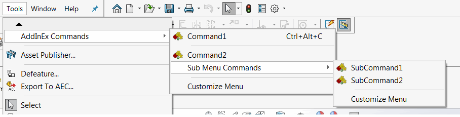

## 添加间隔符

可以通过使用 [CommandSpacerAttribute](https://docs.codestack.net/swex/add-in/html/T_CodeStack_SwEx_AddIn_Attributes_CommandSpacerAttribute.htm) 来为命令之间添加间隔符。间隔符将添加在该命令之前。

```vb
<Title("AddInEx Commands")>
Public Enum Commands_e

    Command1

    <CommandSpacer>
    Command2

End Enum
```

```cs
public enum Commands_e
{
    Command1,

    [CommandSpacer]
    Command2
}
```


如果为该命令组创建了命令选项卡框（即在 [CommandItemInfoAttribute](https://docs.codestack.net/swex/add-in/html/M_CodeStack_SwEx_AddIn_Attributes_CommandItemInfoAttribute__ctor_2.htm) 中将 *showInCmdTabBox* 参数设置为 *true*），则间隔符不会显示在相应的命令选项卡框中。

## 添加子菜单

可以通过调用 [CommandGroupInfoAttribute](https://docs.codestack.net/swex/add-in/html/M_CodeStack_SwEx_AddIn_Attributes_CommandGroupInfoAttribute__ctor_2.htm) 属性的相应重载来定义命令组的子菜单，并指定父菜单组的类型。

```vb
<Title("Sub Menu Commands")>
<CommandGroupInfo(GetType(Commands_e))>
Public Enum SubCommands_e
    SubCommand1
    SubCommand2
End Enum
```

```cs
[CommandGroupInfo(typeof(Commands_e))]
public enum SubCommands_e
{
    SubCommand1,
    SubCommand2
}
```


子菜单将在命令选项卡中以单独的选项卡框呈现。

## 示例


```vb
<Title("AddInEx Commands")>
Public Enum Commands_e

    Command1

    <CommandSpacer>
    Command2

End Enum

<Title("Sub Menu Commands")>
<CommandGroupInfo(GetType(Commands_e))>
Public Enum SubCommands_e
    SubCommand1
    SubCommand2
End Enum

Public Overrides Function OnConnect() As Boolean
    AddCommandGroup(Of Commands_e)(AddressOf OnButtonClick)
    AddCommandGroup(Of SubCommands_e)(AddressOf OnButtonClick)
    Return True
End Function

Private Sub OnButtonClick(ByVal cmd As Commands_e)
End Sub

Private Sub OnButtonClick(ByVal cmd As SubCommands_e)
End Sub
```


```cs
[Title("AddInEx Commands")]
public enum Commands_e
{
    Command1,

    [CommandSpacer]
    Command2
}

[Title("Sub Menu Commands")]
[CommandGroupInfo(typeof(Commands_e))]
public enum SubCommands_e
{
    SubCommand1,
    SubCommand2
}

public override bool OnConnect()
{
    AddCommandGroup<Commands_e>(OnButtonClick);
    AddCommandGroup<SubCommands_e>(OnButtonClick);
    return true;
}

private void OnButtonClick(Commands_e cmd)
{
}

private void OnButtonClick(SubCommands_e cmd)
{
}
```


上述命令配置将创建以下菜单和命令选项卡框：



* Command1 和 Command2 是在 Commands_e 枚举中定义的顶级菜单的命令
* 在 Command1 和 Command2 之间添加了间隔符
* SubCommand1 和 SubCommand2 是在 SubCommands_e 枚举中定义的子菜单的命令，该子菜单是 Commands_e 枚举的子菜单


* 所有命令（包括子菜单命令）都添加在同一个命令选项卡中
* Command1 和 Command2 放置在 SubCommand1 和 SubCommand2 的单独命令选项卡框中
* Command1 和 Command2 之间的间隔符在命令选项卡中被忽略