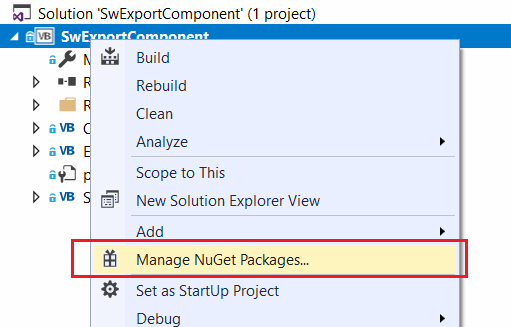
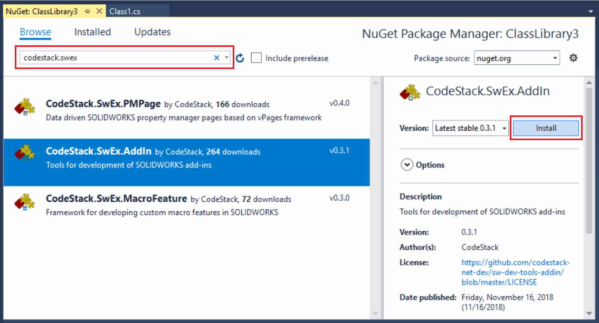
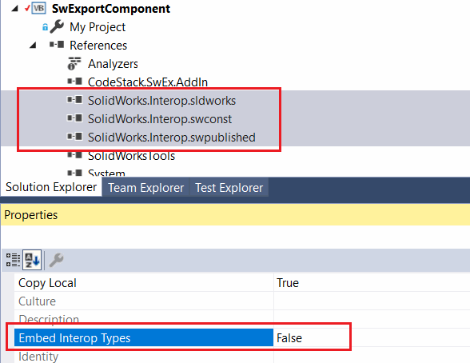
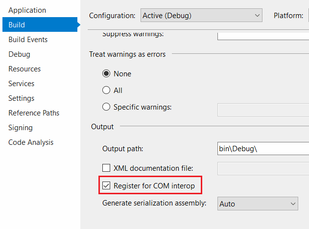
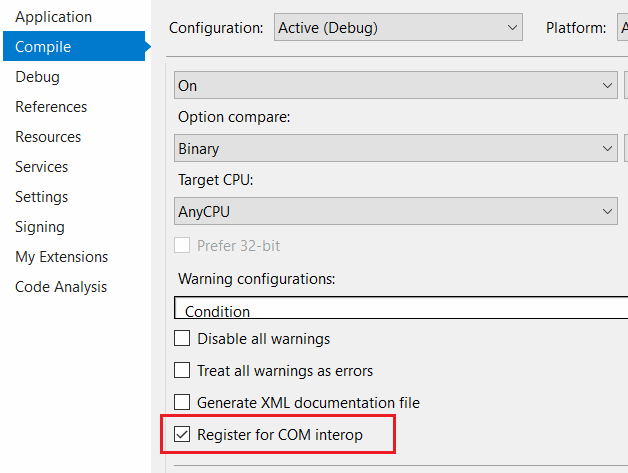
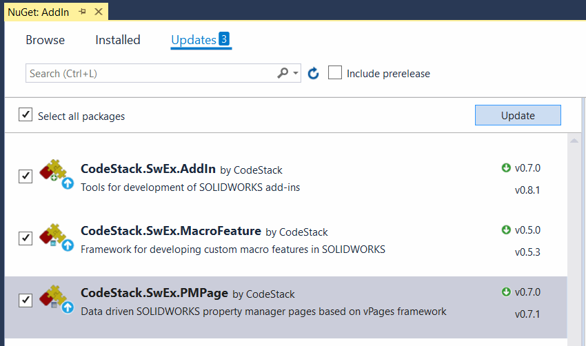
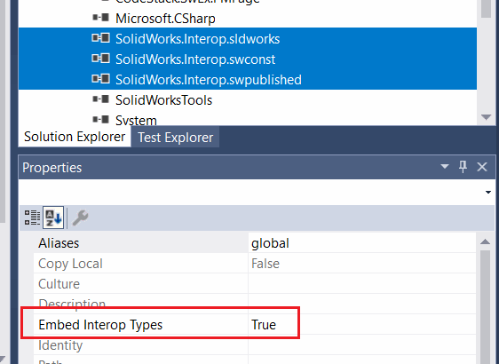

## 安装NuGet包

在Visual Studio中，从项目的上下文菜单中选择“管理NuGet程序包...”命令

{ width=250 }

在搜索框中搜索“CodeStack.SwEx”。找到后，点击所需框架的“安装”按钮。

这将安装所有所需的库到项目中。

## 准备项目

将SOLIDWORKS Interop库的“嵌入互操作类型”设置为“False”，如下所示。

{ width=300 }

在项目属性中勾选“注册COM互操作”选项：

对于C#项目，此选项可以在“生成”选项卡中找到：

{ width=300 }

对于VB.NET项目，此选项可以在“编译”选项卡中找到：

{ width=300 }

## 更新

SwEx框架正在积极开发，新功能和错误修复非常频繁。

NuGet提供了非常简单的方式来升级库的版本。只需导航到NuGet程序包管理器并检查更新：

要查看发布说明，请按照下面的链接查看相应库的内容。

* [SwEx.AddIn发布说明](https://docs.codestack.net/swex/add-in/html/version-history.htm)
* [SwEx.PMPage发布说明](https://docs.codestack.net/swex/pmpage/html/version-history.htm)
* [SwEx.MacroFeature发布说明](https://docs.codestack.net/swex/macro-feature/html/version-history.htm)

在某些情况下，更新库可能会将SOLIDWORKS Interop的“嵌入互操作类型”选项重置为“True”。

{ width=350 }

建议将其重新设置为“False”。

## 支持多个版本的SwEx框架

SwEx框架的方法签名和行为可能会在新版本中发生变化。SwEx库是强命名的，这样可以防止在同一SOLIDWORKS会话中加载多个引用不同版本框架的插件时出现兼容性冲突。