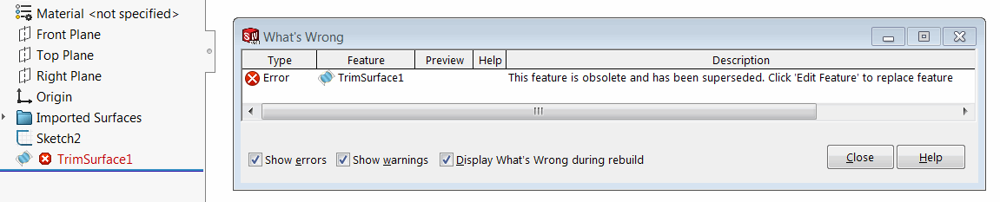
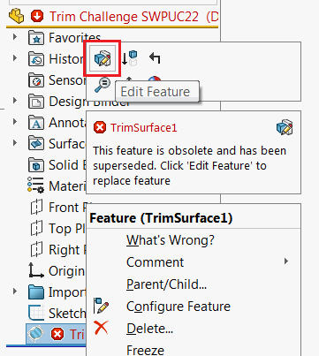
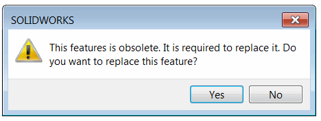

 解释了在SOLIDWORKS宏特征中实现参数的向后兼容性的方法
toc-group-name: labs-solidworks-swex
sidebar_position: 0
---
## 参数

宏特征参数可能需要在不同版本之间进行更改。SwEx.MacroFeature框架提供了一种处理现有特征向后兼容性的机制。

使用[ParametersVersionAttribute](https://docs.codestack.net/swex/macro-feature/html/T_CodeStack_SwEx_MacroFeature_Attributes_ParametersVersionAttribute.htm)标记当前参数的版本，并在参数发生更改时增加版本号。

实现[Paramater Version Converter](https://docs.codestack.net/swex/macro-feature/html/T_CodeStack_SwEx_MacroFeature_Base_IParametersVersionConverter.htm)以将参数从最新版本转换为最新版本。如果参数旧于一个版本，框架将负责对齐版本。

旧版本的参数
~~~ cs
[ParametersVersion("1.0", typeof(MacroFeatureParamsVersionConverter))]
public class MacroFeatureParams
{
    public string Param1 { get; set; }
    public int Param2 { get; set; }
}
~~~

新版本的参数

~~~ cs
[ParametersVersion("2.0", typeof(MacroFeatureParamsVersionConverter))]
public class MacroFeatureParams
{
    public string Param1A { get; set; }//参数重命名
    public int Param2 { get; set; }
    public string Param3 { get; set; }//新增参数
}

public class MacroFeatureParamsVersionConverter : ParametersVersionConverter
{
    private class VersConv_1_0To2_0 : ParameterConverter
    {
        public override Dictionary<string, string> ConvertParameters(IModelDoc2 model, IFeature feat, Dictionary<string, string> parameters)
        {
            var paramVal = parameters["Param1"];
            parameters.Remove("Param1");
            parameters.Add("Param1A", paramVal);//重命名参数
            parameters.Add("Param3", "Default");//添加具有默认值的新参数
            return parameters;
        }
    }

    public ParamsMacroFeatureParamsVersionConverter()
    {
        //从版本1.0转换到2.0
        Add(new Version("2.0"), new VersConv_1_0To2_0());
        //TODO: 添加更多版本转换器
    }
}
~~~

如果特征中添加了新的尺寸，则需要在[ConvertDispayDimensions](https://docs.codestack.net/swex/macro-feature/html/M_CodeStack_SwEx_MacroFeature_Base_IParameterConverter_ConvertDisplayDimensions.htm)方法中使用[DisplayDimensionPlacholder](https://docs.codestack.net/swex/macro-feature/html/T_CodeStack_SwEx_MacroFeature_Placeholders_DisplayDimensionPlaceholder.htm)。

在某些情况下，框架无法转换某些参数。例如，图标和尺寸无法转换。在这种情况下，[SetParameters](https://docs.codestack.net/swex/macro-feature/html/M_CodeStack_SwEx_MacroFeature_MacroFeatureEx_1_SetParameters_1.htm)方法将返回[过时状态](https://docs.codestack.net/swex/macro-feature/html/T_CodeStack_SwEx_MacroFeature_Base_MacroFeatureOutdateState_e.htm)。如果状态不是最新的，建议警告用户并调用[IFeatureManager::ReplaceComFeature](https://docs.codestack.net/swex/macro-feature/html/M_SolidWorks_Interop_sldworks_FeatureManagerEx_ReplaceComFeature__1.htm)扩展方法，该方法将替换树中的特征并保留所有参数。

## 弃用特征

在某些情况下，特征可能变得不再支持（即不再使用）。框架提供了一种将特征标记为弃用并允许替换（如果适用）的机制。

* 将弃用特征的类名、命名空间、GUID和Prog ID复制下来。
* 将特征标记为COM可见。
* 从[ObsoleteMacroFeatureEx](https://docs.codestack.net/swex/macro-feature/html/T_CodeStack_SwEx_MacroFeature_Core_ObsoleteMacroFeatureEx.htm)继承该类。如果此特征有相同模型的替代版本，请使用此版本的[ObsoleteMacroFeatureEx](https://docs.codestack.net/swex/macro-feature/html/T_CodeStack_SwEx_MacroFeature_Core_ObsoleteMacroFeatureEx_1.htm)并将模型作为泛型参数传递。

~~~ cs
namespace CodeStack.SwEx.MacroFeature.Features
{
    [ComVisible(true), ProgId(PROG_ID), Guid("08a4ab5f-7b8a-44b5-a487-b44026a02c2b")]
    public class SomeOriginalFeature : ObsoleteMacroFeatureEx<MacroFeatureModel>
    {
        internal const string PROG_ID = "CodeStack.SomeOriginalFeature";
    }
}
~~~

当用户重新构建特征时，将显示以下错误：

{ width=550 }

当用户点击*编辑特征*时

{ width=250 }

将显示以下消息

{ width=250 }

如果点击*是*，框架将自动用新特征替换弃用特征，并复制所有参数（如果适用）。