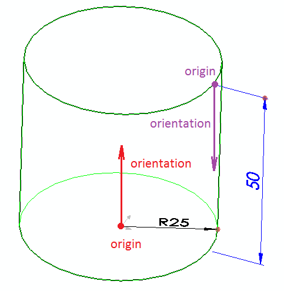

Dimensions is an additional source of input for macro feature. Dimensions can be defined in the following way:

~~~ cs
using CodeStack.SwEx.MacroFeature;
using CodeStack.SwEx.MacroFeature.Attributes;
using CodeStack.SwEx.MacroFeature.Base;
using CodeStack.SwEx.MacroFeature.Data;
using SolidWorks.Interop.sldworks;
using SolidWorks.Interop.swconst;

namespace CodeStack.SwEx
{
    public class DimensionMacroFeatureParams
    {
        [ParameterDimension(swDimensionType_e.swLinearDimension)]
        public double FirstDimension { get; set; } = 0.01;

        [ParameterDimension(swDimensionType_e.swRadialDimension)]
        public double SecondDimension { get; set; }
    }    
}

~~~

It is required to arrange the dimensions after rebuild by overriding the [OnSetDimensions](https://docs.codestack.net/swex/macro-feature/html/M_CodeStack_SwEx_MacroFeature_MacroFeatureEx_1_OnSetDimensions.htm) method. Use [DimensionData::SetOrientation](https://docs.codestack.net/swex/macro-feature/html/M_CodeStack_SwEx_MacroFeature_Data_DimensionDataExtension_SetOrientation.htm) helper method to align the dimension.

~~~ cs
using CodeStack.SwEx.MacroFeature;
using CodeStack.SwEx.MacroFeature.Base;
using CodeStack.SwEx.MacroFeature.Data;
using SolidWorks.Interop.sldworks;

namespace CodeStack.SwEx
{
    public class MyDimMacroFeature : MacroFeatureEx<DimensionMacroFeatureParams>
    {
        protected override void OnSetDimensions(ISldWorks app, IModelDoc2 model,
            IFeature feature, MacroFeatureRebuildResult rebuildResult, DimensionDataCollection dims,
            DimensionMacroFeatureParams parameters)
        {
            dims[0].SetOrientation(new Point(0, 0, 0), new Vector(0, 1, 0));

            dims[1].SetOrientation(new Point(0, 0, 0), new Vector(0, 0, 1));
        }
    }
}

~~~

*Origin* is a starting point of the dimension.

For linear dimensions *orientation* represents the vector along the direction of the dimension (i.e. the direction of measured entity)
For radial dimensions *orientation* represents the normal of the dimension (i.e. the vector of rotation of the dimension)

{ width=350 }

### Passing data from regeneration

In some cases it might be required to pass the data from [OnRebuild](https://docs.codestack.net/swex/macro-feature/html/M_CodeStack_SwEx_MacroFeature_MacroFeatureEx_1_OnRebuild.htm) method to be used within the [OnSetDimensions](https://docs.codestack.net/swex/macro-feature/html/M_CodeStack_SwEx_MacroFeature_MacroFeatureEx_1_OnSetDimensions.htm). For example when the geometry is required to calculate the dimension position.

This could be possible by creating custom rebuild result and returning from the regeneration function.

~~~ cs
using CodeStack.SwEx.MacroFeature;
using CodeStack.SwEx.MacroFeature.Base;
using CodeStack.SwEx.MacroFeature.Data;
using SolidWorks.Interop.sldworks;

namespace CodeStack.SwEx
{
    public class MyDimRegenDataMacroFeature : MacroFeatureEx<DimensionMacroFeatureParams>
    {
        public class MyData
        {
            public int Value1 { get; set; }
        }

        private class CustomRebuildResult : MacroFeatureRebuildBodyResult
        {
            internal MyData CustomData { get; private set; }

            internal CustomRebuildResult(IMacroFeatureData featData,
                IBody2[] bodies, MyData customData) : base(featData, true, bodies)
            {
                CustomData = customData;
            }
        }

        protected override MacroFeatureRebuildResult OnRebuild(ISldWorks app, IModelDoc2 model, IFeature feature, DimensionMacroFeatureParams parameters)
        {
            var featData = feature.GetDefinition() as IMacroFeatureData;

            var resBodies = GetBodies(); //generating bodies
            var customData = new MyData(); //creating custom data and assigning required values

            return new CustomRebuildResult(featData, resBodies, customData); //returning custom rebuild result
        }

        protected override void OnSetDimensions(ISldWorks app, IModelDoc2 model, IFeature feature, MacroFeatureRebuildResult rebuildResult,
            DimensionDataCollection dims, DimensionMacroFeatureParams parameters)
        {
            var rebuildRes = rebuildResult as CustomRebuildResult;

            var customData = rebuildRes.CustomData;

            //TODO: use custom data to arrange dimensions
        }

        private IBody2[] GetBodies()
        {
            //TODO: create bodies for geometry

            return null;
        }
    }
}

~~~

