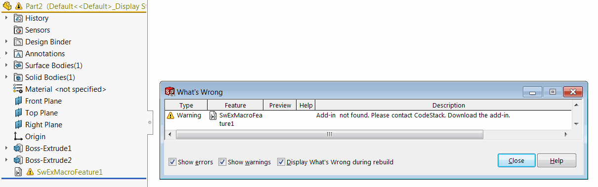

 宏特征和SwEx.MacroFeature框架的通用概述
toc-group-name: labs-solidworks-swex
sidebar_position: 0
---
该框架提供了3个主要的宏特征抽象类，这些类位于[CodeStack.SwEx.MacroFeature](https://docs.codestack.net/swex/macro-feature/html/N_CodeStack_SwEx_MacroFeature.htm)命名空间中，可以继承这些类以注册新的宏特征。

* [MacroFeatureEx](https://docs.codestack.net/swex/macro-feature/html/T_CodeStack_SwEx_MacroFeature_MacroFeatureEx.htm) - 简单的宏特征。宏特征不需要任何参数，将执行简单的操作。
* [MacroFeatureEx{TParams}](https://docs.codestack.net/swex/macro-feature/html/T_CodeStack_SwEx_MacroFeature_MacroFeatureEx_1.htm) - 参数驱动的宏特征。所有必需的输入可以在*TParams*结构（数据模型）中定义。[宏特征数据](/docs/codestack/labs/solidworks/swex/macro-feature/data)包括：
    * 字段值（命名参数）
    * 尺寸
    * 选择集
    * 编辑实体
* [MacroFeatureEx{TParams,THandler}](https://docs.codestack.net/swex/macro-feature/html/T_CodeStack_SwEx_MacroFeature_MacroFeatureEx_2.htm) - 具有按特征分配处理程序的参数驱动的宏特征，以跟踪生命周期。

宏特征类必须是COM可见的。

建议为宏特征明确指定GUID和Prog ID。

~~~ cs
using CodeStack.SwEx.MacroFeature;
using CodeStack.SwEx.MacroFeature.Attributes;
using CodeStack.SwEx.Properties;
using SolidWorks.Interop.swconst;
using System;
using System.Runtime.InteropServices;

namespace CodeStack.SwEx
{
    public class MySimplaeMacroFeatureParameters
    {
        public string Parameter1 { get; set; }
    }

    [ComVisible(true)]
    [Guid("47827004-8897-49F5-9C65-5B845DC7F5AC")]
    [ProgId("CodeStack.MyMacroFeature")]
    [Options("MyMacroFeature", swMacroFeatureOptions_e.swMacroFeatureAlwaysAtEnd)]
    [FeatureIcon(typeof(Resources), nameof(Resources.macro_feature_icon), "CodeStack\\MyMacroFeature\\Icons")]
    public class MySimplaeMacroFeature : MacroFeatureEx<MySimplaeMacroFeatureParameters>
    {
    }
}

~~~

## 图标

可以通过[IconAttribute](https://docs.codestack.net/swex/macro-feature/html/T_CodeStack_SwEx_MacroFeature_Attributes_IconAttribute.htm)指定自定义宏特征图标。图标可以从资源中加载，并支持透明度。默认情况下，图标文件将在%ProgramData%\CodeStack\{MacroFeatureId}\Icons文件夹中创建，但可以通过在*iconFolderName*参数中指定此位置来更改。

## 选项

可以通过[OptionsAttribute](https://docs.codestack.net/swex/macro-feature/html/T_CodeStack_SwEx_MacroFeature_Attributes_OptionsAttribute.htm)指定其他选项。

宏特征是一个COM对象，这意味着它需要注册才能运行。宏特征存储在模型中，但如果在未注册宏特征COM对象的环境中打开模型，则会显示重建错误。此外，这个“悬空”的宏特征无法删除或抑制。

用户可以通过[OptionsAttribute](https://docs.codestack.net/swex/macro-feature/html/T_CodeStack_SwEx_MacroFeature_Attributes_OptionsAttribute.htm)的*provider*参数指定在“出了什么问题”对话框中显示的自定义消息。指定的消息将在预定义的“找不到加载项。请联系”之后显示。

~~~ cs
using CodeStack.SwEx.MacroFeature;
using CodeStack.SwEx.MacroFeature.Attributes;
using System.Runtime.InteropServices;

namespace CodeStack.SwEx
{
    [ComVisible(true)]
    [Options("SwExMacroFeature", "CodeStack. Download the add-in")]
    public class UnregisteredMacroFeature : MacroFeatureEx
    {
    }
}

~~~

{ width=650 }

要插入宏特征，请使用扩展方法：[IFeatureManager::InsertComFeature](https://docs.codestack.net/swex/macro-feature/html/M_SolidWorks_Interop_sldworks_FeatureManagerEx_InsertComFeature__2.htm)。