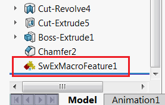

# SwEx.MacroFeature - SOLIDWORKS宏特征的高级框架

SwEx.MacroFeature是一个基于数据模型的简化开发SOLIDWORKS宏特征的工具库。



源代码可在[GitHub](https://github.com/codestackdev/swex-macrofeature)上获取。

## 什么是宏特征？

宏特征是一种可以使用SOLIDWORKS API添加到特征管理器设计树中的自定义元素。该元素的行为与任何其他标准特征（例如，凸台-拉伸、移动-复制实体、配合等）完全相同。

{ width=250 }

宏特征支持SOLIDWORKS的参数化特性，并且在任何父级更改时可以重新生成。

宏特征提供了3个主要的处理程序：

* 重建 - 在特征被重建时调用（无论是作为模型强制重建操作的结果还是作为任何依赖项的更新的结果）。宏特征可以创建新的实体或仅作为元数据元素。
* 编辑 - 当用户请求编辑特征定义时调用
* 状态更新 - 每次状态更新时调用（例如特征被选中、刷新等）

宏特征可以存储附加的元数据参数（包括尺寸和选择引用）。