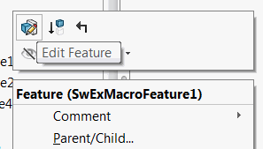

Edit definition allows to modify the parameters of an existing feature. Edit definition is called when *Edit Feature* command is clicked form the feature manager tree.

{ width=250 }

The typical workflow which should be followed when feature is edited

* Get the definition of the feature via [IFeature::GetDefinition](https://help.solidworks.com/2016/english/api/sldworksapi/solidworks.interop.sldworks~solidworks.interop.sldworks.ifeature~getdefinition.html)
* Rollback the feature in the tree via [IMacroFeatureData::AccessSelections](https://help.solidworks.com/2016/english/api/sldworksapi/SolidWorks.Interop.sldworks~SolidWorks.Interop.sldworks.IMacroFeatureData~AccessSelections.html). This will ensure that all the feature selections and edit bodies are available.
* Get the parameters of current macro feature via [GetParameters](https://docs.codestack.net/swex/macro-feature/html/M_CodeStack_SwEx_MacroFeature_MacroFeatureEx_1_GetParameters.htm)
* Create user interface and allow user to edit parameters. The recommended way to use Property Manager Pages to have a native look and feel of your feature. Use [SwEx.PMPage](/docs/codestack/labs/solidworks/swex/pmpage/) framework for simplified way of creating property manager pages.
* Once user interface is closed
    * If OK is clicked, than set modified parameters via [SetParameters](https://docs.codestack.net/swex/macro-feature/html/M_CodeStack_SwEx_MacroFeature_MacroFeatureEx_1_SetParameters.htm) method and apply the changes to the macro feature via [IFeature::ModifyDefinition](https://help.solidworks.com/2016/english/api/sldworksapi/SOLIDWORKS.Interop.sldworks~SOLIDWORKS.Interop.sldworks.IFeature~ModifyDefinition.html) this step will also rollforward the macro feature in the tree.
    If *Cancel* is clicked undo the modifications via [IMacroFeatureData::ReleaseSelectionAccess](https://help.solidworks.com/2016/english/api/sldworksapi/SolidWorks.Interop.sldworks~SolidWorks.Interop.sldworks.IMacroFeatureData~ReleaseSelectionAccess.html)

~~~ cs
using CodeStack.SwEx.MacroFeature;
using SolidWorks.Interop.sldworks;

namespace CodeStack.SwEx
{
    public class EditMacroFeatureDefinitionParameters
    {
        //TODO: add properties
    }

    public class EditMacroFeatureDefinition:MacroFeatureEx<EditMacroFeatureDefinitionParameters>
    {
        protected override bool OnEditDefinition(ISldWorks app, IModelDoc2 model, IFeature feature)
        {
            var featData = feature.GetDefinition() as IMacroFeatureData;

            //rollback feature
            featData.AccessSelections(model, null);

            //read current parameters
            var parameters = GetParameters(feature, featData, model);

            var res = ShowPage(parameters);

            if (res)
            {
                //set parameters and update feature data
                SetParameters(model, feature, featData, parameters);
                feature.ModifyDefinition(featData, model, null);
            }
            else
            {
                //cancel modifications
                featData.ReleaseSelectionAccess();
            }

            return true;
        }

        private bool ShowPage(EditMacroFeatureDefinitionParameters parameters)
        {
            //TODO: Show property page or any other user interface
            return true;
        }
    }
}

~~~

It is important to use the same pointer to [IMacroFeatureData](https://help.solidworks.com/2016/english/api/sldworksapi/solidworks.interop.sldworks~solidworks.interop.sldworks.imacrofeaturedata.html) while calling the [IMacroFeatureData::AccessSelections](https://help.solidworks.com/2016/english/api/sldworksapi/SolidWorks.Interop.sldworks~SolidWorks.Interop.sldworks.IMacroFeatureData~AccessSelections.html), [GetParameters](https://docs.codestack.net/swex/macro-feature/html/M_CodeStack_SwEx_MacroFeature_MacroFeatureEx_1_GetParameters.htm), [SetParameters](https://docs.codestack.net/swex/macro-feature/html/M_CodeStack_SwEx_MacroFeature_MacroFeatureEx_1_SetParameters.htm), [IFeature::ModifyDefinition](https://help.solidworks.com/2016/english/api/sldworksapi/SOLIDWORKS.Interop.sldworks~SOLIDWORKS.Interop.sldworks.IFeature~ModifyDefinition.html) and [IMacroFeatureData::ReleaseSelectionAccess](https://help.solidworks.com/2016/english/api/sldworksapi/SolidWorks.Interop.sldworks~SolidWorks.Interop.sldworks.IMacroFeatureData~ReleaseSelectionAccess.html) methods.