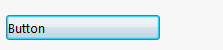

In order to create a button in the property manager page, it is required to declare the property of delegate type [Action](https://docs.microsoft.com/en-us/dotnet/api/system.action?view=netframework-4.8).

The pointer to void function assigned to this property is a handler of the button:

~~~vb
Public Class ButtonDataModel

    Public ReadOnly Property Button As Action
        Get
            Return AddressOf OnButtonClick
        End Get
    End Property

    Private Sub OnButtonClick()
        'TODO: Handle Button click
    End Sub

End Class
~~~

~~~cs
using System;

public class ButtonDataModel
{
    public Action Button => OnButtonClick;

    private void OnButtonClick()
    {
        //TODO: Handle button click
    }
}
~~~
