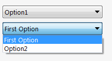

组合框控件将自动为枚举类型的所有属性生成。枚举器的所有值将被视为组合框中的选项：

~~~vb
Imports CodeStack.SwEx.Common.Attributes
Imports CodeStack.SwEx.My.Resources
Imports CodeStack.SwEx.PMPage.Attributes
Imports SolidWorks.Interop.swconst

Public Class ComboBoxDataModel

    Public Enum Options_e
        Option1
        Option2
        Option3
    End Enum

    <ComboBoxOptions(swPropMgrPageComboBoxStyle_e.swPropMgrPageComboBoxStyle_Sorted)>
    Public Property Options As Options_e

End Class
~~~

~~~cs
using CodeStack.SwEx.Common.Attributes;
using CodeStack.SwEx.PMPage.Attributes;
using CodeStack.SwEx.Properties;
using SolidWorks.Interop.swconst;

public class ComboBoxDataModel
{
    public enum Options_e
    {
        Option1,
        Option2,
        Option3
    }

    [ComboBoxOptions(swPropMgrPageComboBoxStyle_e.swPropMgrPageComboBoxStyle_Sorted)]
    public Options_e Options { get; set; }
}
~~~

可以通过[ComboBoxOptionsAttribute](https://docs.codestack.net/swex/pmpage/html/T_CodeStack_SwEx_PMPage_Attributes_ComboBoxOptionsAttribute.htm)指定组合框控件的其他选项和样式。

### 项目文本
可以使用[ComboBoxItemTextAttribute](https://docs.codestack.net/swex/pmpage/html/T_CodeStack_SwEx_PMPage_Attributes_ComboBoxItemTextAttribute.htm)属性来指定在组合框中显示的项目的用户友好标题。

~~~vb
Imports CodeStack.SwEx.Common.Attributes
Imports CodeStack.SwEx.My.Resources
Imports CodeStack.SwEx.PMPage.Attributes
Imports SolidWorks.Interop.swconst

Public Class ComboBoxDataModel

    Public Enum OptionsCustomized_e
        <Title("First Option")>
        Option1
        <Title(GetType(Resources), NameOf(Resources.Option2Title))>
        Option2
    End Enum

    Public Property Options2 As OptionsCustomized_e

End Class
~~~

~~~cs
using CodeStack.SwEx.Common.Attributes;
using CodeStack.SwEx.PMPage.Attributes;
using CodeStack.SwEx.Properties;
using SolidWorks.Interop.swconst;

public class ComboBoxDataModel
{
    public enum OptionsCustomized_e
    {
        [Title("First Option")] //静态标题
        Option1,

        [Title(typeof(Resources), nameof(Resources.Option2Title))] //从资源加载的标题
        Option2
    }

    public OptionsCustomized_e Options2 { get; set; }
}
~~~