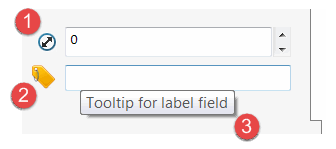
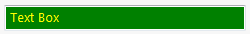
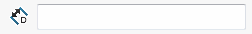
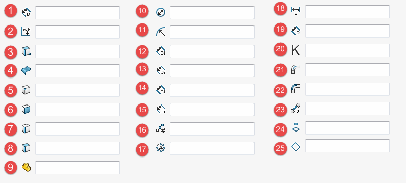

所有生成的控件都有可以自定义的公共属性

1. 从标准图标库中选择的控件图标
1. 从图像加载的自定义控件图标
1. 鼠标悬停时显示的控件工具提示

## 样式

可以通过 [ControlOptionsAttribute](https://docs.codestack.net/swex/pmpage/html/T_CodeStack_SwEx_PMPage_Attributes_ControlOptionsAttribute.htm) 自定义常见样式，通过在数据模型中装饰特定属性来实现。

该属性允许定义对齐方式、位置、大小以及背景和前景颜色：

~~~vb
<ControlOptions(,, KnownColor.Green, KnownColor.Yellow)>
Public Property TextField As String = "Sample Text"
~~~

~~~cs
[ControlOptions(backgroundColor: KnownColor.Green, textColor: KnownColor.Yellow)]
public string TextField { get; set; } = "Sample Text";
~~~

## 归属

### 工具提示

可以通过应用 [DescriptionAttribute](https://docs.microsoft.com/en-us/dotnet/api/system.componentmodel.descriptionattribute?view=netframework-4.0) 来设置控件的工具提示。

### 标准图标

可以通过 [ControlAttributionAttribute](https://docs.codestack.net/swex/pmpage/html/M_CodeStack_SwEx_PMPage_Attributes_ControlAttributionAttribute__ctor.htm) 属性将定义在 [swControlBitmapLabelType_e](https://help.solidworks.com/2017/english/api/swconst/SolidWorks.Interop.swconst~SolidWorks.Interop.swconst.swControlBitmapLabelType_e.html?id=aff2422a1ecf4632aae3e41abe59c6fc) 枚举中的标准图标设置为控件。

~~~vb
<Description("Depth Value")>
   <ControlAttribution(swControlBitmapLabelType_e.swBitmapLabel_Depth)>
   Public Property Depth As String
~~~

~~~cs
[Description("Depth Value")]
[ControlAttribution(swControlBitmapLabelType_e.swBitmapLabel_Depth)]
public string Depth { get; set; }
~~~

使用下面的映射表来查看所有可用的标准图标：

1. swBitmapLabel_LinearDistance
1. swBitmapLabel_AngularDistance
1. swBitmapLabel_SelectEdgeFaceVertex
1. swBitmapLabel_SelectFaceSurface
1. swBitmapLabel_SelectVertex
1. swBitmapLabel_SelectFace
1. swBitmapLabel_SelectEdge
1. swBitmapLabel_SelectFaceEdge
1. swBitmapLabel_SelectComponent
1. swBitmapLabel_Diameter
1. swBitmapLabel_Radius
1. swBitmapLabel_LinearDistance1
1. swBitmapLabel_LinearDistance2
1. swBitmapLabel_Thickness1
1. swBitmapLabel_Thickness2
1. swBitmapLabel_LinearPattern
1. swBitmapLabel_CircularPattern
1. swBitmapLabel_Width
1. swBitmapLabel_Depth
1. swBitmapLabel_KFactor
1. swBitmapLabel_BendAllowance
1. swBitmapLabel_BendDeduction
1. swBitmapLabel_RipGap
1. swBitmapLabel_SelectProfile
1. swBitmapLabel_SelectBoundary

### 自定义图标

可以通过 [ControlAttributionAttribute](https://docs.codestack.net/swex/pmpage/html/M_CodeStack_SwEx_PMPage_Attributes_ControlAttributionAttribute__ctor_1.htm) 属性的重载构造函数来设置自定义图标。

~~~vb
<ControlAttribution(GetType(Resources), NameOf(Resources.OffsetImage))>
Public Property Offset As Double
~~~

~~~cs
[ControlAttribution(typeof(Resources), nameof(Resources.OffsetImage))]
public double Offset { get; set; }
~~~

[重载构造函数的第二个版本](https://docs.codestack.net/swex/pmpage/html/M_CodeStack_SwEx_PMPage_Attributes_ControlAttributionAttribute__ctor_2.htm) 允许通过灰度级别指定透明度掩码，黑色像素边界为 100% 不透明，白色像素为 100% 透明。如果使用构造函数的第一个版本，掩码将根据图像的透明度自动生成（图像的 Alpha 通道）。