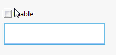
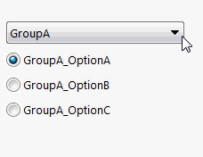

 使用SwEx.PMPage框架分配自定义标签和管理SOLIDWORKS属性管理器页面控件依赖关系（可见性、启用状态等）
image: cascading-controls.gif
labels: [级联,依赖关系,标签]
toc-group-name: labs-solidworks-swex
sidebar_position: 0
---
可能需要开发响应式的属性管理器页面，其控件状态取决于其他控件的值，例如[控件的启用状态](#controls-enable-state)，[级联列表](#cascading-lists)等。SwEx框架提供了易于设置和使用的功能来实现这些要求，并允许动态更新状态。

为了定义将用于依赖关系的控件，需要分配标签。控件标签允许跟踪从数据模型属性创建的控件。标签可以通过在数据模型属性上装饰[ControlTagAttribute](https://docs.codestack.net/swex/pmpage/html/T_CodeStack_SwEx_PMPage_Attributes_ControlTagAttribute.htm)来分配。控件标签可以表示为任何类型，建议使用枚举或字符串作为标签。

处理程序类必须继承[DependencyHandler](https://docs.codestack.net/swex/pmpage/html/T_CodeStack_SwEx_PMPage_Base_DependencyHandler.htm)类，并且每当需要解析状态时（即更改父控件的值）都会调用[UpdateControlState](https://docs.codestack.net/swex/pmpage/html/M_CodeStack_SwEx_PMPage_Base_DependencyHandler_UpdateControlState.htm)方法。

请参阅下面的几个示例，了解如何使用此技术开发响应式属性页面。如果需要，可以实现任何自定义逻辑并提供多个父控件。

## 控件的启用状态

下面是一个代码示例，演示如何根据复选框的值禁用/启用选择框控件。

~~~vb
Public Class DataModelEnable

    <ControlTag(NameOf(Enable))>
    Public Property Enable As Boolean

    <SelectionBox(swSelectType_e.swSelFACES)>
    <DependentOn(GetType(EnableDepHandler), NameOf(Enable))>
    Public Property Selection As IEntity

End Class

Public Class EnableDepHandler
    Inherits DependencyHandler

    Protected Overrides Sub UpdateControlState(ByVal control As IPropertyManagerPageControlEx, ByVal parents As IPropertyManagerPageControlEx())
        control.Enabled = CBool(parents.First().GetValue())
    End Sub
End Class
~~~

~~~cs
public class DataModelEnable
{
    [ControlTag(nameof(Enable))]
    public bool Enable { get; set; }

    [SelectionBox(swSelectType_e.swSelFACES)]
    [DependentOn(typeof(EnableDepHandler), nameof(Enable))]
    public IEntity Selection { get; set; }
}

public class EnableDepHandler : DependencyHandler
{
    protected override void UpdateControlState(IPropertyManagerPageControlEx control, IPropertyManagerPageControlEx[] parents)
    {
        control.Enabled = (bool)parents.First().GetValue();
    }
}
~~~

## 级联列表

下面的代码示例演示了如何实现级联列表。

下拉列表中的每个值（通过枚举定义）都有自己的嵌套选项列表（也由另一个枚举定义）。一旦下拉列表的值更改，选项组的可见性也会更改。

~~~vb
Public Enum Groups_e
    GroupA
    GroupB
    GroupC
End Enum

Public Enum GroupA_e
    GroupA_OptionA
    GroupA_OptionB
    GroupA_OptionC
End Enum

Public Enum GroupB_e
    GroupB_OptionA
    GroupB_OptionB
End Enum

Public Enum GroupC_e
    GroupC_OptionA
    GroupC_OptionB
    GroupC_OptionC
    GroupC_OptionD
End Enum

Public Enum Tags_e
    Groups
End Enum

Public Class DataModelCascading

    <ControlTag(Tags_e.Groups)>
    Public Property Groups As Groups_e

    <DependentOn(GetType(GroupOptionsVisibilityDepHandler), Tags_e.Groups)>
    <ControlTag(Groups_e.GroupA)>
    <OptionBox>
    Public Property GroupA As GroupA_e

    <DependentOn(GetType(GroupOptionsVisibilityDepHandler), Tags_e.Groups)>
    <ControlTag(Groups_e.GroupB)>
    <OptionBox>
    Public Property GroupB As GroupB_e

    <DependentOn(GetType(GroupOptionsVisibilityDepHandler), Tags_e.Groups)>
    <ControlTag(Groups_e.GroupC)>
    <OptionBox>
    Public Property GroupC As GroupC_e

End Class

Public Class GroupOptionsVisibilityDepHandler
    Inherits DependencyHandler

    Protected Overrides Sub UpdateControlState(ByVal control As IPropertyManagerPageControlEx, ByVal parents As IPropertyManagerPageControlEx())
        Dim curGrp = CType(parents.First().GetValue(), Groups_e)
        control.Visible = CType(control.Tag, Groups_e) = curGrp
    End Sub

End Class
~~~

~~~cs
public enum Groups_e
{
    GroupA,
    GroupB,
    GroupC
}

public enum GroupA_e
{
    GroupA_OptionA,
    GroupA_OptionB,
    GroupA_OptionC
}

public enum GroupB_e
{
    GroupB_OptionA,
    GroupB_OptionB,
}

public enum GroupC_e
{
    GroupC_OptionA,
    GroupC_OptionB,
    GroupC_OptionC,
    GroupC_OptionD
}

public enum Tags_e
{
    Groups
}

public class DataModelCascading
{
    [ControlTag(Tags_e.Groups)]
    public Groups_e Groups { get; set; }

    [DependentOn(typeof(GroupOptionsVisibilityDepHandler), Tags_e.Groups)]
    [ControlTag(Groups_e.GroupA)]
    [OptionBox]
    public GroupA_e GroupA { get; set; }

    [DependentOn(typeof(GroupOptionsVisibilityDepHandler), Tags_e.Groups)]
    [ControlTag(Groups_e.GroupB)]
    [OptionBox]
    public GroupB_e GroupB { get; set; }

    [DependentOn(typeof(GroupOptionsVisibilityDepHandler), Tags_e.Groups)]
    [ControlTag(Groups_e.GroupC)]
    [OptionBox]
    public GroupC_e GroupC { get; set; }
}

public class GroupOptionsVisibilityDepHandler : DependencyHandler
{
    protected override void UpdateControlState(IPropertyManagerPageControlEx control, IPropertyManagerPageControlEx[] parents)
    {
        var curGrp = (Groups_e)parents.First().GetValue();

        control.Visible = (Groups_e)control.Tag == curGrp;
    }
}
~~~