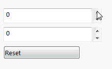

为了在代码后台动态更新属性更改的控件值（例如在按钮点击时或当一个属性更改时），需要在数据模型中实现[INotifyPropertyChanged](https://docs.microsoft.com/en-us/dotnet/api/system.componentmodel.inotifypropertychanged?view=netframework-4.8)接口。对于每个需要监视的属性，触发[PropertyChanged](https://docs.microsoft.com/en-us/dotnet/api/system.componentmodel.inotifypropertychanged.propertychanged?view=netframework-4.8)事件，通知环境值已更改并且控件需要更新。

~~~vb
Imports System.ComponentModel

Public Class DynamicValuesDataModel
    Implements INotifyPropertyChanged

    Public Event PropertyChanged As PropertyChangedEventHandler Implements INotifyPropertyChanged.PropertyChanged

    Private m_Val1 As Double
    Private m_Val2 As Double

    Public Property Val1 As Double
        Get
            Return m_Val1
        End Get
        Set(ByVal value As Double)
            m_Val1 = value
            RaiseEvent PropertyChanged(Me, New PropertyChangedEventArgs(NameOf(Val1)))
            Val2 = value * 2
        End Set
    End Property

    Public Property Val2 As Double
        Get
            Return m_Val2
        End Get
        Set(ByVal value As Double)
            m_Val2 = value
            RaiseEvent PropertyChanged(Me, New PropertyChangedEventArgs(NameOf(Val2)))
        End Set
    End Property

    Public ReadOnly Property Reset As Action
        Get
            Return AddressOf OnResetClick
        End Get
    End Property

    Private Sub OnResetClick()
        Val1 = 10
    End Sub

End Class
~~~

~~~cs
using System;
using System.ComponentModel;

public class DynamicValuesDataModel : INotifyPropertyChanged
{
    public event PropertyChangedEventHandler PropertyChanged;

    private double m_Val1;
    private double m_Val2;

    public double Val1
    {
        get
        {
            return m_Val1;
        }
        set
        {
            m_Val1 = value;
            PropertyChanged?.Invoke(this, new PropertyChangedEventArgs(nameof(Val1)));

            Val2 = value * 2;
        }
    }

    public double Val2
    {
        get
        {
            return m_Val2;
        }
        set
        {
            m_Val2 = value;
            PropertyChanged?.Invoke(this, new PropertyChangedEventArgs(nameof(Val2)));
        }
    }

    public Action Reset => OnResetClick;

    private void OnResetClick()
    {
        Val1 = 10;
    }
}
~~~