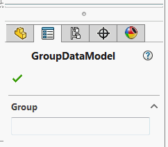

分组框将自动为数据模型中的所有复杂类型创建

~~~vb
Public Class GroupDataModel

    Public Class DataGroup
        Public Property Text As String
    End Class

    Public Property Group As DataGroup

End Class
~~~

~~~cs
public class GroupDataModel
{
    public class DataGroup
    {
        public string Text { get; set; }
    }

    public DataGroup Group { get; set; }
}
~~~

> SOLIDWORKS 不支持将分组嵌套到其他分组中，因此所有嵌套的复杂类型将作为主属性管理器页面的分组添加。