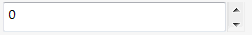

 应用于数字框控件的选项概述
image: number-box-units-wheel.png
toc-group-name: labs-solidworks-swex
sidebar_position: 0
---

数字框将自动为 *int* 和 *double* 类型的属性创建。

~~~vb
Imports CodeStack.SwEx.PMPage.Attributes
Imports SolidWorks.Interop.swconst

Public Class NumberBoxDataModel

    Public Property Number As Integer
    Public Property FloatingNumber As Double

End Class
~~~

~~~cs
using CodeStack.SwEx.PMPage.Attributes;
using SolidWorks.Interop.swconst;

public class NumberBoxDataModel
{
    public int Number { get; set; }
    public double FloatingNumber { get; set; }

}
~~~

可以通过 [NumberBoxOptionsAttribute](https://docs.codestack.net/swex/pmpage/html/T_CodeStack_SwEx_PMPage_Attributes_NumberBoxOptionsAttribute.htm) 自定义数字框的样式。

~~~vb
Imports CodeStack.SwEx.PMPage.Attributes
Imports SolidWorks.Interop.swconst

Public Class NumberBoxDataModel

	<NumberBoxOptions(swNumberboxUnitType_e.swNumberBox_Length, 0, 1000, 0.01, True, 0.02, 0.001,
					  swPropMgrPageNumberBoxStyle_e.swPropMgrPageNumberBoxStyle_Thumbwheel)>
	Public Property Length As Double

End Class
~~~

~~~cs
using CodeStack.SwEx.PMPage.Attributes;
using SolidWorks.Interop.swconst;

public class NumberBoxDataModel
{

    [NumberBoxOptions(swNumberboxUnitType_e.swNumberBox_Length, 0, 1000, 0.01, true, 0.02, 0.001,
        swPropMgrPageNumberBoxStyle_e.swPropMgrPageNumberBoxStyle_Thumbwheel)]
    public double Length { get; set; }
}
~~~