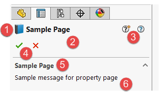
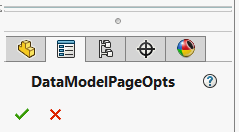
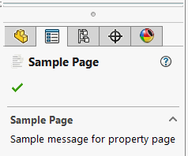
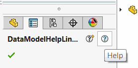

 SOLIDWORKS属性管理器页面本身的选项概述
image: property-manager-page.png
toc-group-name: labs-solidworks-swex
sidebar_position: 0
---

1. 属性管理器页面的图标
1. 属性管理器页面的标题
1. 文档链接（新功能和帮助）
1. 控制按钮（确定和取消）
1. 可选的用户消息标题
1. 可选的用户消息内容

可以通过将[PageOptionsAttribute](https://docs.codestack.net/swex/pmpage/html/T_CodeStack_SwEx_PMPage_Attributes_PageOptionsAttribute.htm)应用于数据模型的主类来自定义属性管理器页面的样式。

~~~vb
<PageOptions(swPropertyManagerPageOptions_e.swPropertyManagerOptions_CancelButton Or swPropertyManagerPageOptions_e.swPropertyManagerOptions_OkayButton)>
Public Class DataModelPageOpts
End Class
~~~

~~~cs
[PageOptions(swPropertyManagerPageOptions_e.swPropertyManagerOptions_CancelButton
| swPropertyManagerPageOptions_e.swPropertyManagerOptions_OkayButton)]
public class DataModelPageOpts
{
}
~~~

属性允许自定义页面的按钮和行为

## 归属

可以通过[DisplayNameAttribute](https://docs.microsoft.com/en-us/dotnet/api/system.componentmodel.displaynameattribute?view=netframework-4.7.2)为页面标题赋值

可以通过[PageOptionsAttribute](https://docs.codestack.net/swex/pmpage/html/M_CodeStack_SwEx_PMPage_Attributes_PageOptionsAttribute__ctor_1.htm)的重载构造函数设置图标

可以通过[MessageAttribute](https://docs.codestack.net/swex/pmpage/html/T_CodeStack_SwEx_PMPage_Attributes_MessageAttribute.htm)设置自定义用户消息以提供附加信息

~~~vb
<PageOptions(GetType(Resources), NameOf(Resources.PageIcon), swPropertyManagerPageOptions_e.swPropertyManagerOptions_OkayButton)>
<Message("属性页面的示例消息", "示例页面")>
<DisplayName("示例页面")>
Public Class DataModelPageAtts
End Class
~~~

~~~cs
[PageOptions(typeof(Resources), nameof(Resources.PageIcon),
    swPropertyManagerPageOptions_e.swPropertyManagerOptions_OkayButton)]
[Message("属性页面的示例消息", "示例页面")]
[DisplayName("示例页面")]
public class DataModelPageAtts
{
}
~~~

## 帮助链接

[HelpAttribute](https://docs.codestack.net/swex/pmpage/html/T_CodeStack_SwEx_PMPage_Attributes_HelpAttribute.htm)允许为插件提供帮助资源的链接。当用户在属性管理器页面上点击相应的帮助按钮时，框架将自动打开指定的URL：

~~~vb
<Help("<帮助URL>", "<新功能URL>")>
Public Class DataModelHelpLinks
End Class
~~~

~~~cs
[Help("<帮助URL>", "<新功能URL>")]
public class DataModelHelpLinks
{
}
~~~