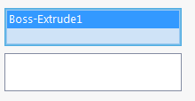
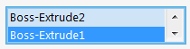

使用[SelectionBoxAttribute](https://docs.codestack.net/swex/pmpage/html/T_CodeStack_SwEx_PMPage_Attributes_SelectionBoxAttribute.htm)对公共属性进行装饰，将生成选择框。

此属性适用于[SolidWorks.Interop.SldWorks](https://help.solidworks.com/2014/english/api/SWHelp_List.html?id=a4a58f35c9bf4504aea25542315877d0#Pg0&ProductType=&ProductName=)命名空间中的对象类型或任何特定可选择类型。在这种情况下，对象的类型应与[SelectionBoxAttribute](https://docs.codestack.net/swex/pmpage/html/T_CodeStack_SwEx_PMPage_Attributes_SelectionBoxAttribute.htm)中指定的类型匹配。

~~~vb
Public Class SelectionBoxDataModel

    <SelectionBox(swSelectType_e.swSelSOLIDBODIES)>
    Public Property Body As IBody2

    <SelectionBox(swSelectType_e.swSelEDGES, swSelectType_e.swSelNOTES, swSelectType_e.swSelCOORDSYS)>
    Public Property Dispatch As Object

End Class
~~~

~~~cs
public class SelectionBoxDataModel
{
    [SelectionBox(swSelectType_e.swSelSOLIDBODIES)]
    public IBody2 Body { get; set; }

    [SelectionBox(swSelectType_e.swSelEDGES, swSelectType_e.swSelNOTES, swSelectType_e.swSelCOORDSYS)]
    public object Dispatch { get; set; }
}
~~~

## 多选

此属性也适用于列表。在这种情况下，选择框将启用多选功能：

~~~vb
Public Class SelectionBoxListDataModel

    <SelectionBox(swSelectType_e.swSelSOLIDBODIES)>
    Public Property Bodies As List(Of IBody2) = New List(Of IBody2)()

    <SelectionBox(swSelectType_e.swSelEDGES, swSelectType_e.swSelNOTES, swSelectType_e.swSelCOORDSYS)>
    Public Property Dispatches As List(Of Object) = New List(Of Object)()

End Class
~~~

~~~cs
public class SelectionBoxListDataModel
{
    [SelectionBox(swSelectType_e.swSelSOLIDBODIES)]
    public List<IBody2> Bodies { get; set; } = new List<IBody2>();

    [SelectionBox(swSelectType_e.swSelEDGES, swSelectType_e.swSelNOTES, swSelectType_e.swSelCOORDSYS)]
    public List<object> Dispatches { get; set; } = new List<object>();
}
~~~

可以通过[SelectionBoxOptionsAttribute](https://docs.codestack.net/swex/pmpage/html/T_CodeStack_SwEx_PMPage_Attributes_SelectionBoxOptionsAttribute.htm)指定其他选择框选项。

## 选择标记

选择标记用于区分选择框中的选择。在大多数情况下，每个选择都需要进入特定的选择框。因此，需要为每个选择框使用不同的选择标记。选择标记是位掩码，这意味着它们应该以2的幂递增（即1、2、4、8、16等）以确保唯一性。默认情况下，SwEx框架将在使用[此](https://docs.codestack.net/swex/pmpage/html/M_CodeStack_SwEx_PMPage_Attributes_SelectionBoxAttribute__ctor.htm)或[此](https://docs.codestack.net/swex/pmpage/html/M_CodeStack_SwEx_PMPage_Attributes_SelectionBoxAttribute__ctor_3.htm)版本的构造函数时自动分配正确的选择标记。但也可以使用[此](https://docs.codestack.net/swex/pmpage/html/M_CodeStack_SwEx_PMPage_Attributes_SelectionBoxAttribute__ctor_1.htm)和[此](https://docs.codestack.net/swex/pmpage/html/M_CodeStack_SwEx_PMPage_Attributes_SelectionBoxAttribute__ctor_2.htm)构造函数手动分配标记。

## 自定义选择过滤器

要为选择框提供自定义过滤逻辑，需要通过继承[SelectionCustomFilter](https://docs.codestack.net/swex/pmpage/html/T_CodeStack_SwEx_PMPage_Base_SelectionCustomFilter_1.htm)类来实现过滤器，并通过[SelectionBoxAttribute](https://docs.codestack.net/swex/pmpage/html/M_CodeStack_SwEx_PMPage_Attributes_SelectionBoxAttribute__ctor_2.htm)属性的重载构造函数分配过滤器。

~~~vb
Public Class SelectionBoxCustomSelectionFilterDataModel

    Public Class DataGroup
        <SelectionBox(GetType(PlanarFaceFilter), swSelectType_e.swSelFACES)>
        Public Property PlanarFace As IFace2
    End Class

    Public Class PlanarFaceFilter
        Inherits SelectionCustomFilter(Of IFace2)

        Protected Overrides Function Filter(ByVal selBox As IPropertyManagerPageControlEx, ByVal selection As IFace2, ByVal selType As swSelectType_e, ByRef itemText As String) As Boolean
            itemText = "Planar Face"
            Return selection.IGetSurface().IsPlane()
        End Function
    End Class

End Class
~~~

~~~cs
public class SelectionBoxCustomSelectionFilterDataModel
{
    public class DataGroup
    {
        [SelectionBox(typeof(PlanarFaceFilter), swSelectType_e.swSelFACES)] //将标准过滤器设置为面，并将自定义过滤器设置为仅过滤平面面
        public IFace2 PlanarFace { get; set; }
    }

    public class PlanarFaceFilter : SelectionCustomFilter<IFace2>
    {
        protected override bool Filter(IPropertyManagerPageControlEx selBox, IFace2 selection, swSelectType_e selType, ref string itemText)
        {
            itemText = "Planar Face";
            return selection.IGetSurface().IsPlane(); //验证选择并仅允许平面面
        }
    }
}
~~~