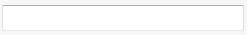

 介绍应用于文本框控件的选项
image: text-box.png
toc-group-name: labs-solidworks-swex
sidebar_position: 0
---

对于所有类型为 *string* 的属性，将自动生成文本框控件。

~~~vb
Public Class TextBoxDataModel
    Public Property Text As String
End Class
~~~

~~~cs
public class TextBoxDataModel
{
    public string Text { get; set; }
}
~~~

可以通过 [TextBoxOptionsAttribute](https://docs.codestack.net/swex/pmpage/html/T_CodeStack_SwEx_PMPage_Attributes_TextBoxOptionsAttribute.htm) 指定其他选项。